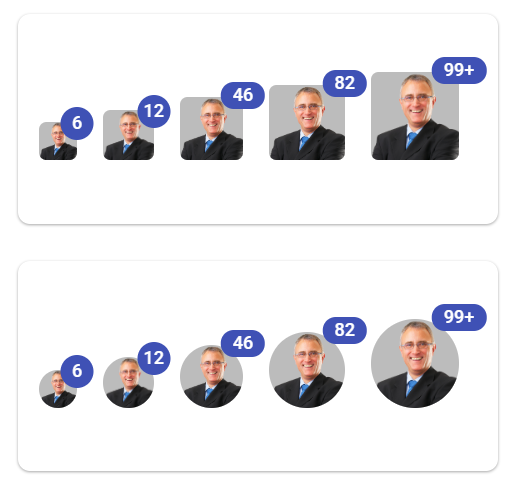

# Integrate avatar into Badge

The badge is dependent and supportive component, and it can be used with avatar to create a notification avatar.
The default avatar (.`e-avatar`) and circle avatar (.`e-avatar-circle`) have been used with notification badges (.`e-badge-notification`) in the following sample.
























Output be like the below.

