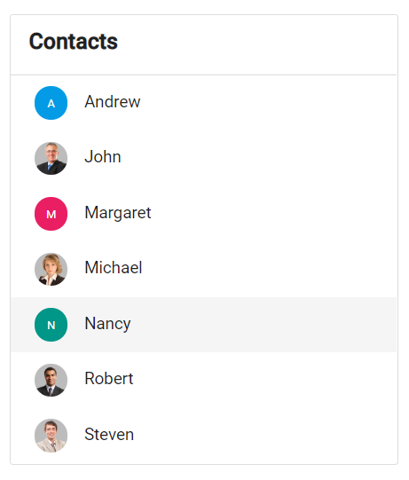

# Integrate avatar into ListView

Avatar is integrated into the listview to create contacts applications. The `xsmall` size avatar is used to match
the size of the list item. Letters and images are also used as avatar content.
























Output be like the below.

