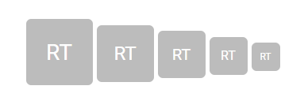
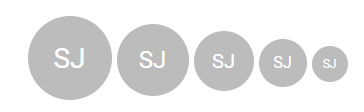

# Types and Styles

This section explains different types of avatar.

## Avatar size

The Essential JS 2 Avatar has the following predefined sizes that can be used with the `.e-avatar` class to change
the appearance of the avatar.

| Class Name         | Description
| :-------------:    |:-------------:
| e-avatar-xlarge    | Displays xlarge size avatar.
| e-avatar-large     | Displays apply large size avatar.
| e-avatar           | Displays apply default size avatar.
| e-avatar-small     | Displays apply small size avatar.
| e-avatar-xsmall    | Displays apply xsmall size avatar.
























Output be like the below.

## Avatar types

The types of Essential JS 2 avatar are:

* Default
* Circle

### Default

The default style of the avatar is rectangular shape with rounded corners, which can be applied from adding the
modifier class `.e-avatar` to the target element.
























Output be like the below.

### Circle

The circle avatar style can be applied by adding the modifier class `.e-avatar-circle` to the target element.
























Output be like the below.

