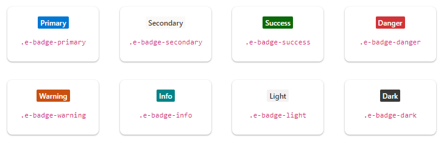

| e-badge-primary   | Represents a primary notification.
| e-badge-secondary | Represents a secondary notification.
| e-badge-success   | Represents a positive notification.
| e-badge-danger    | Represents a negative notification.
| e-badge-warning   | Represents notification with caution.
| e-badge-info      | Represents an informative notification.
| e-badge-light     | Represents notification in light variant.
| e-badge-dark      | Represents notification in dark variant.
























Output be like the below.

## Badge types

The types of Essential JS 2 badges are as follows:

* Circle
* Pill
* Link
* Notification
* Overlap
* Dot
* Position

### Circle

The circle badge style can be applied by adding the modifier class `.e-badge-circle` to the target element.
























Output be like the below.

### Pill

The pill badge style can be applied by adding the modifier class `.e-badge-pill` to the target element.
























Output be like the below.

### Link

When badge modifier classes are applied to the anchor tag, the badge’s appearance will change from normal state to hover state on mouseover.
























Output be like the below.

### Notification

The notification badge style can be applied by adding the modifier class `.e-badge-notification` to the target element.
Notification badges are used when a content or a context needs special attention. While using the notification badge,
set the parent element to `position: relative`.
























Output be like the below.

### Dot

Dot can be applied by adding the modifier class `.e-badge-dot` to the target element. Dot badges are similar to notification badges, but in a minimalistic way. While using the dot badge, set the parent element to `position: relative` .
























Output be like the below.

### Overlap

The overlap badge can be used with `notification` or `dot` badge, which overlaps with the target element
by adding the modifier class`.e-badge-overlap`. While using the overlap badge, set the parent element to `position: relative`.
























Output be like the below.

### Position

The default position of the `notification` or `dot` badge is top. But, the position can be changed to `bottom` using
the modifier class `.e-badge-bottom`. For example, the bottom class modifier is used with dot badge to display the
status in the avatar as shown in the following sample.
























Output be like the below.

