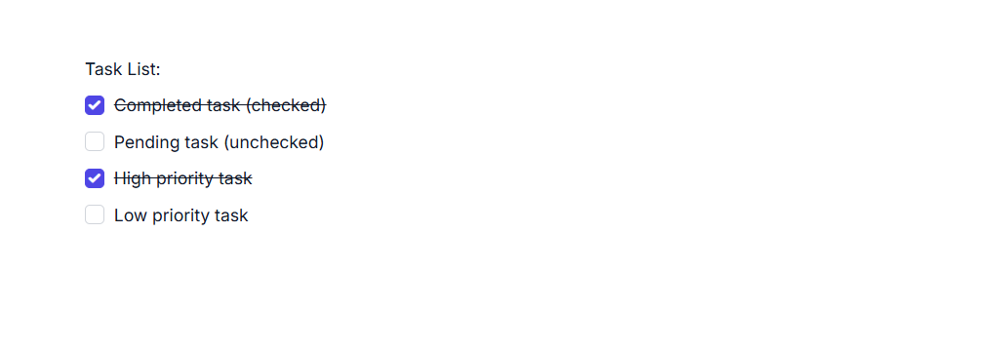
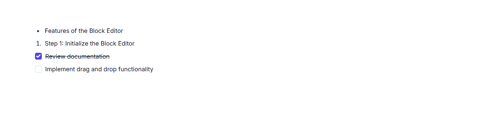

# Lists in ASP.NET MVC Block Editor control

List blocks in the BlockEditor component are used to organize content into structured lists. You can render List blocks by setting the [blockType](https://help.syncfusion.com/cr/aspnetmvc-js2/Syncfusion.EJ2.BlockEditor.BlockType.html) property as [BulletList](https://help.syncfusion.com/cr/aspnetmvc-js2/Syncfusion.EJ2.BlockEditor.BlockType.html#Syncfusion_EJ2_BlockEditor_BlockType_BulletList), [NumberedList](https://help.syncfusion.com/cr/aspnetmvc-js2/Syncfusion.EJ2.BlockEditor.BlockType.html#Syncfusion_EJ2_BlockEditor_BlockType_NumberedList), or [Checklist](https://help.syncfusion.com/cr/aspnetmvc-js2/Syncfusion.EJ2.BlockEditor.BlockType.html#Syncfusion_EJ2_BlockEditor_BlockType_Checklist). Bullet lists and numbered lists are ideal for unordered and ordered items, respectively, while checklist blocks enable interactive to-do lists with checkable items.

## Configure bullet list 

You can render Bullet List block by setting the [blockType](https://help.syncfusion.com/cr/aspnetmvc-js2/Syncfusion.EJ2.BlockEditor.BlockType.html) property as [BulletList](https://help.syncfusion.com/cr/aspnetmvc-js2/Syncfusion.EJ2.BlockEditor.BlockType.html#Syncfusion_EJ2_BlockEditor_BlockType_BulletList). This block type is used for unordered lists.

### BlockType

```typescript
// Adding bulletlist block
{
    blockType = 'BulletList',
    content = new List<object>()
        {
        new 
        {
            contentType = "Text"
            content = 'your content'
        }
    }
}
```

### Configure placeholder

You can configure placeholder text for block using the `placeholder` in the `properties` property. This text appears when the block is empty. The default placeholder for bullet list is  `Add item`.

```typescript
// Adding placeholder value 
{
    blockType = 'BulletList',
    properties = new { placeholder = "Add item" }
}
```

## Configure numbered list

You can render Numbered List block by setting the [blockType](https://help.syncfusion.com/cr/aspnetmvc-js2/Syncfusion.EJ2.BlockEditor.BlockType.html) property as [NumberedList](https://help.syncfusion.com/cr/aspnetmvc-js2/Syncfusion.EJ2.BlockEditor.BlockType.html#Syncfusion_EJ2_BlockEditor_BlockType_NumberedList),. This block type is used for ordered lists.

### BlockType

```typescript
// Adding bulletlist block
{
    blockType = 'NumberedList',
    content = new List<object>()
    {
        new 
        {
            contentType = "Text"
            content = 'your content'
        }
    }
}
```

### Configure placeholder

You can configure placeholder text for block using the `placeholder` in the `properties` property. This text appears when the block is empty. The default placeholder for numbered list is  `Add item`.

```typescript
// Adding placeholder value 
{
    blockType = 'NumberedList',
    properties = new { placeholder = "Add item" }
}
```

## Configure checklist

You can render Checklist block by setting the [blockType](https://help.syncfusion.com/cr/aspnetmvc-js2/Syncfusion.EJ2.BlockEditor.BlockType.html) property as [Checklist](https://help.syncfusion.com/cr/aspnetmvc-js2/Syncfusion.EJ2.BlockEditor.BlockType.html#Syncfusion_EJ2_BlockEditor_BlockType_Checklist). This block type is used for creating interactive to-do lists.

### BlockType

```typescript
// Adding bulletlist block
{
    blockType = 'CheckList',
    content = new List<object>()
    {
        new 
        {
            contentType = "Text"
            content = 'your content'
        }
    }
}
```

### Configure checked state

For blocks that support selection states such as [Checklist](https://help.syncfusion.com/cr/aspnetmvc-js2/Syncfusion.EJ2.BlockEditor.BlockType.html#Syncfusion_EJ2_BlockEditor_BlockType_Checklist), you can configure the checked state using the `properties` property with `isChecked`.

By default, the `isChecked` property is set to `false`.












### Configure placeholder

You can configure placeholder text for block using the `placeholder` in the `properties` property. This text appears when the block is empty. The default placeholder for check list is  `Todo`.

```typescript
// Adding placeholder value 
{
    blockType = 'Checklist',
    properties = new { placeholder = "Todo" }
}
```

## Configure list blocks

Below example illustrates how to render the different types of list blocks in the Block Editor.










