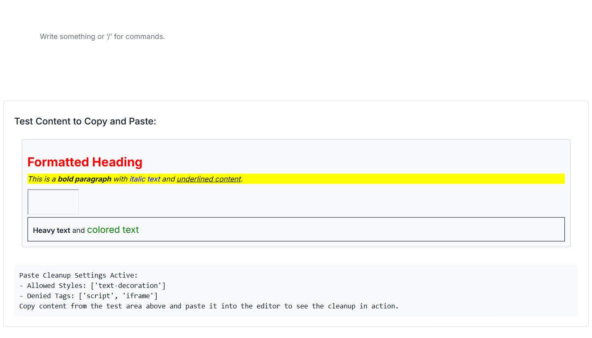
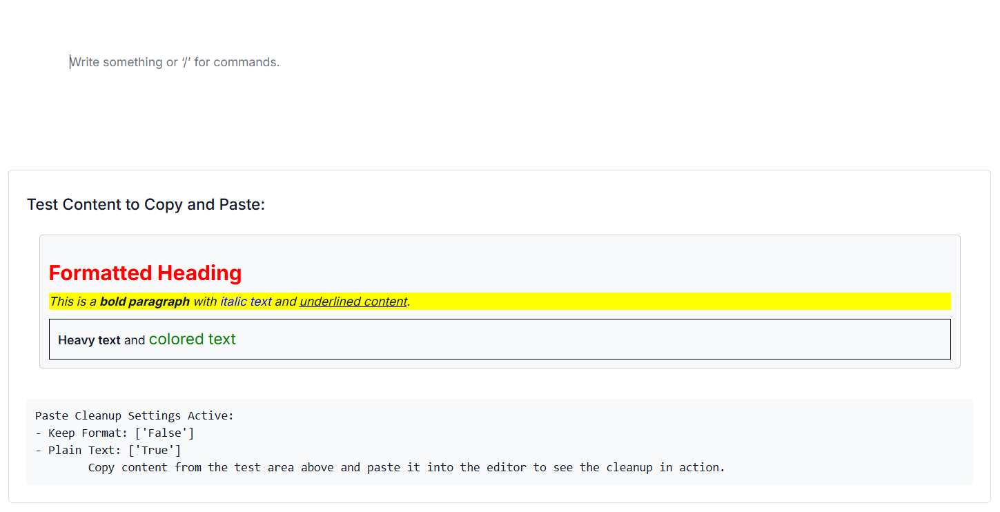

# Paste Clean-up in ##Platform_Name## Block Editor control

The Block Editor control provides robust paste clean-up functionalities to ensure that pasted content integrates seamlessly and maintains consistency with the editor's styling and structure. This helps in removing unwanted formatting, scripts, or elements often copied from external sources like web pages or word processors.

You can configure the paste settings using the [PasteCleanupSettings](https://help.syncfusion.com/cr/aspnetmvc-js2/Syncfusion.EJ2.BlockEditor.PasteCleanupSettings.html) property in the Block Editor control. This property allows you to define various options to control how content is pasted into the editor.

## Configuring allowed styles

The [AllowedStyles](https://help.syncfusion.com/cr/aspnetmvc-js2/Syncfusion.EJ2.BlockEditor.PasteCleanupSettings.htmlAllowedStyles) property in the [`PasteCleanupSettings`](https://help.syncfusion.com/cr/aspnetmvc-js2/Syncfusion.EJ2.BlockEditor.PasteCleanupSettings.html) model allows you to define which CSS styles are permitted when content is pasted into the editor. Any style not included in this list will be stripped from the pasted content. This ensures that only desired visual attributes are preserved, maintaining a clean and consistent look.

By default, following styles are allowed:

['font-weight', 'font-style', 'text-decoration', 'text-transform'].

In the below example, only `font-weight` and `font-style` styles will be retained from the pasted content. All other inline styles will be removed.

```cshtml
@{
    var allowedStyles = new string[] { "font-style", "font-weight" };
}
<div id='blockeditor-container'>
    @Html.EJS().BlockEditor("block-editor").PasteCleanupSettings(new PasteCleanupSettings() { AllowedStyles = allowedStyles }).Render()
</div>
```

## Setting denied tags

The [DeniedTags](https://help.syncfusion.com/cr/aspnetmvc-js2/Syncfusion.EJ2.BlockEditor.PasteCleanupSettings.htmlDeniedTags) property in [`PasteCleanupSettings`](https://help.syncfusion.com/cr/aspnetmvc-js2/Syncfusion.EJ2.BlockEditor.PasteCleanupSettings.html) enables you to specify HTML tags that should be completely removed from the pasted content. This is particularly useful for stripping out potentially problematic or irrelevant tags, such as `script` tags, `iframe`s, or any other elements you don't want to allow in the editor. By default, the [DeniedTags](https://help.syncfusion.com/cr/aspnetmvc-js2/Syncfusion.EJ2.BlockEditor.PasteCleanupSettings.htmlDeniedTags) property is an empty array, meaning no tags are removed by default.

In the below example, any `<script>` or `<iframe>` tags found in the pasted content will be removed, preventing unwanted behavior or styling issues.

```cshtml
@{
    var deniedTags = new string[] { "script", "iframe" };
}
<div id='blockeditor-container'>
    @Html.EJS().BlockEditor("block-editor").PasteCleanupSettings(new PasteCleanupSettings() { DeniedTags = deniedTags }).Render()
</div>
```

Below example demonstrates the usage of paste settings that allows only specific styles and also removes the specific tags from the pasted content.












## Disable Keep format

By default, the editor attempts to keep the formatting of the pasted content (e.g., bold, italics, links). You can disable this behavior by setting the [KeepFormat](https://help.syncfusion.com/cr/aspnetmvc-js2/Syncfusion.EJ2.BlockEditor.PasteCleanupSettings.htmlKeepFormat) property to `false` in [`PasteCleanupSettings`](https://help.syncfusion.com/cr/aspnetmvc-js2/Syncfusion.EJ2.BlockEditor.PasteCleanupSettings.html). When disabled, the editor will primarily paste the content as plain text regardless of [AllowedStyles](https://help.syncfusion.com/cr/aspnetmvc-js2/Syncfusion.EJ2.BlockEditor.PasteCleanupSettings.htmlAllowedStyles)

```cshtml

<div id='blockeditor-container'>
    @Html.EJS().BlockEditor("block-editor").PasteCleanupSettings(new PasteCleanupSettings() { KeepFormat = false }).Render()
</div>

```

## Allowing plain text

To paste content purely as plain text, stripping all HTML tags and inline styles, you can set the [PlainText](https://help.syncfusion.com/cr/aspnetmvc-js2/Syncfusion.EJ2.BlockEditor.PasteCleanupSettings.htmlPlainText) property to `true` in [`PasteCleanupSettings`](https://help.syncfusion.com/cr/aspnetmvc-js2/Syncfusion.EJ2.BlockEditor.PasteCleanupSettings.html). This ensures that only the raw textual content is inserted into the editor, making it ideal for maintaining strict content consistency. By default, the [PlainText](https://help.syncfusion.com/cr/aspnetmvc-js2/Syncfusion.EJ2.BlockEditor.PasteCleanupSettings.htmlPlainText) property is set to `false`.

```cshtml

<div id='blockeditor-container'>
    @Html.EJS().BlockEditor("block-editor").PasteCleanupSettings(new PasteCleanupSettings() { PlainText = true }).Render()
</div>

```

Below example demonstrates the usage of paste settings that disables the keep format and allows plain text.












### Events

The following events are available when pasting content into the editor.

|Name|Args|Description|
|---|---|---|
|`BeforePasteCleanup`|BeforePasteCleanupEventArgs|Triggers before the content is pasted into the editor.|
|`AfterPasteCleanup`|AfterPasteCleanupEventArgs|Triggers after the content is pasted into the editor.|

Below snippet demonstrates how to configure above events in the editor.

```cshtml

<div id='blockeditor-container'>
    @Html.EJS().BlockEditor("block-editor").BeforePasteCleanup("beforePaste").AfterPasteCleanup("afterPaste").Render()
</div>

<script>
    function beforePaste(args) {
        // You may cancel paste if content contains restricted elements
    }
    function afterPaste(args) {
        // Process pasted content or update UI
    }
</script>

```