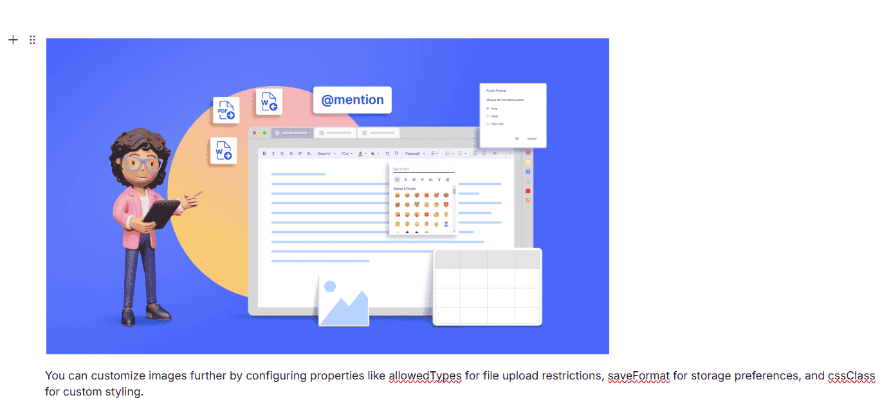

# Embed Blocks in ASP.NET Core Block Editor control

Block Editor supports addition of embeds to help you organize, showcase contents and format your content effectively.

## Image Block

You can use the [Image](https://help.syncfusion.com/cr/aspnetcore-js2/Syncfusion.EJ2.BlockEditor.BlockType.html#Syncfusion_EJ2_BlockEditor_BlockType_Image) block to showcase an image content within your editor.

### Configure Image Block

You can render an [Image](https://help.syncfusion.com/cr/aspnetcore-js2/Syncfusion.EJ2.BlockEditor.BlockType.html#Syncfusion_EJ2_BlockEditor_BlockType_Image) block by setting the [blockType](https://help.syncfusion.com/cr/aspnetcore-js2/Syncfusion.EJ2.BlockEditor.BlockType.html) property to [Image](https://help.syncfusion.com/cr/aspnetcore-js2/Syncfusion.EJ2.BlockEditor.BlockType.html#Syncfusion_EJ2_BlockEditor_BlockType_Image) in the block model. The `properties` property allows you to configure the image source, allowed file types, display dimensions, and more.

#### Global Image Settings

You can configure global settings for image blocks using the [ImageBlockSettings](https://help.syncfusion.com/cr/aspnetcore-js2/Syncfusion.EJ2.BlockEditor.BlockEditor.html#Syncfusion_EJ2_BlockEditor_BlockEditor_ImageBlockSettings) property in the Block Editor root configuration. This ensures consistent behavior for image uploads, resizing, and display.

The [ImageBlockSettings](https://help.syncfusion.com/cr/aspnetcore-js2/Syncfusion.EJ2.BlockEditor.BlockEditor.html#Syncfusion_EJ2_BlockEditor_BlockEditor_ImageBlockSettings) property supports the following options:

| Property | Description | Default Value |
|----------|-------------|---------------|
| saveFormat | Specifies the format to save the image. | `Base64` |
| allowedTypes | Specifies allowed image file types for upload. | `['.jpg', '.jpeg', '.png']` |
| width | Specifies the default display width of the image. | `auto` |
| height | Specifies the default display height of the image. | `auto` |
| enableResize | Enables or disables image resizing. | `true` |
| minWidth | Minimum width allowed for resizing. | `''` |
| maxWidth | Maximum width allowed for resizing. | `''` |
| minHeight | Minimum height allowed for resizing. | `''` |
| maxHeight | Maximum height allowed for resizing. | `''` |

#### Configure Image Block Properties

The [Image](https://help.syncfusion.com/cr/aspnetcore-js2/Syncfusion.EJ2.BlockEditor.BlockType.html#Syncfusion_EJ2_BlockEditor_BlockType_Image) block `properties` property in the block model supports the following options:

| Property | Description | Default Value |
|----------|-------------|---------------|
| src | Specifies the image path. | `''` |
| width | Specifies the display width of the image. | `''` |
| height | Specifies the display height of the image. | `''` |
| altText | Specifies the alternative text to display when the image cannot be loaded. | `''` |

### BlockType & Properties

The following example demonstrates how to pre-configure an [Image](https://help.syncfusion.com/cr/aspnetcore-js2/Syncfusion.EJ2.BlockEditor.BlockType.html#Syncfusion_EJ2_BlockEditor_BlockType_Image) block in the editor.

```typescript
// Adding image block
 {
    blockType = "Image",
    properties = new
    {
        src = "https://cdn.syncfusion.com/ej2/richtexteditor-resources/RTE-Overview.png",
        width = '200px',
        height = '100px',
        altText = '',
    }
}
```

The below sample demonstrates the configuration of image block in the Block Editor.










