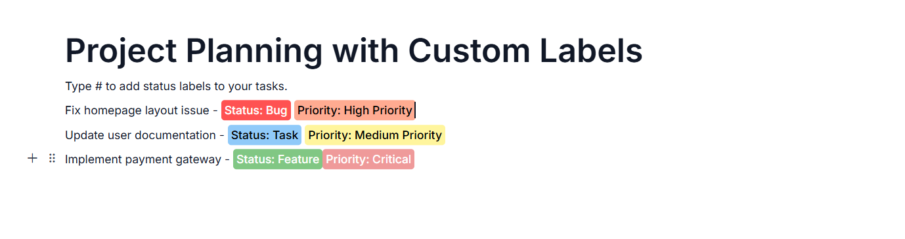

# Inline Content  in ASP.NET Core Block Editor control

Content in the Block Editor is managed through the `content` property of blocks.

Each content can have properties like `id`, `contentType`, `content`, `properties`, and more to customize the appearance and behavior of your text.

## Setting content type

You can specify the type of content using the `contentType` property. The Block Editor supports several content types through the `ContentType` enum:

| Built-in Content Type  | Description                         |
|------------------------|-------------------------------------|
| Text                   | Represents plain text content.      |
| Link                   | Represents a hyperlink.             |
| Mention                | Represents a user mention.          |
| Label                  | Represents a label or tag.          |

> By default, the content type is set to `Text`.

### ContentType 

```typescript
// Adding inline text
{
    blockType = "Paragraph",
    content = new List<object>()
        {
        new { contentType = 'Text', content = "Inline Text" }
    }
}
```

## Configure text content

You can configure Text content by setting the `contentType` property to `Text`. The default content type is `Text`.

## Configure hyperlink

To create a hyperlink, set the `contentType` property to `Link`. You can configure the link's URL using the `properties` property.

### Configure link properties

Link settings control the behavior and properties of hyperlinks in your content. You can configure link settings using the `properties` property.

Link settings accepts the following options:

| Option                     | Description                                                       | Default Value |
| -------------------------  | ----------------------------------------------------------------- | ------------- |
|`url`| Specifies the destination URL of the link.     | `''`          |

### ContentType & Properties

```typescript
{
    blockType = "Paragraph",
    content = new List<object>()
        {
        new 
        {
            contentType = 'Link',
            content = 'hyperlinks',
            properties = {
                url = 'https://ej2.syncfusion.com/documentation',
            }
        }
    }
}
```

## Configure Label

You can render labels by setting the `contentType` property as `Label`. Additionally, by configuring the `properties` property, you can customize how labels behave in your editor. This setup allows you to define the trigger character and specify the available label items.

### Built-in items

The Block Editor comes with offers different built-in options. These include:

-   **Progress**: In-progress, On-hold, Done
-   **Priority**: High, Medium, Low

### Customize label

You can customize the labels by using the `properties` property with type `Label`.

### ContentType & Properties

```typescript
// Adding inline label
{
    blockType = "Paragraph",
    content = new List<object>()
        {
        new {contentType = 'Label', properties = { lableId = "progress" }}
        }
}
```

### Trigger Character configuration

You can use the `triggerChar` property to specify the character that will trigger the label suggestions popup while typing. The default trigger character is `$`.

### Label items configuration

The `labelItems` array allows you to define the available labels in your editor. Each label item can have the following properties:

| Property    | Description                                 |
|-------------|---------------------------------------------|
| `id`          | Unique identifier for the label             |
| `text`        | Display text for the label                  |
| `groupHeader` | Category/group name for organizing labels   |
| `labelColor`  | Background color of the label               |
| `iconCss`  | CSS class for an icon to display with label |

When users type the trigger character followed by text, a popup will appear showing matching label items from which they can select. The selected label will be inserted into the content as a Label content item.

### Using labels with group headers

Labels with the same `groupHeader` value will be grouped together in the label selection popup:

The below sample demonstrates the customization of labels in the Block Editor.












## Configure mention

Mentions are references to users or entities that can be inserted into your content. You can configure mention content by setting the `contentType` property to `Mention`.

Mentions are typically triggered by the `@` character and are linked to the `users` collection defined in the Block Editor.

### ContentType

```typescript
// Adding inline code
{
    blockType = "Paragraph",
    content = new List<object>()
    {
        new { 
            contentType = "Mention", properties = new { userId = "user1" }
        }
    }
}
```

## Applying inline styles

The Block Editor allows you to apply rich formatting to block contents using the `styles` property.

The `styles` property supports the following formatting options:

| Style Property | Description | Default Value |
|---------------|-------------|---------------|
| bold | Makes the text bold | false |
| italic | Makes the text italicized | false |
| underline | Adds an underline to the text | false |
| strikethrough | Adds a line through the text | false |
| color | Sets the text color (HEX or RGBA format) | '' |
| backgroundColor | Sets the background color for the text | '' |
| superscript | Displays the text as superscript | false |
| subscript | Displays the text as subscript | false |
| uppercase | Converts the text to uppercase | false |
| lowercase | Converts the text to lowercase | false |
| inlineCode | Converts the text to InlineCode | false |

You can apply one or more of these styles to any content element for rich text formatting.