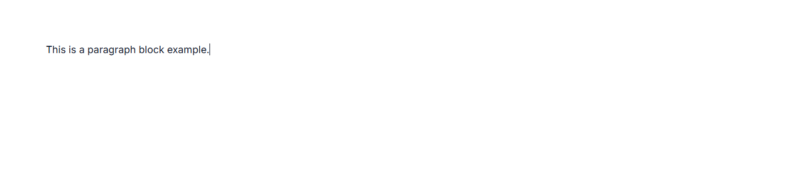
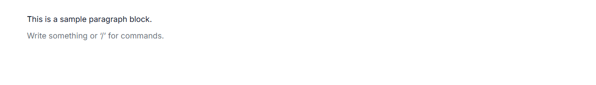
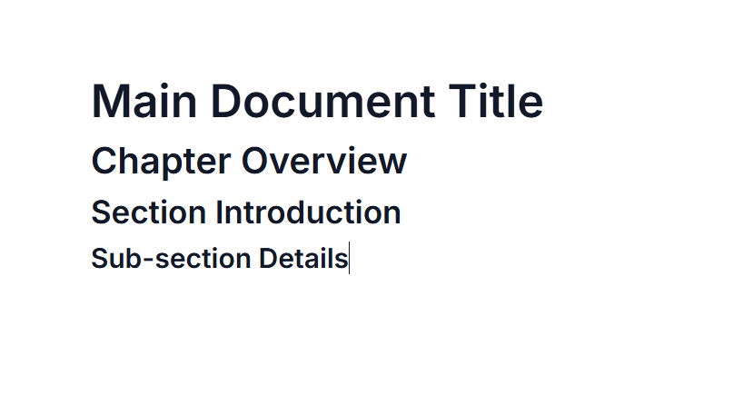
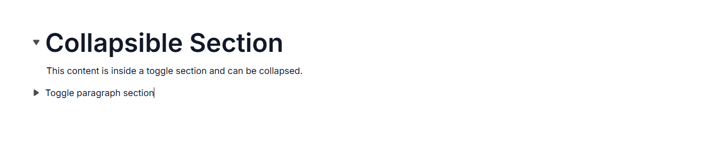
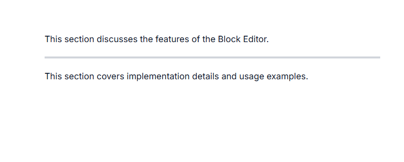
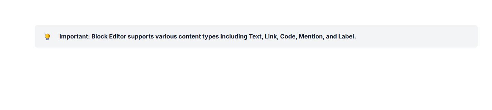
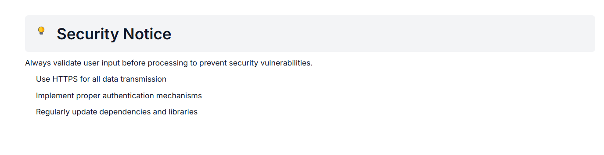

# Typography Blocks in ##Platform_Name## Block Editor control

Typography blocks are essential for organizing and presenting text-based content in your documents. The Block Editor component supports various structural blocks—such as Paragraph, Heading, Collapsible Block, Divider, Quote, and Callout to help you format and structure content effectively.

## Configure paragraph block

You can render Paragraph blocks by setting the [blockType](https://help.syncfusion.com/cr/aspnetcore-js2/Syncfusion.EJ2.BlockEditor.BlockType.html) property as [Paragraph](https://help.syncfusion.com/cr/aspnetcore-js2/Syncfusion.EJ2.BlockEditor.BlockType.html#Syncfusion_EJ2_BlockEditor_BlockType_Paragraph). Paragraph blocks are the most common type, used for regular text content. They provide standard text formatting options and serve as the default block type.

### BlockType  

```typescript
// Adding paragraph block
{
    blockType = 'Paragraph',
    content = new List<object>
    {
        new 
            {
                contentType = 'Text',
                content = 'This is a paragraph block example.'
            }
    }
}
```

The below sample demonstrates the configuration of paragraph block in the Block Editor.












### Configure placeholder

You can configure placeholder text for block using the `placeholder` in the `properties` property. This text appears when the block is empty. The default placeholder for the paragraph block is `Write something or ‘/’ for commands.`.

### BlockType & Properties

```typescript
// Adding placeholder
 {
    blockType = 'Paragraph',
    properties = new { placeholder = "Start typing ..." }
}
```

The below sample demonstrates the configuration of placeholder in the Block Editor for the paragraph block.












## Configure heading block

You can render Heading blocks by setting the [blockType](https://help.syncfusion.com/cr/aspnetcore-js2/Syncfusion.EJ2.BlockEditor.BlockType.html) property as [Heading](https://help.syncfusion.com/cr/aspnetcore-js2/Syncfusion.EJ2.BlockEditor.BlockType.html#Syncfusion_EJ2_BlockEditor_BlockType_Heading). Heading blocks are used to create document titles and section headers of varying importance. These blocks help structure your content hierarchically, making it easier to read and navigate.

### Configure levels

You can configure the heading blocks using the property `level` in the `properties` property.
The heading level representing a title `level: 1`, heading `level: 2`, subheading `level: 3` and a subsection by `level: 4`.

### BlockType & Properties

```typescript
// Adding heading block
{
    blockType = "Heading",
    content = new List<object>
    {
        new { contentType = "Text", content = "Heading" }
    },
     // levels range from 1 to 4
    properties = new { level = 4 }
}
```

The below sample demonstrates the configuration of heading block in the Block Editor.












### Configure placeholder

You can configure placeholder text for block using the `placeholder` in the `properties` property. This text appears when the block is empty. The default placeholder for heading block is `Heading{level}`.

### BlockType & Properties

```typescript
// Adding placeholder
 {
    blockType = 'Paragraph',
    properties = new {level = 4 , placeholder = "Heading block" }
}
```

## Configure collapsible blocks

You can render Collapsible blocks by setting the [blockType](https://help.syncfusion.com/cr/aspnetcore-js2/Syncfusion.EJ2.BlockEditor.BlockType.html) property as [CollapsibleParagraph](https://help.syncfusion.com/cr/aspnetcore-js2/Syncfusion.EJ2.BlockEditor.BlockType.html#Syncfusion_EJ2_BlockEditor_BlockType_CollapsibleParagraph) or [CollapsibleHeading](https://help.syncfusion.com/cr/aspnetcore-js2/Syncfusion.EJ2.BlockEditor.BlockType.html#Syncfusion_EJ2_BlockEditor_BlockType_CollapsibleHeading). Collapsible blocks allow users to expand or collapse sections, providing a way to hide or show content as needed.

### Configure levels

You can configure the CollapsibleHeading using the property `level` inside the `properties` property . The levels can be varied from `level: 1` to `level: 4`.

### Configure children

The Block Editor supports hierarchical content structures through the `children` property. This property can be achieved through `properties` property that allows you to create nested blocks, which is applicable only for Callout and Collapsible blocks.

Child blocks can be configured with all the same properties as top-level blocks.

### Configure parent id

To establish a clear parent-child relationship, the `parentId` in the `properties` of each child block must match the `id` of its parent block.

This structure is essential for maintaining nested relationships within the editor.

### Configure expanded state

You can control whether a block is expanded or collapsed using the `isExpanded` in the `properties` property. By default, this property is set to `false`, meaning the block will be collapsed initially. This setting is only applicable to Collapsible blocks.

### BlockType & Properties

```typescript
	// Configuring CollapsibleHeading block
    new BlockModel
    {
        blockType = "CollapsibleHeading",
        properties = new
        {
                level=1,
                isExpanded = true,
                children = new List<BlockModel>(){ 
                    // your actions
                }
        }
    },
    // Configuring CollapsibleParagraph block
    new BlockModel
    {
        blockType = "CollapsibleParagraph",
        properties = new
        {
                isExpanded = false,
                children = new List<BlockModel>()
                {
                    // your actions
                }
        }
        }
```

The below sample demonstrates the configuration of collapsibleHeading and collapsibleParagraph blocks in the Block Editor.












### Configure placeholder

You can configure placeholder text for block using the `placeholder` in the `properties` property. This text appears when the block is empty. The default placeholder for collapsible heading and collapsible paragraph is [CollapsibleParagraph](https://help.syncfusion.com/cr/aspnetcore-js2/Syncfusion.EJ2.BlockEditor.BlockType.html#Syncfusion_EJ2_BlockEditor_BlockType_CollapsibleParagraph) and [CollapsibleHeading](https://help.syncfusion.com/cr/aspnetcore-js2/Syncfusion.EJ2.BlockEditor.BlockType.html#Syncfusion_EJ2_BlockEditor_BlockType_CollapsibleHeading) respectively.

```typescript
	// Configuring CollapsibleHeading block
    new BlockModel
    {
        blockType = "CollapsibleHeading",
        properties = new
        {
                level=1,
                isExpanded = true,
                placeholder = "collapsible heading"
        }
    },
    // Configuring CollapsibleParagraph block
    new BlockModel
    {
        blockType = "CollapsibleParagraph",
        properties = new
        {
                isExpanded = false,
                placeholder = "collapsible paragraph"
        }
        }
```

## Configure divider block

Divider blocks insert horizontal lines that separate different sections of content. You can render Divider blocks by setting the [blockType](https://help.syncfusion.com/cr/aspnetcore-js2/Syncfusion.EJ2.BlockEditor.BlockType.html) property as [Divider](https://help.syncfusion.com/cr/aspnetcore-js2/Syncfusion.EJ2.BlockEditor.BlockType.html#Syncfusion_EJ2_BlockEditor_BlockType_Divider).

### BlockType 

```typescript
// Adding divider block
{
    blockType = "Divider"
},
```

The below sample demonstrates the configuration of divider block in the Block Editor.












## Configure quote block

You can render Quote blocks by setting the [blockType](https://help.syncfusion.com/cr/aspnetcore-js2/Syncfusion.EJ2.BlockEditor.BlockType.html) property as [Quote](https://help.syncfusion.com/cr/aspnetmvc-js2/Syncfusion.EJ2.BlockEditor.BlockType.html#Syncfusion_EJ2_BlockEditor_BlockType_Quote). Quote blocks are specially styled for quotations or excerpts.

### BlockType & Properties

```typescript
// Adding divider block
{
    blockType = "Quote",
    content = new List<object>
    {
        new { contentType = "Text", content = "“Quotes are perfect for highlighting key messages or testimonials.”" }
    }
}
```

The below sample demonstrates the configuration of quote block in the Block Editor.











### Configure placeholder

You can configure placeholder text for block using the `placeholder` in the `properties` property. This text appears when the block is empty. The default placeholder for quote block is `Write a quote`.

```typescript
// Adding placeholder value to blocktype
{
    blockType =  'Quote',
    properties = new { placeholder = "Quote" }
}
```

## Configure callout block

You can render Callout blocks by setting the [blockType](https://help.syncfusion.com/cr/aspnetcore-js2/Syncfusion.EJ2.BlockEditor.BlockType.html) property as [Callout](https://help.syncfusion.com/cr/aspnetmvc-js2/Syncfusion.EJ2.BlockEditor.BlockType.html#Syncfusion_EJ2_BlockEditor_BlockType_Callout). They're useful for notes, warnings, or tips that require special attention.

### BlockType & Properties

```typescript
// Adding callout block
  {
    blockType = "Callout",
    properties = new {
    children = new List<BlockModel>()
    {
            new BlockModel()
            {
                    blockType = "Paragraph",
                    content = new List<object>(){
                            new{
                                    contentType = "Text",
                                    content = "Important information: This is a callout block used to highlight important content"
                            }
                    }
            }
    }
    }
  }

```

The below sample demonstrates the configuration of callout block in the Block Editor.












### Configure children

The Block Editor supports hierarchical content structures through the `children` in the `properties` property. This property allows you to create nested blocks, which is applicable only for Callout and Collapsible blocks.

Child blocks can be configured with all the same properties as top-level blocks.

### Configure parent id

To establish a clear parent-child relationship, the `parentId` in the `properties` of each child block must match the `id` of its parent block.

This structure is essential for maintaining nested relationships within the editor.

The below sample demonstrates the configuration of children in the Block Editor using parentId.










