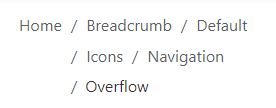
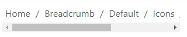
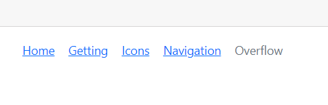

# Overflow Mode in breadcrumb

## Overflow Mode

In the Breadcrumb component, `maxItems` and `overflowMode` properties were used to limit the number of breadcrumb items to be displayed.

In the following example, the maxItems is set as 3 with overflowMode as Default. To prevent breadcrumb item navigation, the `enableNavigation` property has been set to false in the Breadcrumb component.

The following overflow modes are available in the Breadcrumb component.

* Collapsed
* Menu 
* Wrap
* Scroll
* Hidden
* None

## Collapsed

Collapsed mode shows the first and last Breadcrumb items and hides the remaining items with a collapsed icon. When the collapsed icon is clicked, all items become visible and navigable.
























Output be like the below.

## Menu

Menu mode shows the number of Breadcrumb items that can be accommodated within the container space and creates a submenu with the remaining items.
























Output be like the below.

## Wrap

Wrap mode wraps the items to multiple lines when the Breadcrumb’s width exceeds the container space.
























Output be like the below.

## Scroll

Scroll mode shows an HTML scroll bar when the Breadcrumb’s width exceeds the container space.
























Output be like the below.

## Hidden

Hidden mode shows the maximum number of items possible in the container space and hides the remaining items. Clicking on a previous item will make the hidden item visible.
























Output be like the below.

## None

None mode shows all the items on a single line.
























Output be like the below.

