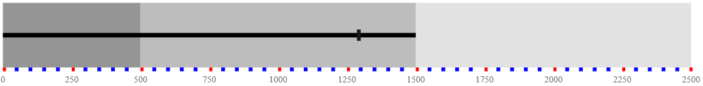
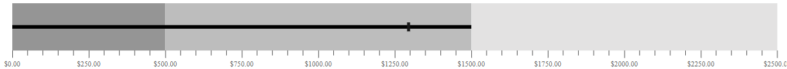
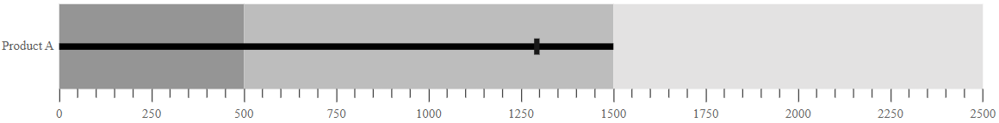
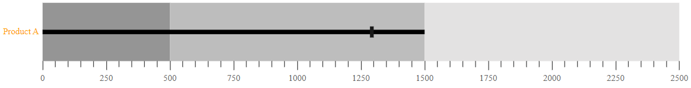

# Axis Customization

## MajorTickLines and MinorTickLines Customization

You can customize the `width`, `color`, and `size` of minor and major tick lines using the
[`majorTickLines`](https://help.syncfusion.com/cr/aspnetcore-js2/Syncfusion.EJ2.Charts.BulletChartMajorTickLines.html) and [`minorTickLines`](https://help.syncfusion.com/cr/aspnetcore-js2/Syncfusion.EJ2.Charts.BulletChartMinorTickLines.html) properties of the bullet-chart.

The following properties can be used to customize `majorTicklines` and `minorTicklines`.

* **width** - Specifies the width of ticklines.
* **height** - Specifies the height of ticklines.
* **color** - Specifies the color of ticklines.
* **useRangeColor** - Specifies the color of ticklines and represents the color from corresponding range colors.

## Tick Placement

The major and the minor ticks can be placed **inside** or **outside** the ranges using the `tickPosition` property.

## Label Format

Axis numeric labels can be formatted by using the `labelFormat` property. Axis labels support all globalize formats.





The following table describes the result of applying some commonly used formats to numeric axis labels.

<!-- markdownlint-disable MD033 -->
<table>
<tr>
<td><b>Label Value</b></td>
<td><b>Label Format property value</b></td>
<td><b>Result </b></td>
<td><b>Description </b></td>
</tr>
<tr>
<td>1000</td>
<td>n1</td>
<td>1000.0</td>
<td>The Number is rounded to 1 decimal place</td>
</tr>
<tr>
<td>1000</td>
<td>n2</td>
<td>1000.00</td>
<td>The Number is rounded to 2 decimal place</td>
</tr>
<tr>
<td>1000</td>
<td>n3</td>
<td>1000.000</td>
<td>The Number is rounded to 3 decimal place</td>
</tr>
<tr>
<td>0.01</td>
<td>p1</td>
<td>1.0%</td>
<td>The Number is converted to percentage with 1 decimal place</td>
</tr>
<tr>
<td>0.01</td>
<td>p2</td>
<td>1.00%</td>
<td>The Number is converted to percentage with 2 decimal place</td>
</tr>
<tr>
<td>0.01</td>
<td>p3</td>
<td>1.000%</td>
<td>The Number is converted to percentage with 3 decimal place</td>
</tr>
<tr>
<td>1000</td>
<td>c1</td>
<td>$1000.0</td>
<td>The Currency symbol is appended to number and number is rounded to 1 decimal place</td>
</tr>
<tr>
<td>1000</td>
<td>c2</td>
<td>$1000.00</td>
<td>The Currency symbol is appended to number and number is rounded to 2 decimal place</td>
</tr>
</table>

## GroupingSeparator

To separate groups of thousands, use the [`enableGroupSeparator`](https://help.syncfusion.com/cr/aspnetcore-js2/Syncfusion.EJ2.Charts.BulletChartBuilder.html) property of bullet-chart.
To separate the groups of thousands, set the `enableGroupSeparator` property to **true**.

## Custom Label Format

Using the `labelFormat` property, axis labels can be specified with a custom defined format in addition to the axis value. The label format uses a placeholder such as **${value}K**, which represents the axis label.





## Label Placement

You can customize the axis labels `inside` or `outside` the bullet-chart using the [`labelPosition`](https://help.syncfusion.com/cr/aspnetcore-js2/Syncfusion.EJ2.Charts.LabelPosition.html) property.

## Opposed Position

To place an axis opposite to its original position, set the `opposedPosition` property to **true**.

## Category Label

The Bullet Chart supports X-axis label by specifying the property from the data source to the `categoryField`. It helps to understand the input data in a more efficient way.





## Category Label Customization

The label color, opacity, font size, font family, font weight, and font style can be customized by using the `categoryLabelStyle` setting for category and the `labelStyle` setting for axis label. The `useRangeColor` property specifies the color of the axis label and represents the color from the corresponding range colors.





