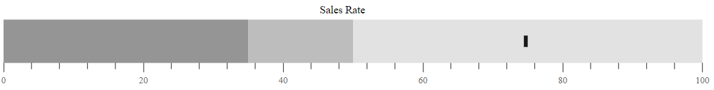
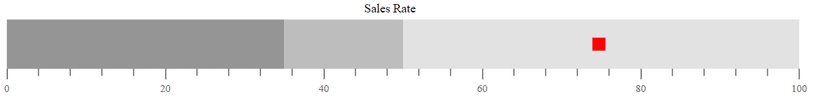

# Target Bar

The line marker that runs perpendicular to the orientation of the graph is known as the **Comparative Measure** and it is used as a target marker to compare against the feature measure value. This is also called as the **Target Bar** in the Bullet Chart. To display the target bar, the `targetField` should be mapped to the appropriate field from the datasource.
























## Types of Target Bar

The shape of the target bar can be customized using the `targetTypes` property and it supports **Circle**, **Cross**, and **Rect** shapes. The default type of the target bar is **Rect**.
























## Target Bar Customization

The following properties can be used to customize the Target Bar.

* `targetColor` - Specifies the fill color of Target Bar.
* `targetWidth` - Specifies the width of Target Bar.
























