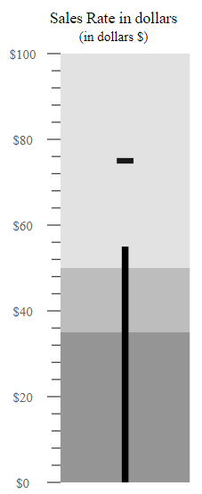
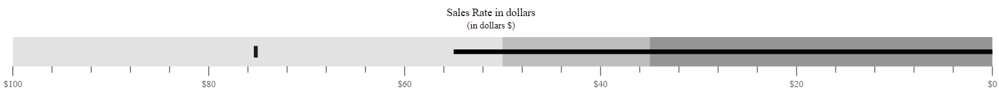
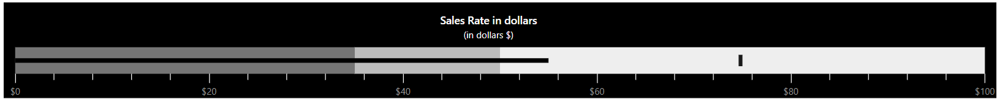

# Customization

## Orientation

The Bullet Chart can be rendered in different orientations such as **Horizontal** or **Vertical** via the `orientation` property. By default, the Bullet Chart is rendered in the **Horizontal** orientation.
























## Right-to-left (RTL)

The Bullet Chart supports the right-to-left rendering that can be enabled by setting the `enableRtl` property to **true**.
























## Animation

The actual and the target bar supports the linear animation via the `animation` setting. The speed and the delay are controlled using the `duration` and `delay` properties respectively.
























## Theme

The Bullet Chart supports different type of themes via the `theme` property.
























