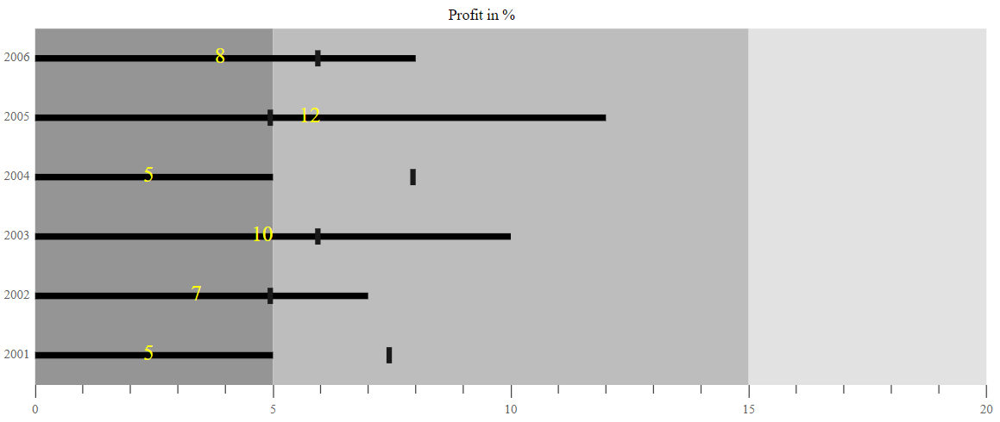

# Data Label

Data Labels are used to identify the value of actual bar in the Bullet Chart component. The Data Labels will be shown by specifying the `dataLabel` setting's `enable` property to **true**.





## Data Label Customization

Data Labels color, opacity, font size, font family, font weight, and font style can be customized using the `labelStyle`.





