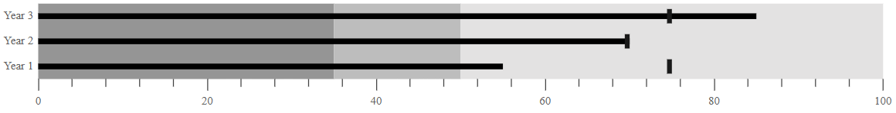

# Ranges

Ranges represent the quality of a specific range such as **Good**, **Bad** and **Satisfactory** in the Bullet Chart scale. The ending point of a qualitative range is specified in the `end` property in `ranges`. The `minimum` value of a quantitative scale is considered the starting point of the first range or the previous range end point.
























## Color Customization

Enhance the readability of ranges with color and opacity. It can be applied using the `color` and `opacity` properties in `ranges`.
























