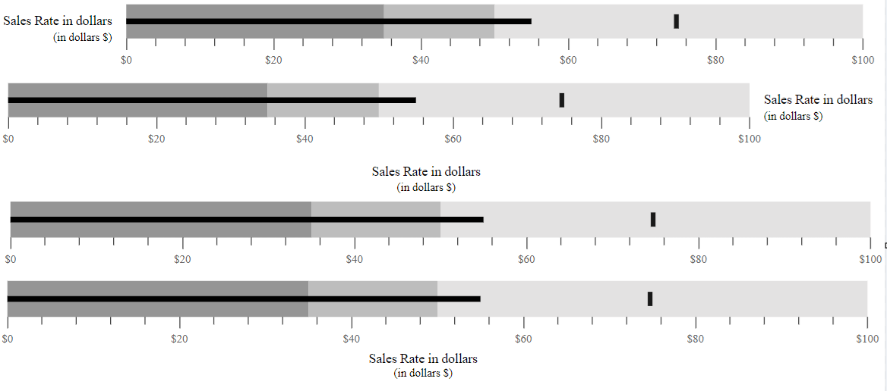
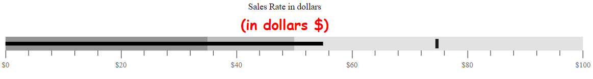

# Title and Subtitle

## Title

The title of the Bullet Chart displays the information about the data plotted by specifying it in the `title` property.
























## Subtitle

To show additional information about the data plotted, the Bullet Chart can also be given a subtitle using the `subtitle` property.
























## Title and SubTitle Position

The title and the subtitle positions can be customized using the `titlePosition` property. Possible positions are **Left**, **Right**, **Top**, and **Bottom**.

### Position as Left

By setting the `titlePosition` to **Left**, you can display the title and subtitle at the left side of the Bullet Chart.
























### Position as Right

By setting the `titlePosition` to **Right**, you can display the title and subtitle at the right side of the Bullet Chart.
























### Position as Top

By setting the `titlePosition` to **Top**, you can display the title and subtitle at the top of the Bullet Chart. The default title and subtitle positions of the Bullet Chart is **Top**.
























### Position as Bottom

By setting the `titlePosition` to **Bottom**, you can display the title and subtitle at the bottom of the Bullet Chart.
























## Title Customization

The title color, opacity, font size, font family, font weight, and font style can be customized using the `titleStyle` property.
























## SubTitle Customization

The sub-title color, opacity, font size, font family, font weight, and font style can be customized using the `subtitleStyle` property.
























