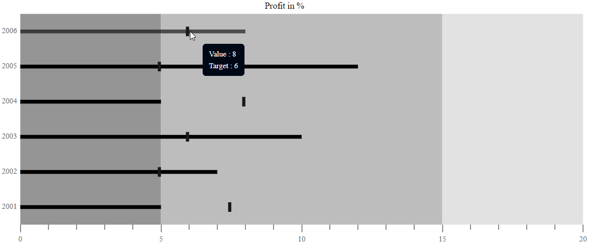

# Tooltip

When the mouse is hovered over a bar in the Bullet Chart, the tooltip displays important summary about the actual and the target bar values.

## Default Tooltip

By setting [`enable`](https://help.syncfusion.com/cr/aspnetcore-js2/Syncfusion.EJ2.Charts.BulletChartBuilder.html)property to true. By default tooltip is visible in bullet-chart.
The tooltip is not visible by default. To make it visible, set the `enable` property in the `tooltip` to **true**.
























## Tooltip Template

Any HTML elements can be displayed in the tooltip by using the `template` property of the `tooltip`. You can use the **${target}** and **${value}** as place holders in the HTML element to display the value and target values from the data source of corresponding data point.

## Tooltip Customization

The following properties can be used to customize the Bullet Chart tooltip.

The [`fill`](https://help.syncfusion.com/cr/aspnetcore-js2/Syncfusion.EJ2.Charts.BulletChartBuilder.html) and [`border`](https://help.syncfusion.com/cr/aspnetcore-js2/Syncfusion.EJ2.Charts.BulletChartBuilder.html) properties are used to customize the background color and border of the tooltip respectively. The [`textStyle`](https://help.syncfusion.com/cr/aspnetcore-js2/Syncfusion.EJ2.Charts.BulletChartBuilder.html) property in the tooltip is used to customize the font of the tooltip text.
* `fill` - Specifies the color of tooltip.
* `border` - Specifies the tooltip border color and width.
* `textStyle` - Specifies the tooltip font family, font style, font weight, color and size.
