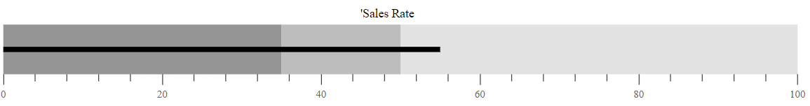

# Actual Bar

To display the primary data or the current value of the data being measured known as the **Feature Measure** that should be encoded as a bar. This is called as the **Actual Bar** or the **Feature Bar** in the Bullet Chart, and to display the actual bar the `valueField` should be mapped to the appropriate field from the data source.
























## Types of Actual Bar

The shape of the actual bar can be customized using the `type` property of the Bullet Chart. The actual bar contains `Rect` and `Dot` shapes. By default, the actual bar shape is Rect.
























## Actual Bar Customization

### Border Customization

Using the `valueBorder` property of the bullet chart, you can customize the border `color` and `width` of the actual bar.
























### Fill color and height Customization

Customize the fill color and height of the actual bar using the `valueFill` and `valueHeight` properties of the bullet chart.
























