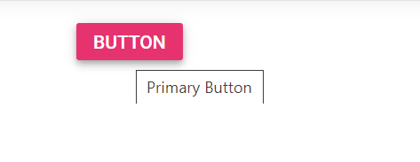

# Tooltip for Button Control

Tooltip can be shown on Button hover and it can be achieved by setting `title` attribute.





















N> [View Sample in GitHub](https://github.com/SyncfusionExamples/ASP-NET-Core-UG-Examples/tree/main/Button/ButtonHowToSample).