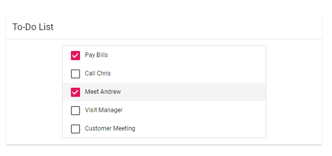

# Integrate other component inside the card

You can integrate any component inside the card element. Here ListView component is placed inside the card for showcasing the To-Do list.
























Output be like the below.

