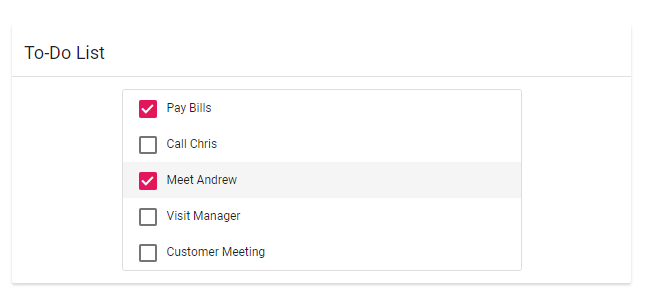

# Integrate other component inside the card in ##Platform_Name## Card

You can integrate any component inside the card element. Here, ListView component is placed inside the card for showcasing the To-Do list.





















N> [View Sample in GitHub](https://github.com/SyncfusionExamples/ASP-NET-Core-UG-Examples/tree/main/Card/CardUGSample).