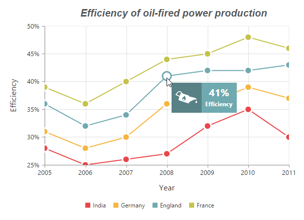
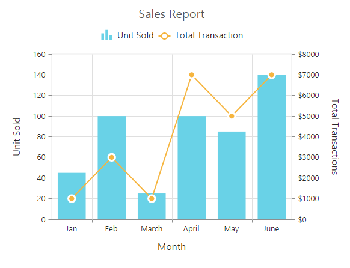

---
layout: post
title: Accessibility | ASP.NET MVC | Syncfusion
description: Accessibility 
platform: ej2-asp-core-mvc
control: Common 
publishingplatform: ##Platform_Name##
documentation: ug
--- 



# Chart Series

## Multiple Series

In EjChart, you can add multiple series object in the **Series** options. The series are rendered in the order it is added to the Series option, by default. You can change this order by using the **ZOrder** option.  



@(Html.EJ().Chart("chartContainer")

      // ...

     //Adding Multiple Series
     .Series(sr =>
     {
          // Add first series
         sr.Type(SeriesType.Column).Points(pt=>{
             pt.X("USA").Y(50).Add();
             //...
         }).Add();
          // Add second series
         sr.Type(SeriesType.Column).Points(pt => { 
             pt.X("USA").Y(70).Add(); 
             //...
         }).Add();
          // Add third series
         sr.Type(SeriesType.Column).Points(pt => { 
             pt.X("USA").Y(45).Add();
             //...
         }).Add();
     })
 )



[Click](http://mvc.syncfusion.com/demos/web/chart/column) here to view the multiple series online demo sample.

### Customizing all series together

By using the **CommonSeriesOptions**, you can customize the series options for all the series commonly, instead of setting the options directly on each series object. 

N> The inline properties of the series has the first priority and override the commonSeriesOptions.

The following code example explains on how to enable marker, tooltip and animation for the chart series by using the commonSeriesOptions.



    @(Html.EJ().Chart("chartContainer")

      // ...
      //Initializing Common Properties for all the series
      .CommonSeriesOptions(options=>options.Type(SeriesType.Line).EnableAnimation(true)
          .Border(border=>border.Width(2))
          .Marker(marker=>marker.Visible(true).Shape(ChartShape.Circle).Size(size=>size.Height(10).Width(10)))
          .Tooltip(tooltip=>tooltip.Visible(true).Template("Tooltip")))
     //Adding Multiple Series
     .Series(sr =>
     {
          // Add first series
         sr.Points(pt=>{
             pt.X("USA").Y(50).Add();
             //...
         }).Add();
          // Add second series
         sr.Points(pt => { 
             pt.X("USA").Y(70).Add(); 
             //...
         }).Add();
          // Add third series
         sr.Points(pt => { 
             pt.X("USA").Y(45).Add();
             //...
         }).Add();
     })
 )

 

## Combination Series

EjChart allows you to render the combination of different series in the chart. 



@(Html.EJ().Chart("chartContainer")

      // ...
    
     //Adding Multiple Series
     .Series(sr =>
     {
          // Add first series
         sr.Type(SeriesType.Column).Points(pt=>{
             pt.X("USA").Y(50).Add();
             //...
         }).Add();
          // Add second series
         sr.Type(SeriesType.Line).Points(pt => { 
             pt.X("USA").Y(70).Add(); 
             //...        
         }).Add();
     })
 )



[Click](http://mvc.syncfusion.com/demos/web/chart/combination) here to view the combination series online demo sample.

### Limitation of combination chart

* Bar, StackingBar, and StackingBar100 cannot be combined with the other Cartesian type series.

* Cartesian type series cannot be combined with the accumulation series Pie, Doughnut, Funnel, and Pyramid.

* Polar and Radar series cannot be combined with the accumulation and Cartesian type series.

When the combination of Cartesian and accumulation series types are added to the series option, the series that are similar to the first series are rendered and other series are ignored. The following code example illustrates this,  



@(Html.EJ().Chart("chartContainer")

      // ...
    
     .Series(sr =>
     {
          // Add line series
         sr.Type(SeriesType.Line).Points(pt=>{
             pt.X("Jan").Y(50).Add();
             //...
         }).Add();
          // Add pie series
         sr.Type(SeriesType.Pie).Points(pt => { 
             pt.X("Jan").Y(70).Add(); 
             //...        
         }).Add();
     })
 )



