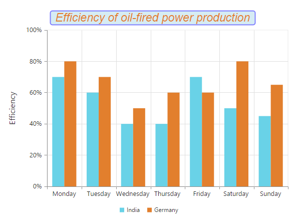
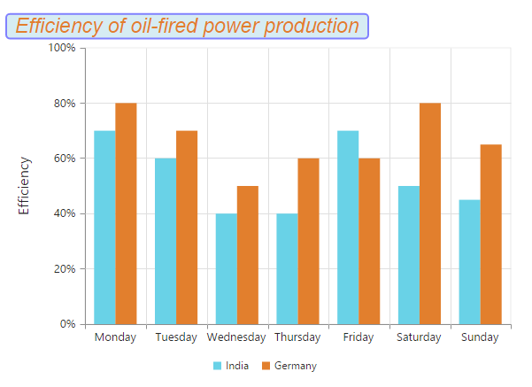
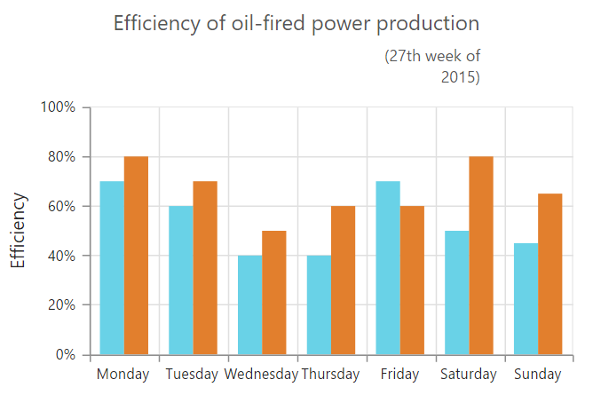

# Chart Title & Subtitle

## Title

By using the **Title** option, you can add the *Text* as well as customize its *Border, Background and Font*.



@(Html.EJ().Chart("container")
       // ... 
       //Adding text to chart title
       .Title(title => title.Text("Efficiency of oil-fired power production")
        //Change the title text background color
        .Background("lightblue")
        //Customizing Chart title border
        .Border(b => b.Color("blue").Width(2).CornerRadius(4.0).Opacity(0.5))
        //Customizing Chart title font
        .Font(f => f.Opacity(1).FontFamily("Arial").FontStyle("italic ").FontWeight("regular")
        .Color("#E27F2D").Size("23px"))
               , 
        // ... 
)



[Click](http://mvc.syncfusion.com/demos/web/chart/subtitle) here to view the Chart Title online demo sample.

We can trim, wrap and wrapAndTrim to the chart title using textOverflow property. The original text will be displayed as tooltip on mouse hover.



@(Html.EJ().Chart("chartContainer")
   //  ..
                // To enable title trim and wrap
        .Title(title => title.Text("Efficiency of oil-fired power production ")
                .EnableTrim("true")
                .MaximumWidth(150)
                .TextOverflow("trim"))
  //  ..
)



### Title Alignment

You can change the title alignment to *Center*, *Far* and *Near* by using the **TextAlignment** property of the chart title. 



@(Html.EJ().Chart("container")                
           // ... 

             .Title(title => title.Text("Efficiency of oil-fired power production")
                //Change title text alignment
                .TextAlignment(Syncfusion.JavaScript.DataVisualization.TextAlignment.Far)
                //... 
             } 
          // ...

       )

 

## Add Subtitle to the chart

By using the **SubTitle** option, you can add the SubTitle to the chart title and customize its *Border, Background and Font*. 



@(Html.EJ().Chart("container")
               
         // ... 
         .Title(title => title.Text("Efficiency of oil-fired power production")                
          //Add subtitle to chart title 
          .SubTitle(t2 => t2.Text("(in a week)")
          //Change the subtitle text background color
          .Background("lightblue")
          //Customizing Chart subtitle border
          .Border(b => b.Color("blue").Width(2).CornerRadius(4.0).Opacity(0.2))
          //Customizing Chart subtitle font 
          .Font(f => f.Opacity(1).FontFamily("Arial").FontStyle("italic").FontWeight("regular")
          .Color("#E27F2D").Size("12px"))
          
          // ...
 )



We can trim, wrap and wrapAndTrim to the chart subtitle using textOverflow property. The original text will be displayed as tooltip on mouse hover.



@(Html.EJ().Chart("chartContainer")
   //  ..
                // To enable sub-title trim and wrap
        .Title(title => title.SubTitle(sTitle => sTitle.Text("(In a Week) ")
                .EnableTrim("true")
                .MaximumWidth(150)
                .TextOverflow("wrap")))
  //  ..
)



### Subtitle Alignment

You can change the SubTitle alignment to *Center*, *Far* and *Near* by using the **TextAlignment** property of the SubTitle.



    @(Html.EJ().Chart("chartContainer")
          //...

         .Title(title = >title
              //...
              .SubTitle(st=>st
                   //Change subtitle text alignment
                   .TextAlignment(Syncfusion.JavaScript.DataVisualization.TextAlignment.Center)
                   //...
                 )
         )
         //...
     )



