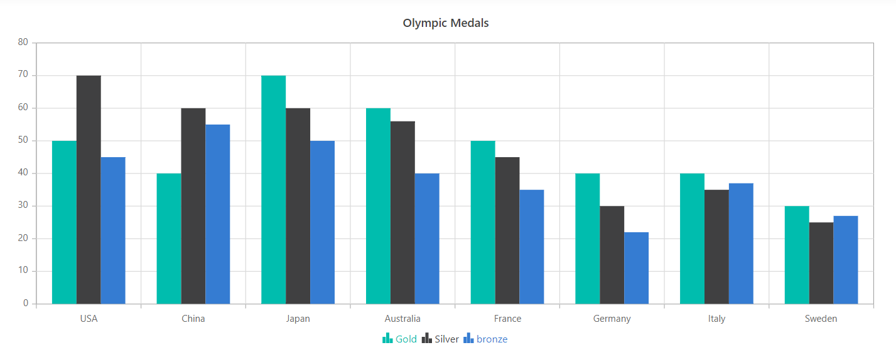

# Legend and in ##Platform_Name## Chart Component

The legend provides information about the series rendered in the chart and helps users identify each series by its color, shape, or style.

## Enable Legend

You can use legend for the chart by setting the [`Visible`](https://help.syncfusion.com/cr/aspnetcore-js2/Syncfusion.EJ2.Charts.ChartLegendSettings.html#Syncfusion_EJ2_Charts_ChartLegendSettings_Visible) property to true in [`LegendSettings`](https://help.syncfusion.com/cr/aspnetmvc-js2/Syncfusion.EJ2.Charts.ChartLegendSettings.html) object.
























## Position and Alignment

By using the [`Position`](https://help.syncfusion.com/cr/aspnetcore-js2/Syncfusion.EJ2.Charts.ChartLegendSettings.html#Syncfusion_EJ2_Charts_ChartLegendSettings_Position) property, the legend can be positioned at the left, right, top, or bottom of the chart. By default, the legend is positioned at the bottom of the chart.
























Custom positioning allows the legend to be placed anywhere in the chart using `X` and `Y` coordinates.
























## Legend Reverse

Use the [`Reverse`](https://help.syncfusion.com/cr/aspnetcore-js2/Syncfusion.EJ2.Charts.ChartLegendSettings.html#Syncfusion_EJ2_Charts_ChartLegendSettings_Reverse) property to reverse the order of legend items. By default, the legend item for the first series is placed first.
























<!-- markdownlint-disable MD036 -->

**Legend Alignment**

<!-- markdownlint-disable MD036 -->

Align the legend to `Center`, `Far`, or `Near` using the [`Alignment`](https://help.syncfusion.com/cr/aspnetcore-js2/Syncfusion.EJ2.Charts.ChartLegendSettings.html#Syncfusion_EJ2_Charts_ChartLegendSettings_Alignment) property.
























## Customization

To change the legend icon shape, use the [`LegendShape`](https://help.syncfusion.com/cr/aspnetcore-js2/Syncfusion.EJ2.Charts.ChartSeries.html#Syncfusion_EJ2_Charts_ChartSeries_LegendShape) property in the [`Series`](https://help.syncfusion.com/cr/aspnetmvc-js2/Syncfusion.EJ2.Charts.ChartSeries.html). By default, the legend icon shape is the `SeriesType`.
























### Legend Size

By default, the legend occupies approximately 20%–25% of the chart height when positioned at the top or bottom, and 20%–25% of the chart width when positioned at the left or right. Change the default size using the [`Width`](https://help.syncfusion.com/cr/aspnetcore-js2/Syncfusion.EJ2.Charts.ChartLegendSettings.html#Syncfusion_EJ2_Charts_ChartLegendSettings_Width) and [`Height`](https://help.syncfusion.com/cr/aspnetcore-js2/Syncfusion.EJ2.Charts.ChartLegendSettings.html#Syncfusion_EJ2_Charts_ChartLegendSettings_Height) properties of `LegendSettings`.
























### Legend Item Size

Customize the size of legend items using the [`ShapeHeight`](https://help.syncfusion.com/cr/aspnetcore-js2/Syncfusion.EJ2.Charts.ChartLegendSettings.html#Syncfusion_EJ2_Charts_ChartLegendSettings_ShapeHeight) and [`ShapeWidth`](https://help.syncfusion.com/cr/aspnetcore-js2/Syncfusion.EJ2.Charts.ChartLegendSettings.html#Syncfusion_EJ2_Charts_ChartLegendSettings_ShapeWidth) properties.
























### Paging for Legend

Paging is enabled automatically when legend items exceed the legend bounds. Navigate between pages using the provided navigation buttons.
























### Legend Text Wrap

When legend text exceeds the container, enable wrapping using the [`TextWrap`](https://help.syncfusion.com/cr/aspnetcore-js2/Syncfusion.EJ2.Charts.ChartLegendSettings.html#Syncfusion_EJ2_Charts_ChartLegendSettings_TextWrap) property. Wrapping can also be controlled using the [`MaximumLabelWidth`](https://help.syncfusion.com/cr/aspnetcore-js2/Syncfusion.EJ2.Charts.ChartLegendSettings.html#Syncfusion_EJ2_Charts_ChartLegendSettings_MaximumLabelWidth) property.
























### Set the label color based on series color

Set the legend label color based on the series color by using the chart’s [Loaded](https://help.syncfusion.com/cr/aspnetmvc-js2/Syncfusion.EJ2.Charts.Chart.html#Syncfusion_EJ2_Charts_Chart_Loaded) event.










## Series Selection on Legend

By default, clicking a legend item toggles the visibility of its series. To select a series through a legend click, disable [`ToggleVisibility`](https://help.syncfusion.com/cr/aspnetcore-js2/Syncfusion.EJ2.Charts.ChartLegendSettings.html#Syncfusion_EJ2_Charts_ChartLegendSettings_ToggleVisibility).
























## Enable Animation

You can customize the animation while clicking legend by setting enableAnimation as true or false using `EnableAnimation` property in chart.
























## Collapsing Legend Item

By default, the series name is displayed as a legend item. To omit a legend item for a particular series, set the series name to an empty string.
























## Legend Title

Set a title for the legend using the `Title` property in `LegendSettings`. The title can be customized using `FontStyle`, `Size`, `FontWeight`, `Color`, `TextAlignment`, `FontFamily`, `Opacity`, and `TextOverflow`. Use `TitlePosition` to place the title at `Top`, `Left`, or `Right`. The `MaximumTitleWidth` property sets the width of the legend title and defaults to `100px`.
























## Arrow Page Navigation

When legend paging is enabled, page numbers are shown by default. To display only left and right arrows for navigation, set `EnablePages` to `false`.
























## Legend Item Padding

Use the [`ItemPadding`](https://help.syncfusion.com/cr/aspnetmvc-js2/Syncfusion.EJ2.Charts.ChartLegendSettings.html#Syncfusion_EJ2_Charts_ChartLegendSettings_ItemPadding) property to adjust the spacing between legend items.
























## Legend layout

The [`Layout`](https://help.syncfusion.com/cr/aspnetmvc-js2/Syncfusion.EJ2.Charts.ChartLegendSettings.html#Syncfusion_EJ2_Charts_ChartLegendSettings_Layout) property in [`LegendSettings`](https://help.syncfusion.com/cr/aspnetmvc-js2/Syncfusion.EJ2.Charts.Chart.html#Syncfusion_EJ2_Charts_Chart_LegendSettings) displays the legend horizontally or vertically. By default, [`Layout`](https://help.syncfusion.com/cr/aspnetmvc-js2/Syncfusion.EJ2.Charts.ChartLegendSettings.html#Syncfusion_EJ2_Charts_ChartLegendSettings_Layout) is set to **Auto**. The [`MaximumColumns`](https://help.syncfusion.com/cr/aspnetmvc-js2/Syncfusion.EJ2.Charts.ChartLegendSettings.html#Syncfusion_EJ2_Charts_ChartLegendSettings_MaximumColumns) property defines the maximum number of columns that can be displayed within the available space when using auto layout. Enabling the [`FixedWidth`](https://help.syncfusion.com/cr/aspnetmvc-js2/Syncfusion.EJ2.Charts.ChartLegendSettings.html#Syncfusion_EJ2_Charts_ChartLegendSettings_FixedWidth) property ensures that all legend items have equal widths, determined by the maximum item width.






















