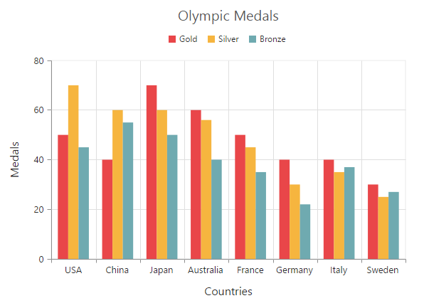
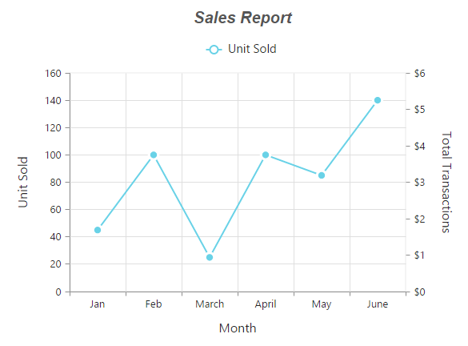



# Chart Series

## Multiple Series

In chart, you can add multiple series object in **Series** option. The series are rendered based on the order the object is added to the series option, by default. You can change this order by using the **ZOrder** option.  



<ej-chart id="chartContainer">
    <e-chart-series>
        <e-series type="Column">
            <e-points>
                <e-point x="USA" y="50"></e-point>
            </e-points>
        </e-series>
        <e-series type="Column">
            <e-points>
                <e-point x="China" y="70"></e-point>
            </e-points>
        </e-series>
        <e-series type="Column">
            <e-points>
                <e-point x="Japan" y="45"></e-point>
            </e-points>
        </e-series>
    </e-chart-series>
</ej-chart>



### Customizing all series together

By using the **CommonSeriesOptions** property, you can customize the series options for all the series commonly, instead of setting the options directly on each series object. 

N> The inline properties of the series have the first priority and they can override the commonSeriesOptions.

The following code example explains how to enable marker, tooltip, and animation for the chart series by using the **commonSeriesOptions** property.



<ej-chart id="chartContainer">
    <e-common-series-options type="Line" enable-animation="true">
        <e-border width="2"></e-border>
        <e-marker visible="true" shape="Circle"><e-Size height="10" width="10"></e-Size></e-marker>
        <e-chart-tooltip visible="true" template="Tooltip"></e-chart-tooltip>
    </e-common-series-options>
    <e-chart-series>
        <e-series type="Column">
            <e-points>
                <e-point x="USA" y="50"></e-point>
            </e-points>
        </e-series>
        <e-series type="Column">
            <e-points>
                <e-point x="China" y="70"></e-point>
            </e-points>
        </e-series>
        <e-series type="Column">
            <e-points>
                <e-point x="Japan" y="45"></e-point>
            </e-points>
        </e-series>
    </e-chart-series>
</ej-chart>

 

## Combination Series

Chart allows you to render the combination of different series in the chart. 



<ej-chart id="chartContainer">
    // ...
    <e-chart-series>
        <e-series type="Column">
            <e-points>
                <e-point x="Jan" y="50"></e-point>
            </e-points>
        </e-series>
        <e-series type="Line">
            <e-points>
                <e-point x="Jan" y="70"></e-point>
            </e-points>
        </e-series>
    </e-chart-series>
    // ...
</ej-chart>



### Limitation of combination chart

* Bar, stacking bar, and stacking bar 100 series cannot be combined with the other Cartesian type series.

* Cartesian type series cannot be combined with the accumulation series such as pie, doughnut, funnel, and pyramid.

* Polar and radar series cannot be combined with the accumulation and Cartesian type series.

When the combination of Cartesian and accumulation series types are added to the series option, the series that are similar to the first series are rendered, and other series are ignored. The following code example illustrates this,  



<ej-chart id="chartContainer">
    // ...
    <e-chart-series>
        <e-series type="Line">
            <e-points>
                <e-point x="Jan" y="50"></e-point>
            </e-points>
        </e-series>
        <e-series type="Pie">
            <e-points>
                <e-point x="Jan" y="70"></e-point>
            </e-points>
        </e-series>
    </e-chart-series>
    // ...
</ej-chart>



 

