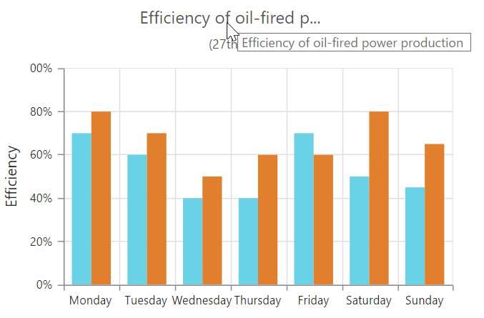
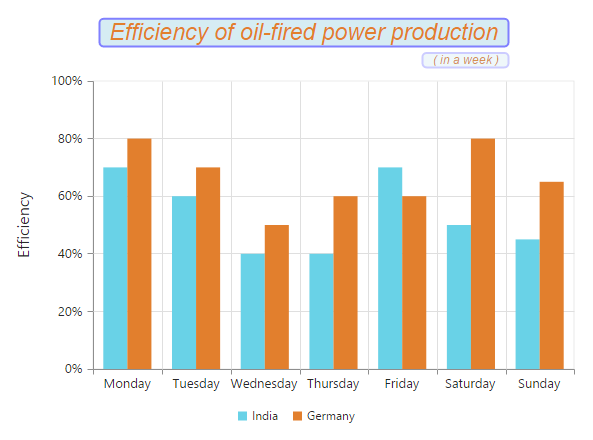
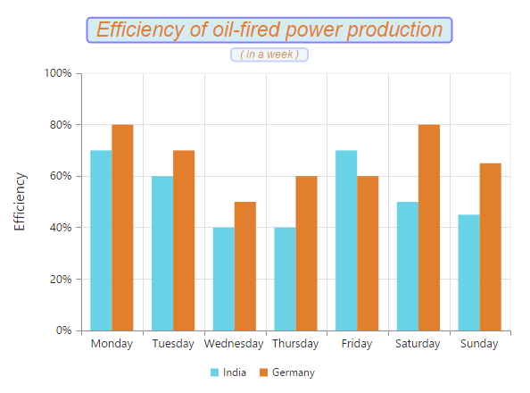

# Chart Title & Subtitle

## Title

By using the **Title** option, you can add text as well as customize its border, Background, and Font.



<ej-chart id="chartContainer">
    <e-title text="Efficiency of oil-fired power production" background="lightblue">
        <e-Border color="blue" width="2" opacity="0.5" corner-radius="4.0"></e-Border>
        <e-Font opacity="1" font-family="Arial" color="#E27F2D" font-size="23px" font-style="Italic" font-weight="Regular"></e-Font>
    </e-title>
</ej-chart>



You can trim, wrap, and wrapAndTrim the chart title by using **textOverflow** property. The original text will be displayed as tooltip on mouse hover.



<ej-chart id="chartContainer">
    <e-title text="Efficiency of oil-fired power production" enable-trim="true" maximum-width="150" text-overflow="Trim">
    </e-title>
</ej-chart>



### Title alignment

You can change the title alignment to center, far, and near by using the **TextAlignment** property of the chart title. 



<ej-chart id="chartContainer">
    <e-title text="Efficiency of oil-fired power production" text-alignment="Far">
    </e-title>
</ej-chart>

 

## Add subtitle to the chart

By using the **SubTitle** option, you can add the sub title to the chart title and customize its Border, Background, and Font.



<ej-chart id="chartContainer">
    <e-title text="Efficiency of oil-fired power production" background="lightblue">
        <e-SubTitle text="in a week"></e-SubTitle>
        <e-Border color="blue" width="2" corner-radius="4.0" opacity="0.2"></e-Border>
        <e-Font opacity="1" font-family="Arial" font-style="Italic" color="#E27F2D" font-size="12px" font-weight="Regular"></e-Font>
    </e-title>
</ej-chart>



You can trim, wrap, and wrapAndTrim the subtitle of the chart by using **textOverflow** property. The original text will be displayed as tooltip on mouse hover.



<ej-chart id="chartContainer">
    <e-title text="Efficiency of oil-fired power production" enable-trim="true" maximum-width="150" text-overflow="Wrap">
        <e-SubTitle text="In a Week"></e-SubTitle>
    </e-title>
</ej-chart>



### Subtitle alignment

You can change the alignment of the sub title to center, far, and near by using the **TextAlignment** property of the SubTitle.



<ej-chart id="chartContainer">
    <e-title>
        <e-SubTitle text-alignment="Center"></e-SubTitle>
    </e-title>
</ej-chart>



 