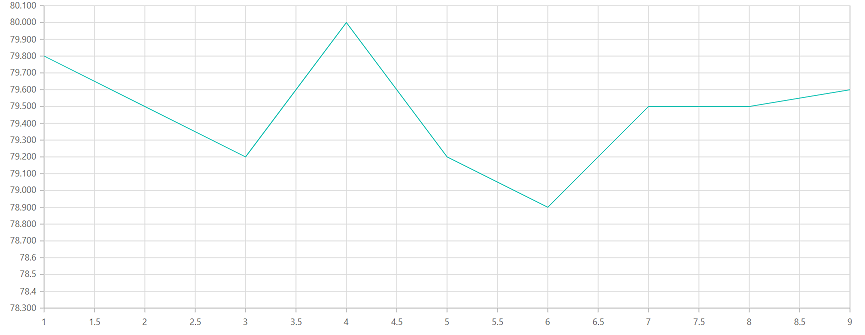
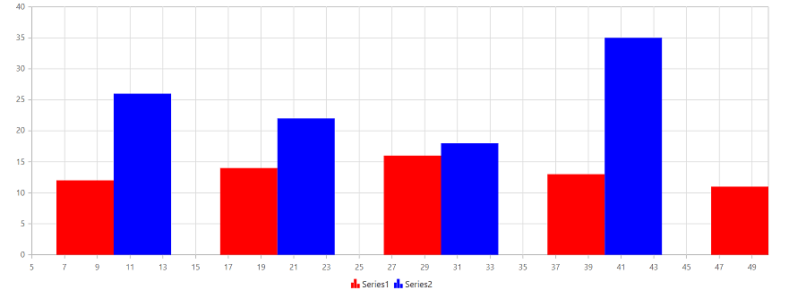

<!-- markdownlint-disable MD036 -->

# Render chart from code behind and update the chart using partial view

You can render the charts from code behind and update the charts in partial view by calling the partial view action method in ajax.

Follow the given steps to render and update the charts from code behind.

**Step 1**:
Initially, render the home view page, and then call the partial view action method via ajax call in the home view page. In that chart is render using client side content.

```html
<div class="row" style="margin-top:10px">
    <button onclick="refreshChart()">Update Chart</button>
</div>

<div class="row" id="container">
    @Html.Partial("_ViewChart");
</div>

<script>
    function refreshChart() {
        var ajax = new ej.base.Ajax();
        ajax.url = "@Url.Action("Create")";
        ajax.type = "GET";
        ajax.successHandler = function (args) {
            $('#container').html(args);
        }
        ajax.send();
    }
</script>

```

**Initial Chart**


**Step 2**:
Then create chart model properties in controller page. After initial rendering then update the created chart properties in the home view page through partial view action method in ajax call.

```cs
// partial view action method
  [HttpGet]
        public ActionResult Create()
        {
            Chart chartModel = new Chart();

            InitializeChart(chartModel);

            ViewData["ChartModel"] = chartModel;
            return PartialView("_ViewChart");
        }

        private void InitializeChart(Chart chartModel)
        {
            List<LineChartData> data = new List<LineChartData>();

            data.Add(new LineChartData(10, 12, 26));
            data.Add(new LineChartData(20, 14, 22));
            data.Add(new LineChartData(30, 16, 18));
            data.Add(new LineChartData(40, 13, 35));
            data.Add(new LineChartData(50, 11, 24));
            ChartSeries series1 = new ChartSeries();
            series1.XName = "Xvalue";
            series1.YName = "YValue1";
            series1.DataSource = data;
            series1.Fill = "red";
            series1.Name = "Series1";
            series1.Type = Syncfusion.EJ2.Charts.ChartSeriesType.Column;
            series1.Trendlines = new List<ChartTrendline>();
            series1.Segments = new List<ChartSegment>();
            series1.Visible = true;
            ChartSeries series2 = new ChartSeries();
            series2.XName = "Xvalue";
            series2.YName = "yValue2";
            series2.DataSource = data;
            series2.Fill = "blue";
            series2.Name = "Series2";
            series2.Type = Syncfusion.EJ2.Charts.ChartSeriesType.Column;
            series2.Trendlines = new List<ChartTrendline>();
            series2.Segments = new List<ChartSegment>();
            series2.Visible = true;
            chartModel.Series = new List<ChartSeries>();
            chartModel.PrimaryXAxis = new ChartAxis();
            chartModel.PrimaryXAxis.Minimum = 5;
            chartModel.PrimaryXAxis.Maximum = 50;
            chartModel.PrimaryXAxis.Interval = 2;
            chartModel.Series.Add(series1);
            chartModel.Series.Add(series2);
        }

    }
    [Serializable]
    public class LineChartData
    {
        public LineChartData(double xval, double yvalue1, double yvalue2)
        {
            this.Xvalue = xval;
            this.YValue1 = yvalue1;
            this.yValue2 = yvalue2;
        }
        public double Xvalue { get; set; }
        public double YValue1 { get; set; }
        public double yValue2 { get; set; }


    }
```

**Step 3**:

Return the partial view page when calling partial view action method. In that partial view, refer the `scriptManager` to render the charts. Using `viewData` you can get chart object in view page from code behind and append it to chart container.

```html
<div>
    @if ((Syncfusion.EJ2.Charts.Chart)ViewData["ChartModel"] == null)
    {
        @Html.EJS().Chart("container").Load("firstChartLoad").Render();
    }
    else
    {
        @Html.EJS().Chart("container", (Syncfusion.EJ2.Charts.Chart)ViewData["ChartModel"]).Render();
    }
</div>
<script>
var firstChartLoad = function (args) {
        args.chart.series[0].dataSource = getData();
        args.chart.series[0].xName = "x";
        args.chart.series[0].yName = "y";

    }
    function getData() {
        let data = [];
        let point;
        let value = 80;
        for (let i = 1; i < 10; i++) {
            if (Math.random() > .5) {
                value += Math.random();
            } else {
                value -= Math.random();
            }
            point = { x: i, y: value.toFixed(1) };
            data.push(point);
        }
        return data;
    }
</script>
@Html.EJS().ScriptManager()

```

**Updated Chart**


**Sample reference**

Sample for how to render the charts from code behind and update using partial view
[`chart sample`](http://www.syncfusion.com/downloads/support/directtrac/219809/ze/ajaxcall-611246099)
