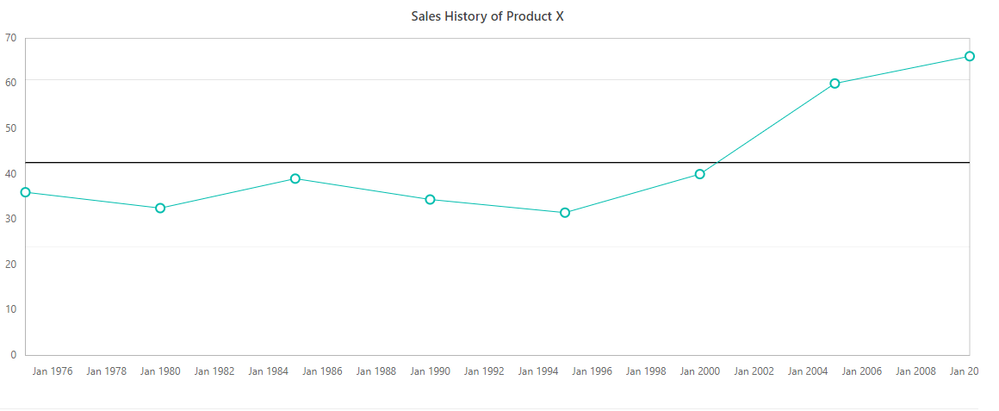
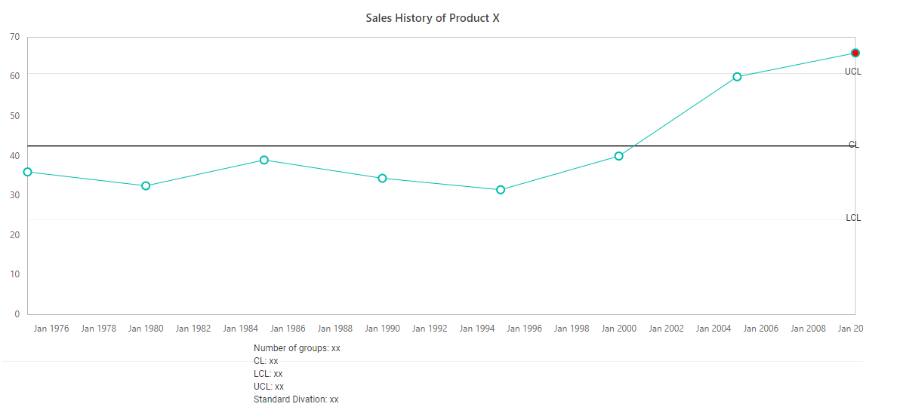
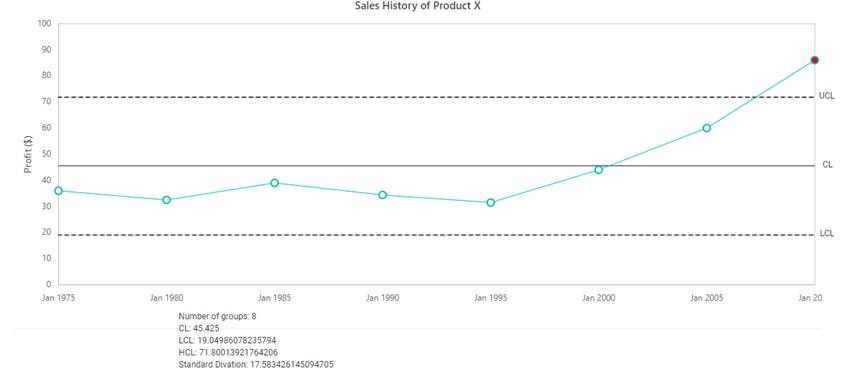

<!-- markdownlint-disable MD036 -->

# Create a control chart

You can create a control chart (with UCL, CL, and LCL limits) using the stripline and annotation features.

To create a control charts, follow the given steps.

**Step 1**:

Load line charts for the data.

























**Step 2**:

Now, add three striplines for three control limits: LCL, UCL, and CL.

























**Step 3**:

Then, add annotations to show the text for LCL, UCL, and CL in respective positions.

```html
        <ejs-chart id="container" title="Sales History of Product X">
            <e-chart-primaryxaxis valueType="DateTime" majorGridLines="ViewBag.line" majorTickLines="ViewBag.line"></e-chart-primaryxaxis>
            <e-chart-primaryyaxis stripLines="ViewBag.yAxisStripLine" majorGridLines="ViewBag.line" majorTickLines="ViewBag.line"></e-chart-primaryyaxis>
            <e-series-collection>
                <e-series dataSource="ViewBag.dataSource" xName="xValue" yName="yValue" type="@Syncfusion.EJ2.Charts.ChartSeriesType.Line">
                    <e-series-marker visible="true" height="10" width="10"></e-series-marker>
                </e-series>
            </e-series-collection>
            <e-chart-annotations>
                <e-chart-annotation Content="<div>LCL</div>" X="30" Y="2" CoordinateUnits='@Syncfusion.EJ2.Charts.Units.Point'></e-chart-annotation>
                <e-chart-annotation Content="<div>CL</div>" X="30" Y="2" CoordinateUnits='@Syncfusion.EJ2.Charts.Units.Point'></e-chart-annotation>
                <e-chart-annotation Content="<div>UCL</div>" X="30" Y="2" CoordinateUnits='@Syncfusion.EJ2.Charts.Units.Point'></e-chart-annotation>
                <e-chart-annotation Content="<div>Number of groups: xx</div><div>CL: xx</div><div>LCL: xx</div><div>UCL: xx</div><div>Standard Divation: xx</div>" X="400" Y="500" CoordinateUnits='@Syncfusion.EJ2.Charts.Units.Pixel'></e-chart-annotation>
            </e-chart-annotations>
        </ejs-chart>
```

**Step 4**:

Calculate the control limits based on the CL, LCL, and UCL. The start and end ranges have been set for strip lines in the load event.

```html
<script>
    var mean = 0, LCL = 0, UCL = 0, s = 0;
    function load(args) {
        // calculate the mean value
        for (var i = 0; i < args.chart.series[0].dataSource.length; i++) {
            mean = (mean) + (+args.chart.series[0].dataSource[i].yValue);
        }
        mean = mean / args.chart.series[0].dataSource.length;
        for (var i = 0; i < args.chart.series[0].dataSource.length; i++) {
            s += ((+args.chart.series[0].dataSource[i].yValue) - mean) * ((+args.chart.series[0].dataSource[i].yValue) - mean);
        }
        // calculate the standard divation here
        s = s / args.chart.series[0].dataSource.length;
        s = Math.sqrt(s);
        // Calculate LCL and UCL
        LCL = mean - (1.5 * s);
        UCL = mean + (1.5 * s);
        // set the strip line ranges based on the LCL and UCL
        args.chart.primaryYAxis.stripLines[0].start = LCL;
        args.chart.primaryYAxis.stripLines[0].end = LCL + 0.0125;
        args.chart.primaryYAxis.stripLines[1].start = mean;
        args.chart.primaryYAxis.stripLines[1].end = mean + 0.25;
        args.chart.primaryYAxis.stripLines[2].start = UCL;
        args.chart.primaryYAxis.stripLines[2].end = UCL + 0.0135;
    }
</script>
```



**Step 5**:

Highlight the points that are above the UCL using the pointRender event.

```html
<script>
    function pointRender(args) {
        if (args.point.y > UCL) {
            args.fill = 'red';

        }
    }
</script>
```


**Step 6**:

Change the values of annotation text (UCL, LCL, mean, and CL).

```html
<script>
    var mean = 0, LCL = 0, UCL = 0, s = 0;
    function load(args) {
        // calculate the mean value
        for (var i = 0; i < args.chart.series[0].dataSource.length; i++) {
            mean = (mean) + (+args.chart.series[0].dataSource[i].yValue);
        }
        mean = mean / args.chart.series[0].dataSource.length;
        for (var i = 0; i < args.chart.series[0].dataSource.length; i++) {
            s += ((+args.chart.series[0].dataSource[i].yValue) - mean) * ((+args.chart.series[0].dataSource[i].yValue) - mean);
        }
        // calculate the standard divation here
        s = s / args.chart.series[0].dataSource.length;
        s = Math.sqrt(s);
        // Calculate LCL and UCL
        LCL = mean - (1.5 * s);
        UCL = mean + (1.5 * s);

        // set the annotations x and y positions based on the LCL and UCL
        args.chart.annotations[0].x = args.chart.series[0].dataSource[args.chart.series[0].dataSource.length - 1].xValue;
        args.chart.annotations[0].y = LCL;
        args.chart.annotations[1].x = args.chart.series[0].dataSource[args.chart.series[0].dataSource.length - 1].xValue;
        args.chart.annotations[1].y = mean;
        args.chart.annotations[2].x = args.chart.series[0].dataSource[args.chart.series[0].dataSource.length - 1].xValue;
        args.chart.annotations[2].y = UCL;
    }
</script>
```



**Step 7**:

Add the dasharray for stripline elements and add some pixel for the annotation elements to move from its default position and then add the text for the last annotation to show the mean, UCL, CL, LCL and standard divation in the loaded event.

```html
<script>
    function loaded(args) {
        // Add dasharray for strip line elements
        var strip1 = document.getElementById('container_stripline_Behind_rect_0');
        strip1.setAttribute('stroke', 'black');
        strip1.setAttribute('stroke-dasharray', '5');
        var strip2 = document.getElementById('container_stripline_Behind_rect_2');
        strip2.setAttribute('stroke', 'black');
        strip2.setAttribute('stroke-dasharray', '5');
        var annotation = document.getElementById('container_Annotation_Collections');
        var child, left;

        // move the annotation elements to nearest chart area by adding some pixel to annotation elements
        for (var i = 0; i < annotation.children.length - 1; i++) {
            child = annotation.children[i];
            left = child.style.left;
            left = +(left.replace('px', '')) + 20;
            child.style.left = left + 'px';
        }

        // Add the annotation text to show the mean, UCL, CL, LCL and standard divation
        annotation.children[3].children[0].innerText = annotation.children[3].children[0].innerText.replace('xx', args.chart.series[0].dataSource.length);
        annotation.children[3].children[1].innerText = annotation.children[3].children[1].innerText.replace('xx', mean);
        annotation.children[3].children[2].innerText = annotation.children[3].children[2].innerText.replace('xx', LCL);
        annotation.children[3].children[3].innerText = annotation.children[3].children[3].innerText.replace('xx', UCL);
        annotation.children[3].children[4].innerText = annotation.children[3].children[4].innerText.replace('xx', s);
    }
</script>
```

























**Screenshots**:



**Sample link**:

A sample for creating control chart is available in the following link,
[`chartSample`](http://www.syncfusion.com/downloads/support/directtrac/207077/ze/coreEJ2Sample-1067535862)