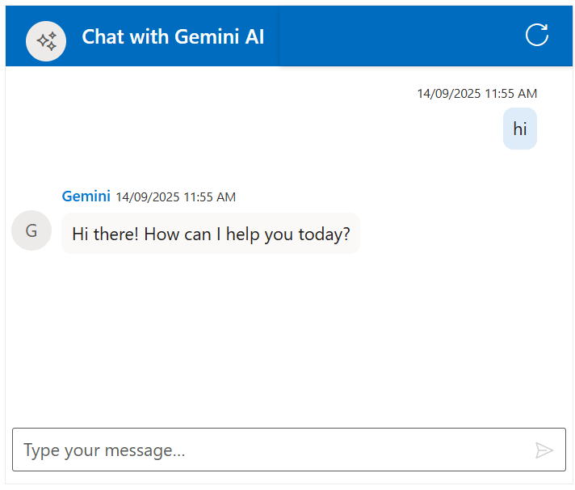

# Integration of Gemini AI With Chat UI component 

The Syncfusion Chat UI supports integration with [Gemini](https://ai.google.dev/gemini-api/docs), enabling advanced conversational AI features in your MVC applications.

## Getting Started With the Chat UI Component

Before integrating Gemini AI, ensure that the Syncfusion Chat UI control is correctly rendered in your MVC application:

[ MVC Getting Started Guide](../getting-started)

## Prerequisites

* Google account to generate API key on accessing `Gemini AI`

* Syncfusion Chat UI for MVC `Syncfusion.EJ2.MVC5` Install ASP.NET MVC package in the application.

## Install Dependencies

Install the Syncfusion ASP.NET MVC package in the application using the Package Manager Console.

```bash 

NuGet\Install-Package Syncfusion.EJ2.MVC5

```

Install the Open AI package in the application using the Package Manager Console.

```bash 

NuGet\Install-Package Mscc.GenerativeAI

```

## Generate API Key

1. Go to [Google AI Studio](https://aistudio.google.com/app/apikey) and sign in with your Google account. If you don’t have one, create a new account. 

2. Once logged in, click on `Get API Key` from the left-hand menu or the top-right corner of the dashboard. 

3. Click the `Create API Key` button. You’ll be prompted to either select an existing Google Cloud project or create a new one. Choose the appropriate option and proceed. 

4. After selecting or creating a project, your API key will be generated and displayed. Copy the key and store it securely, as it will only be shown once.

> `Security Note`: Never commit the API key to version control. Use environment variables or a secret manager for production.

##  Integration Gemini AI with Chat UI

You can add the below respective files in your application:

> Add your generated `API Key` at the line 

```bash

const geminiApiKey = 'Place your API key here'; 

```
> ASP.NET MVC requires this token for POST requests to handlers (like OnPostGetAIResponse) to prevent CSRF attacks.

Add this to Pages/Index.cshtml

```bash

@Html.AntiForgeryToken()

```












## Run and Test 

Run the application in the browser using the following command.

Build and run the app (Ctrl + F5).

Open `https://localhost:44321` to interact with your Gemini AI for dynamic response.