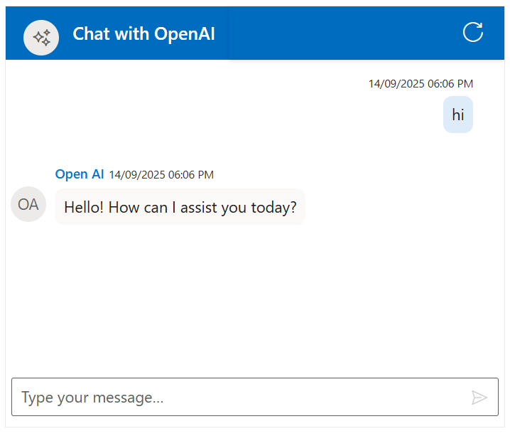

# Integration of Azure Open AI With Chat UI component 

The Syncfusion AI AssistView supports integration with [Azure Open AI](https://microsoft.github.io/PartnerResources/skilling/ai-ml-academy/resources/openai), enabling advanced conversational AI features in your MVC applications.

## Getting Started With the Chat UI Component

Before integrating Azure Open AI, ensure that the Syncfusion Chat UI control is correctly rendered in your MVC application:
[ MVC Getting Started Guide](../getting-started)

## Prerequisites

* An Azure account with access to `Azure Open AI` services and a generated API key.

* Syncfusion Chat UI for MVC `Syncfusion.EJ2.MVC5` Install ASP.NET MVC package in the application.

## Install Dependencies

Install the Syncfusion ASP.NET MVC package in the application using the Package Manager Console.

```bash 

NuGet\Install-Package Syncfusion.EJ2.MVC5

```

Install the Open AI and Azure Open AI package in the application using Package Manager Console.

```bash 

NuGet\Install-Package OpenAI
NuGet\Install-Package Azure.AI.OpenAI
NuGet\Install-Package Azure.Core

```


## Generate API Key

1. Log in to the [Azure Portal](https://portal.azure.com/#home) and navigate to your Azure Open AI resource. 

2. Under Resource Management, select Keys and Endpoint to retrieve your API key and endpoint URL.  

3. Copy the API key, endpoint, and deployment name (e.g., gpt-4o-mini). Ensure the API version (e.g., 2024-07-01-preview) matches your resource configuration.

4. Store these values securely, as they will be used in your application.

> `Security Note`: Never expose your API key in client-side code for production applications. Use a server-side proxy or environment variables to manage sensitive information securely

##  Integration Azure Open AI with Chat UI

You can add the below respective files in your application:

* Update the following configuration values with your Azure Open AI details:

```bash

string endpoint = "Your_Azure_OpenAI_Endpoint";
string apiKey = "Your_Azure_OpenAI_API_Key";
string deploymentName = "Your_Deployment_Name";

```









  


## Run and Test 

Run the application in the browser using the following command.

Build and run the app (Ctrl + F5).

Open `https://localhost:44321` to interact with your Azure Open AI for dynamic response.