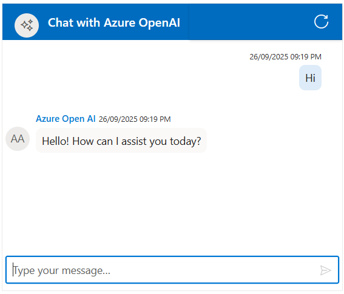

# Integration of Open AI With Chat UI component 

The Syncfusion Chat UI supports integration with (OpenAI)[https://platform.openai.com/docs/overview], enabling advanced conversational AI features in your Asp Core applications.

## Getting Started With the Chat UI Component

Before integrating Open AI, ensure that the Syncfusion Chat UI control is correctly rendered in your core application:
[ Asp Core Getting Started Guide](../getting-started)

## Prerequisites

* OpenAI account to generate an API key for accessing the `OpenAI` API

* Syncfusion Chat UI for Core `Syncfusion.EJ2.AspNet.Core` Install ASP.NET Core package in the application.

## Install Dependencies

Install the Syncfusion ASP.NET Core package in the application using the Package Manager Console.

```bash 

NuGet\Install-Package Syncfusion.EJ2.AspNet.Core
```

Install the Open AI package in the application using the Package Manager Console.

```bash 

NuGet\Install-Package OpenAI

```


## Generate API Key

1. Go to [Open AI](https://platform.openai.com/docs/overview) and sign in with your Google account. If you don’t have one, create a new account. 

2. Once logged in, click on your profile icon in the top-right corner and select `API Keys` from the dropdown menu.  

3. Click the `+ Create new secret key` button. You’ll be prompted to name the key (optional). Confirm to generate the key.

4. Your API key will be displayed once. Copy it and store it securely, as it won’t be shown again.

> `Security Note`: Never commit the API key to version control. Use environment variables or a secret manager for production.

##  Integration Open AI with Chat UI

You can add the below respective files in your application:

* Add your generated `API Key` at the line 

```bash

const openaiApiKey = 'Place your API key here';  

```









  


## Run and Test 

Run the application in the browser using the following command.

Build and run the app (Ctrl + F5).

Open `https://localhost:44321` to interact with your Open AI for dynamic response.