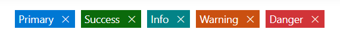
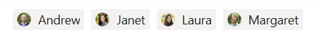
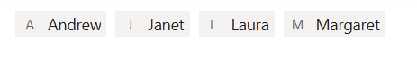
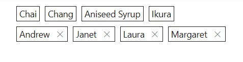
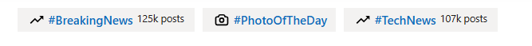

# Chips Customization in Chips Control

This section explains the customization of styles, leading icons, avatars, and trailing icons in the Chips control.

## Styles



The Chips control has the following predefined styles that can be defined using the [`cssClass`](https://help.syncfusion.com/cr/aspnetcore-js2/syncfusion.ej2.buttons.chiplist.html#Syncfusion_EJ2_Buttons_ChipList_CssClass) property.

| Class | Description |
| -------- | -------- |
| e-primary | Represents a primary Chips. |
| e-success | Represents a positive Chips. |
| e-info |  Represents an informative Chips. |
| e-warning | Represents a Chips with caution. |
| e-danger | Represents a negative Chips. |









The Chips control has the following predefined styles that can be defined using the [`cssClass`](https://help.syncfusion.com/cr/aspnetmvc-js2/Syncfusion.EJ2.Buttons.ChipList.html#Syncfusion_EJ2_Buttons_ChipList_CssClass) property.

| Class | Description |
| -------- | -------- |
| e-primary | Represents a primary Chips. |
| e-success | Represents a positive Chips. |
| e-info |  Represents an informative Chips. |
| e-warning | Represents a Chips with caution. |
| e-danger | Represents a negative Chips. |











## Leading Icon



You can add and customize the leading icon of Chips using the [`leadingIconCss`](https://help.syncfusion.com/cr/aspnetcore-js2/syncfusion.ej2.buttons.chiplist.html#Syncfusion_EJ2_Buttons_ChipList_LeadingIconCss) property.









You can add and customize the leading icon of Chips using the [`leadingIconCss`](https://help.syncfusion.com/cr/aspnetmvc-js2/Syncfusion.EJ2.Buttons.ChipList.html#Syncfusion_EJ2_Buttons_ChipList_LeadingIconCss) property.











## Avatar



You can add and customize the avatar of Chips using the [`avatarIconCss`](https://help.syncfusion.com/cr/aspnetcore-js2/syncfusion.ej2.buttons.chiplist.html#Syncfusion_EJ2_Buttons_ChipList_AvatarIconCss) property.









You can add and customize the avatar of Chips using the [`avatarIconCss`](https://help.syncfusion.com/cr/aspnetmvc-js2/Syncfusion.EJ2.Buttons.ChipList.html#Syncfusion_EJ2_Buttons_ChipList_AvatarIconCss) property.











## Avatar Content



You can add and customize the avatar content of Chips using the [`avatarText`](https://help.syncfusion.com/cr/aspnetcore-js2/syncfusion.ej2.buttons.chiplist.html#Syncfusion_EJ2_Buttons_ChipList_AvatarText) property.









You can add and customize the avatar content of Chips using the [`avatarText`](https://help.syncfusion.com/cr/aspnetmvc-js2/Syncfusion.EJ2.Buttons.ChipList.html#Syncfusion_EJ2_Buttons_ChipList_AvatarText) property.











## Trailing Icon



You can add and customize the trailing icon of Chips using the [`trailingIconCss`](https://help.syncfusion.com/cr/aspnetcore-js2/syncfusion.ej2.buttons.chiplist.html#Syncfusion_EJ2_Buttons_ChipList_TrailingIconCss) property.









You can add and customize the trailing icon of Chips using the [`trailingIconCss`](https://help.syncfusion.com/cr/aspnetmvc-js2/Syncfusion.EJ2.Buttons.ChipList.html#Syncfusion_EJ2_Buttons_ChipList_TrailingIconCss) property.











## Outline Chips



Outline Chips have a border with a transparent background. It can be set using the [`cssClass`](https://help.syncfusion.com/cr/aspnetcore-js2/syncfusion.ej2.buttons.chiplist.html#Syncfusion_EJ2_Buttons_ChipList_CssClass) property.









Outline Chips have a border with a transparent background. It can be set using the [`cssClass`](https://help.syncfusion.com/cr/aspnetmvc-js2/Syncfusion.EJ2.Buttons.ChipList.html#Syncfusion_EJ2_Buttons_ChipList_CssClass) property.











## Template



The [`Template`](https://help.syncfusion.com/cr/aspnetcore-js2/syncfusion.ej2.buttons.chiplist.html#Syncfusion_EJ2_Buttons_ChipList_Template) property of the Chips control allows users to fully customize the layout and design of each Chips. By using the `Template` property, users can include custom HTML elements such as links, icons, or additional content.









The [`Template`](https://help.syncfusion.com/cr/aspnetmvc-js2/syncfusion.ej2.buttons.chiplist.html#Syncfusion_EJ2_Buttons_ChipList_Template) property of the Chips control allows users to fully customize the layout and design of each Chips. By using the `Template` property, users can include custom HTML elements such as links, icons, or additional content.











N> [View Sample in GitHub](https://github.com/SyncfusionExamples/ASP-NET-Core-UG-Examples/tree/main/Chips/ChipsSample).
