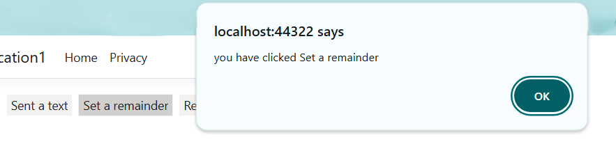

# Types in Chips Control

The ChipList control has the following types.

* Input Chips
* Choice Chips
* Filter Chips
* Action Chips

## Input Chips

Input Chips holds information in compact form. It converts user input into Chips.





















## Choice Chips



Choice Chips allows to select a single Chips from the set of ChipList/ChipCollection. It can be enabled by setting the [`selection`](https://help.syncfusion.com/cr/aspnetcore-js2/Syncfusion.EJ2.Buttons.ChipList.html#Syncfusion_EJ2_Buttons_ChipList_Selection) property to `Single`.









Choice Chips allows to select a single Chips from the set of ChipList/ChipCollection. It can be enabled by setting the [`selection`](https://help.syncfusion.com/cr/aspnetmvc-js2/Syncfusion.EJ2.Buttons.ChipList.html#Syncfusion_EJ2_Buttons_ChipList_Selection) property to `Single`.











## Filter Chips



Filter Chips allows to select a multiple Chips from the set of ChipList/ChipCollection. It can be enabled by setting the [`selection`](https://help.syncfusion.com/cr/aspnetcore-js2/Syncfusion.EJ2.Buttons.ChipList.html#Syncfusion_EJ2_Buttons_ChipList_Selection) property to `Multiple`.









Filter Chips allows to select a multiple Chips from the set of ChipList/ChipCollection. It can be enabled by setting the [`selection`](https://help.syncfusion.com/cr/aspnetmvc-js2/Syncfusion.EJ2.Buttons.ChipList.html#Syncfusion_EJ2_Buttons_ChipList_Selection) property to `Multiple`.











## Action Chips



The Action Chips triggers the event like [`click`](https://help.syncfusion.com/cr/aspnetcore-js2/Syncfusion.EJ2.Buttons.ChipList.html#Syncfusion_EJ2_Buttons_ChipList_Click) or [`delete`](https://help.syncfusion.com/cr/aspnetcore-js2/Syncfusion.EJ2.Buttons.ChipList.html#Syncfusion_EJ2_Buttons_ChipList_Delete), which helps doing action based on the event.









The Action Chips triggers the event like [`click`](https://help.syncfusion.com/cr/aspnetmvc-js2/Syncfusion.EJ2.Buttons.ChipList.html#Syncfusion_EJ2_Buttons_ChipList_Click) or [`delete`](https://help.syncfusion.com/cr/aspnetmvc-js2/Syncfusion.EJ2.Buttons.ChipList.html#Syncfusion_EJ2_Buttons_ChipList_Delete), which helps doing action based on the event.











### Deletable Chips



Deletable Chips allows to delete a Chips from ChipList/ChipCollection. It can be enabled by setting the [`enableDelete`](https://help.syncfusion.com/cr/aspnetcore-js2/Syncfusion.EJ2.Buttons.ChipList.html#Syncfusion_EJ2_Buttons_ChipList_EnableDelete) property to `true`.









Deletable Chips allows to delete a Chips from ChipList/ChipCollection. It can be enabled by setting the [`enableDelete`](https://help.syncfusion.com/cr/aspnetmvc-js2/Syncfusion.EJ2.Buttons.ChipList.html#Syncfusion_EJ2_Buttons_ChipList_EnableDelete) property to `true`.











N> [View Sample in GitHub](https://github.com/SyncfusionExamples/ASP-NET-Core-UG-Examples/tree/main/Chips/ChipsSample).