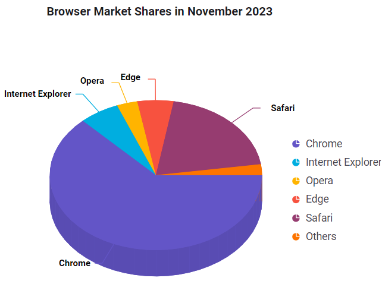

# Getting started with ASP.NET MVC 3D Circular Chart control

This section briefly explains about how to include [ASP.NET MVC 3D Circular Chart](https://www.syncfusion.com/aspnet-mvc-ui-controls/charts) control in your ASP.NET MVC application using Visual Studio.

## Prerequisites

[System requirements for ASP.NET MVC controls](https://ej2.syncfusion.com/aspnetmvc/documentation/system-requirements)

## Create ASP.NET MVC application with HTML helper

* [Create a Project using Microsoft Templates](https://learn.microsoft.com/en-us/aspnet/mvc/overview/getting-started/introduction/getting-started#create-your-first-app)

* [Create a Project using Syncfusion ASP.NET MVC Extension](https://ej2.syncfusion.com/aspnetmvc/documentation/getting-started/project-template)

## Install ASP.NET MVC package in the application

To add `ASP.NET MVC` controls in the application, open the NuGet package manager in Visual Studio (Tools → NuGet Package Manager → Manage NuGet Packages for Solution), search for [Syncfusion.EJ2.MVC5](https://www.nuget.org/packages/Syncfusion.EJ2.MVC5) and then install it.




Install-Package Syncfusion.EJ2.MVC5 -Version {{ site.ej2version }}




N> Syncfusion ASP.NET MVC controls are available in [nuget.org.](https://www.nuget.org/packages?q=syncfusion.EJ2) Refer to [NuGet packages topic](https://ej2.syncfusion.com/aspnetmvc/documentation/nuget-packages) to learn more about installing NuGet packages in various OS environments. The Syncfusion.EJ2.MVC5 NuGet package has dependencies, [Newtonsoft.Json](https://www.nuget.org/packages/Newtonsoft.Json/) for JSON serialization and [Syncfusion.Licensing](https://www.nuget.org/packages/Syncfusion.Licensing/) for validating Syncfusion license key.

## Add namespace

Add **Syncfusion.EJ2** namespace reference in `Web.config` under `Views` folder.

```
<namespaces>
    <add namespace="Syncfusion.EJ2"/>
</namespaces>
```

## Add script resources

Here, the script is referred using CDN inside the `<head>` of `~/Views/Shared/_Layout.cshtml` file as follows,




<head>
    ...
    <!-- Syncfusion ASP.NET MVC controls scripts -->
    <script src="https://cdn.syncfusion.com/ej2/{{ site.ej2version }}/dist/ej2.min.js"></script>
</head>




N> Checkout the [Adding Script Reference](https://ej2.syncfusion.com/aspnetmvc/documentation/common/adding-script-references) topic to learn different approaches for adding script references in your ASP.NET MVC application.

## Register Syncfusion script manager

Also, register the script manager `EJS().ScriptManager()` at the end of `<body>` in the `~/Views/Shared/_Layout.cshtml` file as follows.




<body>
...
    <!-- Syncfusion ASP.NET MVC Script Manager -->
    @Html.EJS().ScriptManager()
</body>




## Add ASP.NET MVC 3D Circular Chart control

Now, add the Syncfusion ASP.NET MVC 3D Circular Chart control in `~/Home/Index.cshtml` page.




@(Html.EJS().CircularChart3D("container").Render())




**Pie Series**

By default, the pie series will be rendered when assigning the JSON data to the series using the `dataSource` property. Map the field names in the JSON data to the `xName` and `yName` properties of the series.






public ActionResult Index()
{
    List<CircularChartData> circularData = new List<CircularChartData>
    {
        new CircularChartData { X = "Chrome", Y = 62.92 },
        new CircularChartData { X = "Internet Explorer", Y = 6.12 },
        new CircularChartData { X = "Opera", Y = 3.15 },
        new CircularChartData { X = "Edge", Y = 5.5 },
        new CircularChartData { X = "Safari", Y = 19.97 },
        new CircularChartData { X = "Others", Y = 2.34 }
    };
    return View(circularData);
}
public class CircularChartData
{
    public string X;
    public double Y;
}



Press <kbd>Ctrl</kbd>+<kbd>F5</kbd> (Windows) or <kbd>⌘</kbd>+<kbd>F5</kbd> (macOS) to run the app. Then, the Syncfusion ASP.NET MVC 3D Circular Chart control will be rendered in the default web browser.



N> `View Sample in GitHub`.