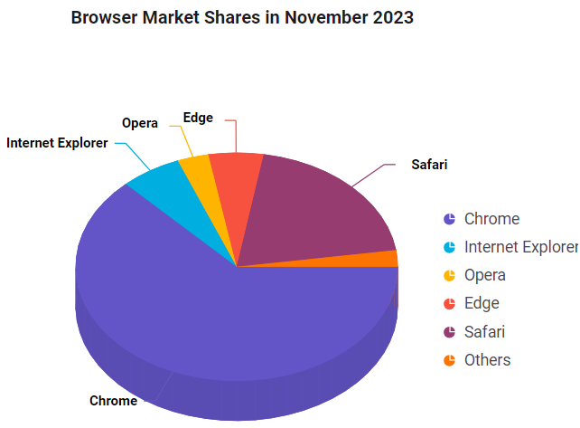

# Getting Started with ASP.NET Core 3D Circular Chart Control

This section briefly explains how to include the [ASP.NET Core 3D Circular Chart](https://www.syncfusion.com/aspnet-core-ui-controls/charts) control in your ASP.NET Core application using Visual Studio.

## Prerequisites

[System requirements for ASP.NET Core controls](https://ej2.syncfusion.com/aspnetcore/documentation/system-requirements)

## Create ASP.NET Core web application with Razor pages

* [Create a Project using Microsoft Templates](https://learn.microsoft.com/en-us/aspnet/core/tutorials/razor-pages/razor-pages-start?view=aspnetcore-8.0&tabs=visual-studio#create-a-razor-pages-web-app)

* [Create a Project using Syncfusion&reg; ASP.NET Core Extension](https://ej2.syncfusion.com/aspnetcore/documentation/visual-studio-integration/create-project)

## Install ASP.NET Core package in the application

To add `ASP.NET Core` controls in the application, open the NuGet package manager in Visual Studio (Tools → NuGet Package Manager → Manage NuGet Packages for Solution), search for [Syncfusion.EJ2.AspNet.Core](https://www.nuget.org/packages/Syncfusion.EJ2.AspNet.Core/) and then install it. Alternatively, you can run the following command in the **Package Manager Console**.




Install-Package Syncfusion.EJ2.AspNet.Core -Version {{ site.releaseversion }}




> Syncfusion&reg; ASP.NET Core controls are available in [nuget.org.](https://www.nuget.org/packages?q=syncfusion.EJ2) Refer to [NuGet packages topic](https://ej2.syncfusion.com/aspnetcore/documentation/nuget-packages) to learn more about installing NuGet packages in various OS environments. The Syncfusion.EJ2.AspNet.Core NuGet package has dependencies, [Newtonsoft.Json](https://www.nuget.org/packages/Newtonsoft.Json/) for JSON serialization and [Syncfusion.Licensing](https://www.nuget.org/packages/Syncfusion.Licensing/) for validating Syncfusion&reg; license key.

## Add Syncfusion&reg; ASP.NET Core Tag Helper

Open `~/Pages/_ViewImports.cshtml` file and import the `Syncfusion.EJ2` TagHelper.




@addTagHelper *, Syncfusion.EJ2




## Add script resources

Here, script is referred using CDN inside the `<head>` of `~/Pages/Shared/_Layout.cshtml` file as follows,




<head>
    ...
    <!-- Syncfusion ASP.NET Core controls scripts -->
    
</head>




> Checkout the [Adding Script Reference](https://ej2.syncfusion.com/aspnetcore/documentation/common/adding-script-references) topic to learn different approaches for adding script references in your ASP.NET Core application.

## Register Syncfusion&reg; Script Manager

Also, register the script manager `<ejs-script>` at the end of `<body>` in the ASP.NET Core application as follows.




<body>
    ...
    <!-- Syncfusion ASP.NET Core Script Manager -->
    <ejs-scripts></ejs-scripts>
</body>




## Add ASP.NET Core 3D Circular Chart Control

Add the Syncfusion&reg; ASP.NET Core 3D Circular Chart tag helper to the `~/Pages/Index.cshtml` page.




<ejs-circularchart3d id="container" title="Browser Market Shares in November 2023" tilt="-45">
    <e-circularchart3d-legendsettings visible="true" position="@Syncfusion.EJ2.Charts.LegendPosition.Right">
    </e-circularchart3d-legendsettings>
    <e-circularchart3d-series-collection>
        <e-circularchart3d-series dataSource="@circularData" xName="X" yName="Y">
            <e-circularchart3d-series-datalabel visible="true" name="X"
            position="@Syncfusion.EJ2.Charts.CircularChart3DLabelPosition.Outside">
                <e-font fontWeight="600"></e-font>
                <e-connectorstyle length="40px"></e-connectorstyle>
            </e-circularchart3d-series-datalabel>
        </e-circularchart3d-series>
    </e-circularchart3d-series-collection>
</ejs-circularchart3d>




## Pie series

The pie series is rendered by default when the [dataSource](https://help.syncfusion.com/cr/aspnetcore-js2/syncfusion.ej2.charts.circularchart3d.html#Syncfusion_EJ2_Charts_CircularChart3D_DataSource) is assigned to the series. Map the JSON field names to the [xName](https://help.syncfusion.com/cr/aspnetcore-js2/Syncfusion.EJ2.Charts.CircularChart3DSeries.html#Syncfusion_EJ2_Charts_CircularChart3DSeries_XName) and [yName](https://help.syncfusion.com/cr/aspnetcore-js2/Syncfusion.EJ2.Charts.CircularChart3DSeries.html#Syncfusion_EJ2_Charts_CircularChart3DSeries_XName) properties.






public class CircularChartData
{
    public string X { get; set; }
    public double Y { get; set; }
}



Press <kbd>Ctrl</kbd>+<kbd>F5</kbd> (Windows) or <kbd>⌘</kbd>+<kbd>F5</kbd> (macOS) to run the app. The Syncfusion&reg; ASP.NET Core 3D Circular Chart control will be rendered in the default web browser.

## Troubleshooting

If the 3D Circular Chart does not render or you run into build/runtime issues, try the following:

* **3D Circular Chart is not visible on the page** — Ensure the `ejs-scripts` tag helper is registered at the end of `<body>` in `~/Pages/Shared/_Layout.cshtml`. Missing this registration prevents Syncfusion client-side scripts from initializing the control.
* **Chart renders as a flat 2D pie instead of 3D** — Verify the `tilt` attribute is set on the `<ejs-circularchart3d>` tag helper and that WebGL is enabled in the browser.
* **Pie/series renders with no data points** — Confirm the data model exposes `X` and `Y` properties and that the `xName`/`yName` values on the series match the field names exactly. If you reference `@circularData` from the page, ensure it is supplied by the page model.
* **Legend does not appear** — Verify the `<e-circularchart3d-legendsettings>` child element is present with its `visible` attribute set to `true`, and confirm a `using Syncfusion.EJ2.Charts;` directive is in place if you reference `LegendPosition` directly.
* **Data labels do not appear** — Verify the `<e-circularchart3d-series-datalabel>` child element is present with its `visible` attribute set to `true`.
* **Build error: `TagHelper is not registered`** — Verify that `~/Pages/_ViewImports.cshtml` contains `@addTagHelper *, Syncfusion.EJ2` and rebuild the solution.
* **NuGet restore failures** — Confirm the project targets a supported .NET version and that the NuGet feed is reachable. Refer to the [NuGet packages](https://ej2.syncfusion.com/aspnetcore/documentation/nuget-packages) topic.

## See also

* [Getting Started with Syncfusion&reg; ASP.NET Core using Razor Pages](https://ej2.syncfusion.com/aspnetcore/documentation/getting-started/razor-pages)
* [Getting Started with Syncfusion&reg; ASP.NET Core MVC using Tag Helper](https://ej2.syncfusion.com/aspnetcore/documentation/getting-started/aspnet-core-mvc-taghelper)