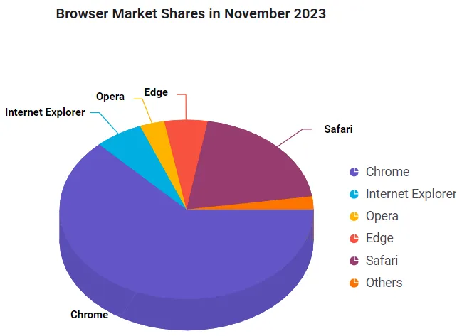

# Getting Started with ASP.NET Core 3D Circular Charts Control

This section briefly explains how to include the [ASP.NET Core 3D Circular Charts](https://www.syncfusion.com/aspnet-core-ui-controls/3d-circular-chart) control in your ASP.NET Core application using Visual Studio.

## Create an ASP.NET Core Web App with Razor Pages

Create an **ASP.NET Core Web App** using Visual Studio via [Microsoft Templates](https://learn.microsoft.com/en-us/aspnet/core/tutorials/razor-pages/razor-pages-start?view=aspnetcore-10.0&tabs=visual-studio#create-a-razor-pages-web-app) or the [ASP.NET Core Extension](https://ej2.syncfusion.com/aspnetcore/documentation/visual-studio-integration/create-project). For detailed instructions, refer to the [ASP.NET Core Web App Getting Started](https://ej2.syncfusion.com/aspnetcore/documentation/getting-started/razor-pages) documentation.

## Install the required ASP.NET Core package

To add **ASP.NET Core 3D Circular Charts** control in the app, open the NuGet package manager in Visual Studio (Tools → NuGet Package Manager → Manage NuGet Packages for Solution), search for and install the [Syncfusion.AspNetCore.CircularChart3D](https://www.nuget.org/packages/Syncfusion.AspNetCore.CircularChart3D/) package. All Syncfusion ASP.NET Core packages are available in [nuget.org](https://www.nuget.org/packages?q=syncfusion.EJ2). See the [NuGet packages](https://ej2.syncfusion.com/aspnetcore/documentation/nuget-packages) topic for details.

Alternatively, you can install the same package using the Package Manager Console with the following command.




Install-Package Syncfusion.AspNetCore.CircularChart3D -Version {{ site.releaseversion }}




## Add the ASP.NET Core Tag Helpers

After the package is installed, open the **~/Pages/_ViewImports.cshtml** file and import the `Syncfusion.AspNetCore.Base` and `Syncfusion.AspNetCore.Charts` Tag Helpers.




@addTagHelper *, Syncfusion.AspNetCore.Base
@addTagHelper *, Syncfusion.AspNetCore.Charts




## Add script resources

The theme stylesheet and script can be referenced from the [CDN](https://ej2.syncfusion.com/aspnetcore/documentation/appearance/theme#cdn-reference). Include the [script references](https://ej2.syncfusion.com/aspnetcore/documentation/common/adding-script-references) inside the `<head>` of **~/Pages/Shared/_Layout.cshtml** 




<head>
    ...
    <!-- ASP.NET Core controls scripts -->
    
</head>




## Register the script manager

Open the **~/Pages/Shared/_Layout.cshtml** file and register the script manager `<ejs-scripts>` at the end of the `<body>` element as follows.




<body>
    ...
    <!-- ASP.NET Core Script Manager -->
    <ejs-scripts></ejs-scripts>
</body>




## Add ASP.NET Core 3D Circular Charts control

Add the [ASP.NET Core 3D Circular Charts](https://www.syncfusion.com/aspnet-core-ui-controls/3d-circular-chart) control in the **~/Pages/Index.cshtml** file.




<ejs-circularchart3d id="container" title="Browser Market Shares in November 2023" tilt="-45">
    <e-circularchart3d-legendsettings visible="true" position="@Syncfusion.EJ2.Charts.LegendPosition.Right">
    </e-circularchart3d-legendsettings>
    <e-circularchart3d-series-collection>
        <e-circularchart3d-series dataSource="@circularData" xName="X" yName="Y">
            <e-circularchart3d-series-datalabel visible="true" name="X"
            position="@Syncfusion.EJ2.Charts.CircularChart3DLabelPosition.Outside">
                <e-font fontWeight="600"></e-font>
                <e-connectorstyle length="40px"></e-connectorstyle>
            </e-circularchart3d-series-datalabel>
        </e-circularchart3d-series>
    </e-circularchart3d-series-collection>
</ejs-circularchart3d>




**Pie Series**

By default, the pie series will be rendered when assigning the JSON data to the series using the `dataSource` property. Map the field names in the JSON data to the `xName` and `yName` properties of the series.







public class CircularChartData
{
    public string X;
    public double Y;
}




## Run the application

Press <kbd>Ctrl</kbd>+<kbd>F5</kbd> (Windows) or <kbd>⌘</kbd>+<kbd>F5</kbd> (macOS) to launch the application. The [ASP.NET Core 3D Circular Charts](https://www.syncfusion.com/aspnet-core-ui-controls/3d-circular-chart) control will render in your default web browser.

N> `View Sample in GitHub`.

## See also

1. [Getting Started with ASP.NET Core using Razor Pages](https://ej2.syncfusion.com/aspnetcore/documentation/getting-started/razor-pages)
2. [Getting Started with ASP.NET Core MVC using Tag Helper](https://ej2.syncfusion.com/aspnetcore/documentation/getting-started/aspnet-core-mvc-taghelper)