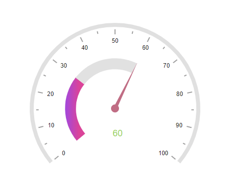

# Animation in Circular Gauge component



All of the elements in the Circular Gauge, such as the axis lines, ticks, labels, ranges, pointers, and annotations, can be animated sequentially by using the [animationDuration](https://help.syncfusion.com/cr/aspnetcore-js2/Syncfusion.EJ2.CircularGauge.CircularGauge.html#Syncfusion_EJ2_CircularGauge_CircularGauge_AnimationDuration) property. The animation for the Circular Gauge is enabled when the `animationDuration` property is set to an appropriate value in milliseconds, providing a smooth rendering effect for the component. If the `animationDuration` property is set to **0**, which is the default value, the animation effect is disabled. If the animation is enabled, the component will behave in the following order.

1. The axis line will be animated in the rendering direction (clockwise or anticlockwise).
2. Each tick line and label will then be animated.
3. If available, ranges will be animated.
4. If available, pointers will be animated in the same way as [pointer animation](https://ej2.syncfusion.com/aspnetcore/documentation/circular-gauge/gauge-pointers#animation).
5. If available, annotations will be animated.

The animation of the Circular Gauge is demonstrated in the following example.





 
 



> Only the pointer of the Circular Gauge can be animated individually, not the axis lines, ticks, labels, ranges, and annotations. You can refer this [link](https://ej2.syncfusion.com/aspnetcore/documentation/circular-gauge/gauge-pointers#animation) to enable only pointer animation.



All of the elements in the Circular Gauge, such as the axis lines, ticks, labels, ranges, pointers, and annotations, can be animated sequentially by using the [AnimationDuration](https://help.syncfusion.com/cr/aspnetmvc-js2/Syncfusion.EJ2.CircularGauge.CircularGauge.html#Syncfusion_EJ2_CircularGauge_CircularGauge_AnimationDuration) property. The animation for the Circular Gauge is enabled when the `AnimationDuration` property is set to an appropriate value in milliseconds, providing a smooth rendering effect for the component. If the `AnimationDuration` property is set to **0**, which is the default value, the animation effect is disabled. If the animation is enabled, the component will behave in the following order.

1. The axis line will be animated in the rendering direction (clockwise or anticlockwise).
2. Each tick line and label will then be animated.
3. If available, ranges will be animated.
4. If available, pointers will be animated in the same way as [pointer animation](https://ej2.syncfusion.com/aspnetmvc/documentation/circular-gauge/gauge-pointers#animation).
5. If available, annotations will be animated.

The animation of the Circular Gauge is demonstrated in the following example.










> Only the pointer of the Circular Gauge can be animated individually, not the axis lines, ticks, labels, ranges, and annotations. You can refer this [link](https://ej2.syncfusion.com/aspnetmvc/documentation/circular-gauge/gauge-pointers#animation) to enable only pointer animation.


