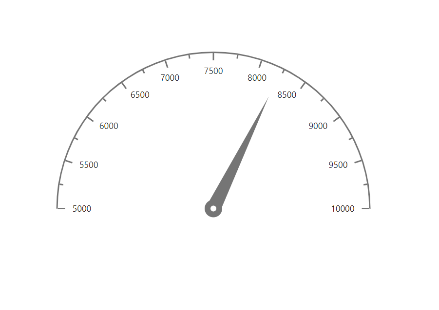

# How To

<!-- markdownlint-disable MD036 -->

## Get data from database for circular gauge and render gauge from code behind

<!-- markdownlint-disable MD033 -->
Circular gauge can be rendered from the code behind by initializing the required properties in controller and passing them through ViewData to client-side. You can get the data from the database by creating a data table and accessing the data table values to gauge pointers value.

To get the data from data base and render the gauge from code behind, follow the given steps:

**Step 1**:

<!-- markdownlint-disable MD031 -->
Initialize the required properties in controller and get data from database, create a new data collection that contains minimum, maximum, and value attributes from the data base data, and then assign the data to the minimum, maximum, and pointer values of gauge.

```cs
 public ActionResult Index()
        {
            //Initialize the chart model
            CircularGauge gaugeModel = new CircularGauge();
            // Add the required properties for chart using the following method
            InitializeGauge(gaugeModel);
            // Store the chart model
            ViewData["GaugeModel"] = gaugeModel;
            return View();
        }
        private void InitializeGauge(CircularGauge gaugeModel)
        {
            // Create a data base data table
            DataTable dt = new DataTable();
            dt.Columns.Add("Name");
            dt.Columns.Add("MaxStock");
            dt.Columns.Add("FreeStock");
            dt.Columns.Add("AvailableStock");
            dt.Rows.Add(new Object[] { "T13", 10000, 5000, 8230 });

            // Create  a new data collection from data base table
            GaugeData gauges = new GaugeData();
            foreach (DataRow row in dt.Rows)
            {
                gauges.Minimum = Convert.ToDouble(row["FreeStock"]);
                gauges.Maximum = Convert.ToDouble(row["MaxStock"]);
                gauges.Value = Convert.ToDouble(row["AvailableStock"]);
            }

            CircularGaugePointer pointer = new CircularGaugePointer();
            pointer.Value = gauges.Value;

            CircularGaugeAxis axis = new CircularGaugeAxis();
            axis.Pointers = new List<CircularGaugePointer>();
            axis.Minimum = gauges.Minimum;
            axis.Maximum = gauges.Maximum;
            axis.Pointers.Add(pointer);

            gaugeModel.Axes = new List<CircularGaugeAxis>();
            gaugeModel.Axes.Add(axis);
        }
```

**Step 2**:

Bind the gauge properties passed via ViewData from the controller at client-side as demonstrated in the following code sample.

```html
   @Html.EJS().CircularGauge("container", (Syncfusion.EJ2.CircularGauge.CircularGauge)ViewData["GaugeModel"]).Render();
```

























**Sample reference**

[`circulargauge sample`](https://github.com/SyncfusionExamples/How-to-get-data-for-circular-gauge-from-database-and-render-gauge-from-code-behind).

**Screenshot**

