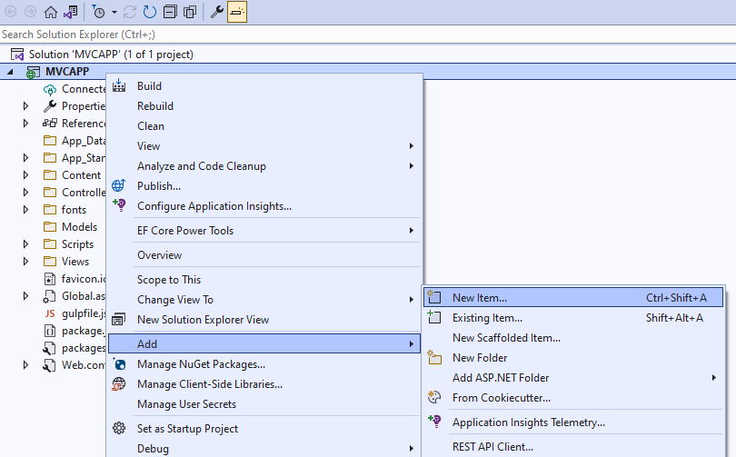
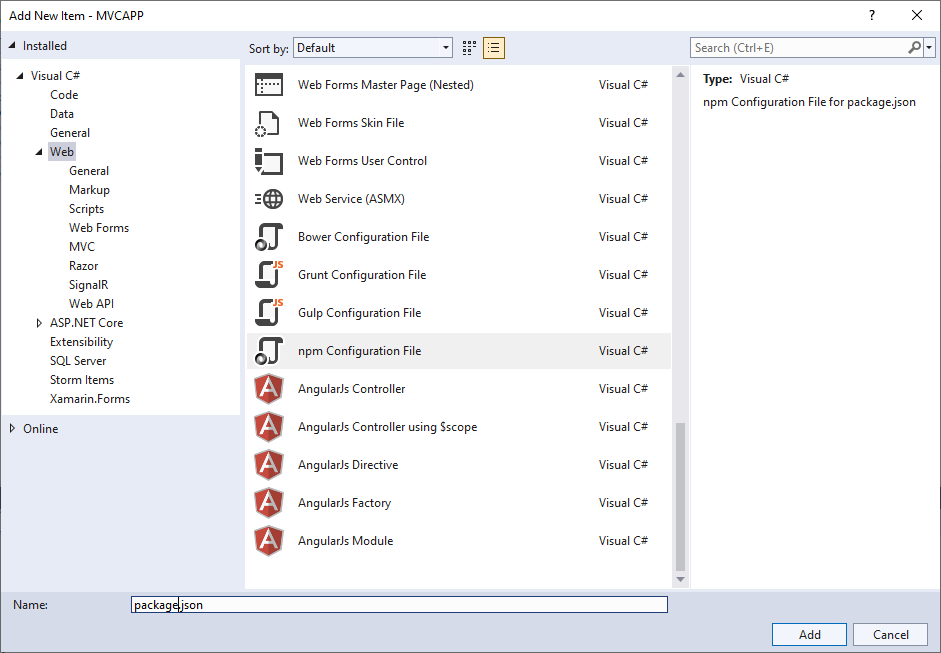
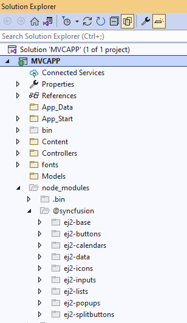
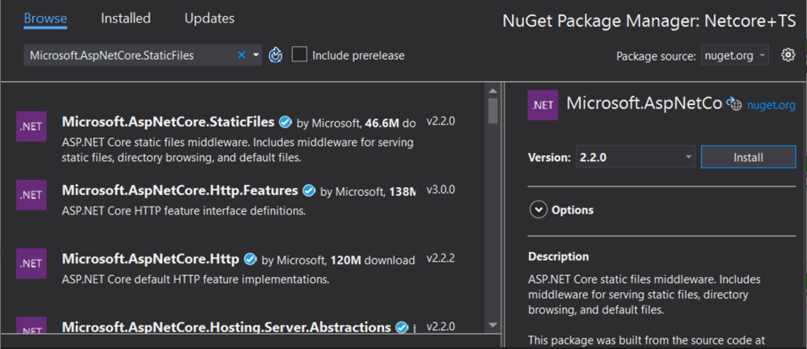
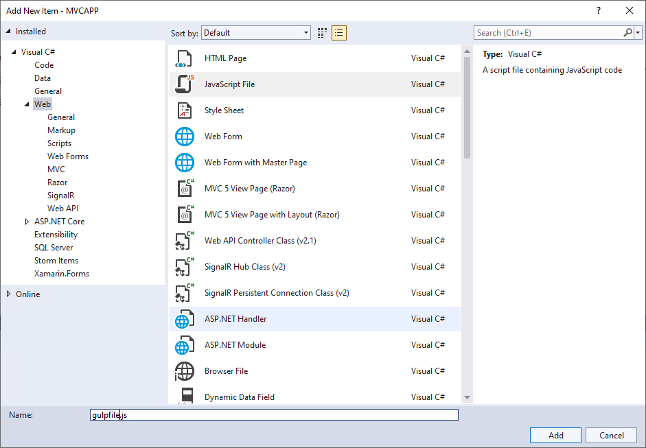
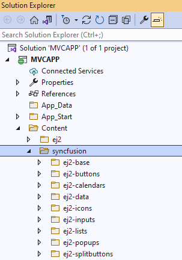
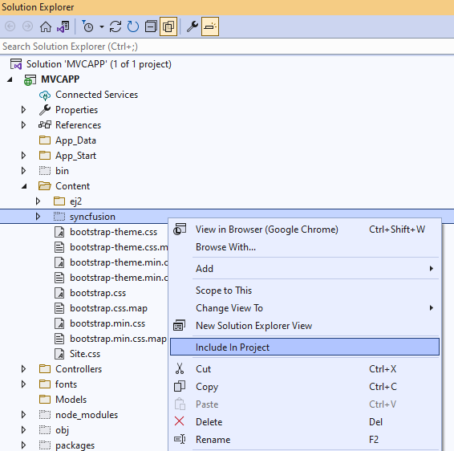

# Reference Scripts in ASP.NET MVC Application

This section provides information about reference scripts from CDN and Custom resource generator (CRG) for Syncfusion ASP.NET MVC controls.

## CDN Reference

Syncfusion hosts every ASP.NET MVC control as a separate node package in CDN, from which scripts and style sheets of the individual package can be loaded. Syncfusion also hosts a single node package with all ASP.NET MVC controls on it, from which scripts and style sheets of all controls can be loaded as single script and style file.

Here, the Syncfusion ASP.NET MVC CDN URL for the both Individual ASP.NET MVC control package and Complete ASP.NET MVC controls package has been explained.

W> The un-versioned CDN links which always maintains latest version scripts are deprecated from 2022 Vol1 - 20.1 version. These links are available with 19.4 version scripts to avoid breaking in sites and apps that uses un-versioned links.

### CDN Reference for all controls

The primary goal of all the ASP.NET MVC controls package is to help the novice to get started with Syncfusion ASP.NET MVC control by referring the single line for script and styles without bothering about the dependency graph of the ASP.NET MVC controls.

| controls | CDN Reference |
| --- | --- |
| Scripts reference for all controls| https://cdn.syncfusion.com/ej2/{{ site.ej2version }}/dist/ej2.min.js |
| Styles reference for all controls | https://cdn.syncfusion.com/ej2/{{ site.ej2version }}/{THEME-NAME}.css |

N> Syncfusion will never recommend all controls CDN for real-time projects. Because, the size of this CDN impacts website/app loading time since this package includes all the Syncfusion ASP.NET MVC controls.

Add the EJ2 CDN client-side resources to the `<head>` element of the `~/Views/Shared/_Layout.cshtml` layout page.




<head>
    ...
    <!-- Syncfusion ASP.NET MVC controls styles -->
    <link rel="stylesheet" href="https://cdn.syncfusion.com/ej2/{{ site.ej2version }}/material.css" />

    <!-- Syncfusion ASP.NET MVC controls scripts -->
    
</head>




### Individual control CDN Reference

The primary goal of individual control CDN is to optimize the loading time and memory of the website/app in the production stage. The order of individual control package loading should be in line with its dependency graph. The CDN of the Dependency Packages should be included manually before the intended individual control package CDN.

| controls | CDN Reference |
| --- | --- |
| Scripts reference for individual control| https://cdn.syncfusion.com/ej2/{{ site.ej2version }}/{PACKAGE-NAME}/dist/global/{PACKAGE-NAME}.min.js |
| Styles reference for individual control | https://cdn.syncfusion.com/ej2/{{ site.ej2version }}/{PACKAGE-NAME}/styles/{THEME-NAME}.css |

Add the CDN client-side resources in the `<head>` element of the `~/Views/Shared/_Layout.cshtml` layout page.

For example, the scripts and styles for the ASP.NET MVC Calendar control are listed below.




<head>
    ...
    <!-- Syncfusion ASP.NET MVC controls styles -->
    <link rel="stylesheet" href="https://cdn.syncfusion.com/ej2/{{ site.ej2version }}/ej2-calendars/styles/material.css" />
    <link rel="stylesheet" href="https://cdn.syncfusion.com/ej2/{{ site.ej2version }}/ej2-base/styles/material.css" />
    <link rel="stylesheet" href="https://cdn.syncfusion.com/ej2/{{ site.ej2version }}/ej2-buttons/styles/material.css" />

    <!-- Syncfusion ASP.NET MVC controls scripts -->
    
    
</head>




In addition to above, Syncfusion ASP.NET MVC controls provides latest scripts and styles in CDN without versioning. You can use this in development environment if you want to always use the latest version of scripts and styles. It is not recommended to use this in production environment.

| controls | CDN Reference |
| --- | --- |
| Scripts reference for all controls| https://cdn.syncfusion.com/ej2/dist/ej2.min.js |
| Styles reference for all controls | https://cdn.syncfusion.com/ej2/{THEME-NAME}.css |

## Node Package Manager (NPM)

A package in Node.js consists of a set of files needed for a JavaScript module which can be included in any web application. NPM is the popular package manager for both public and private packages.

### Syncfusion NPM packages

Scripts and style sheets of Syncfusion ASP.NET MVC controls can be included in an ASP.NET MVC web application using NPM packages, since Syncfusion publishes its ASP.NET MVC controls as the scoped package in NPM.

#### Installing NPM packages in ASP.NET MVC Web Application

1.Open the Source Explorer and right click the application name. Then, select “**Add New Item**” menu item to open the “**Add New Item**” window. 

2.Select “**Web**” on the left side Tree View and select “**npm configuration File**” in “**Add New Item**” window which will include and configure “**package.json**” file in root folder of the ASP.NET MVC web application. 

3.Open the Source Explorer and right click on the application name. Then, select “**Open Folder in File Explorer**”. 

4.Open the Command Prompt for this location and install the required Syncfusion packages using “**npm install @syncfusion/{PACKAGE_NAME} --save**”




npm install @syncfusion/ej2-calendars --save




5.Installed packages with all its dependencies can be found under the  “**node_modules**” folder as shown in the following image.

#### From Installed Packages

Scripts and style sheets of Syncfusion ASP.NET MVC controls from locally-installed packages can be included in an ASP.NET MVC web application using the following two methods.

N>Files in the **Content** folder can be accessed only in client-side, hence Syncfusion scripts and style sheets should be copied from **node_modules** to **Content**.

By using either one of the following methods, Client-Side Resource can be loaded in ASP.NET MVC web application:

1. Copying scripts and styles using gulp
2. Generating scripts and styles using [CRG (Custom Resource Generator)](./custom-resource-generator)

#### Copying by Gulp

Install required Syncfusion ASP.NET MVC control packages as mentioned in “[**Installing NPM Packages in ASP.NET MVC Web Application**](#installing-npm-packages-in-aspnet-mvc-web-application)”. 

1.In addition to Syncfusion ASP.NET MVC packages, install gulp and glob packages using below commands.

N>Gulp Installation - **npm install gulp --save**




npm install gulp@latest --save




N>Glob Installation - **npm install glob --save**




npm install glob@latest --save




2.To set up the server, Tools → NuGet Package Manager → Manage NuGet Packages for Solution. Then, search and install "**Microsoft.AspNetCore.StaticFiles**" and "**Microsoft.TypeScript.MSBuild**" packages.

3.Open the Source Explorer and right click on the application name. Then, select “**Add New Item**” menu item to open the “**Add New Item**” window. 

4.Select “**ASP.NET Core**” on the left side Tree View and select “**JavaScript File**” in the “**Add New Item**” window. It will include a js file in the root folder of the ASP.NET MVC web application. Rename the js file as “**gulpfile.js**”.

5.Copy the following code snippet and paste it in **gulpfile.js** for automatically copying the script and styles from “**node_modules**” to “**Content**” while building the web application.




/// <binding BeforeBuild='copy-client-resource'/>
// nodejs requiring statement for importing and using the package in this js file
var gulp = require('gulp');
var glob = require('glob');
// gulp task for copying file form “node_modules” to “Content” directory
gulp.task("copy-client-resource", function (done) {
    let packagePath = './node_modules/@syncfusion/';
    let destCommonPath = 'Content/syncfusion'
    let installedPackages = glob.sync(`${packagePath}*`);
    for (let insPackage of installedPackages) {
        let packagename = insPackage.replace(packagePath, '');
        gulp.src(`${insPackage}/dist/global/**/*`)
            .pipe(gulp.dest(`${destCommonPath}/${packagename}/`));
        gulp.src(`${insPackage}/styles/**/*.css`)
            .pipe(gulp.dest(`${destCommonPath}/${packagename}/styles/`));
    }
    done();
});




6.Build the ASP.NET MVC web application and notice that a new folder named “**Syncfusion**” is created in “**Content**” folder.

7.Right click the “**Syncfusion**” folder and include in project like below.

8.Add the client-side resource in the `<head>` element of the `~/Views/Shared/_Layout.cshtml`. Here, scripts and styles of Syncfusion ASP.NET MVC Calendar has been loaded for example.  




<head>
    <!-- Syncfusion ASP.NET MVC controls styles -->
    @Styles.Render("~/Content/syncfusion/ej2-calendars/styles/calendar/material.css")
    @Styles.Render("~/Content/syncfusion/ej2-base/styles/material.css")
    @Styles.Render("~/Content/syncfusion/ej2-buttons/styles/button/material.css")
    <!-- Syncfusion ASP.NET MVC controls scripts -->
    @Scripts.Render("~/Content/syncfusion/ej2-base/ej2-base.min.js")
    @Scripts.Render("~/Content/syncfusion/ej2-calendars/ej2-calendars.min.js")
</head>




## Custom Resource Generator

The Syncfusion ASP.NET MVC provides an option to generate a control's scripts using the [Custom Resource Generator](https://crg.syncfusion.com/) (CRG) tool for the ASP.NET MVC Controls. To generate the control-wise scripts externally using CRG, refer [here](./custom-resource-generator).

## See also

* [CDN Fallback](./cdn-fallback)
