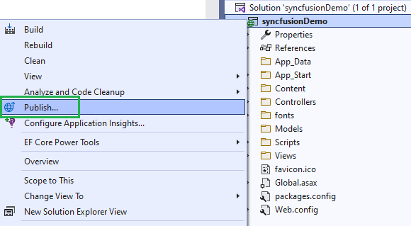
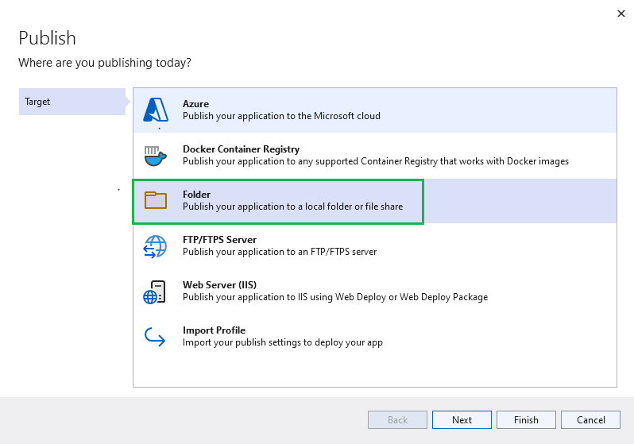
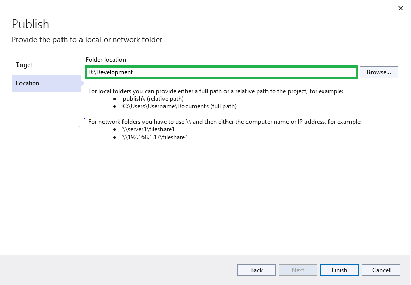
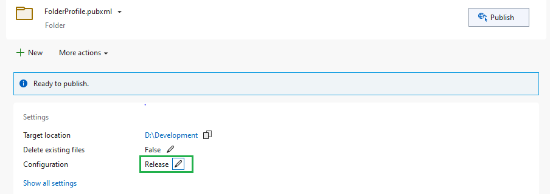

# Deployment in ASP.NET MVC

This section provides information about deploying ASP.NET MVC applications with the Syncfusion ASP.NET MVC controls.

Refer to [ASP.NET MVC Deployment](https://docs.microsoft.com/en-us/aspnet/core/host-and-deploy/?view=aspnetcore-6.0) topic for more information.

## Publish ASP.NET MVC Application with Visual Studio

* Right-click on the project in the `Solution Explorer` and select `Publish`.

* Then, select the `Folder` option and click `Next` to select the publishing target location.

* Browse and specify the target location.

* Then, click `Finish` and check the configuration as Release by clicking the edit option below the target location.

* Then, click `Save` and `Publish`.

> Refer [here](https://docs.microsoft.com/en-us/azure/app-service/quickstart-dotnetcore?tabs=netframework48&pivots=development-environment-vs#publish-your-web-app) for publishing the application to Azure App Service using Visual Studio.  

## Publish ASP.NET MVC Application with CLI

Packing the application and its dependencies into a folder for deployment to a hosting system by using the `MSBuild` command.

Use the following command to specify the path for the output directory.




msbuild <ProjectName> /p:Configuration=Release /p:outdir="<output directory>"




you can find the published folder in this `<output directory>\_PublishedWebsites\<ProjectName>` location.

Refer to the MSBuild [optional arguments](https://docs.microsoft.com/en-us/visualstudio/msbuild/msbuild-command-line-reference?view=vs-2022).

If the path is relative, the output directory generated is relative to the project file location, not to the current working directory.

Now, you can host the published folder by using the IIS or Azure app service.

## See also

* [Publish a Web app to Azure App Service using Visual Studio](https://docs.microsoft.com/en-us/visualstudio/deployment/quickstart-deploy-aspnet-web-app?view=vs-2022&tabs=azure)
* [Publish a Web app to Azure App Service using Visual Studio for Mac](https://docs.microsoft.com/en-us/visualstudio/mac/publish-app-svc?toc=%2Faspnet%2Fcore%2Ftoc.json&bc=%2Faspnet%2Fcore%2Fbreadcrumb%2Ftoc.json&view=vsmac-2019)