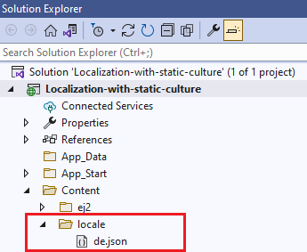
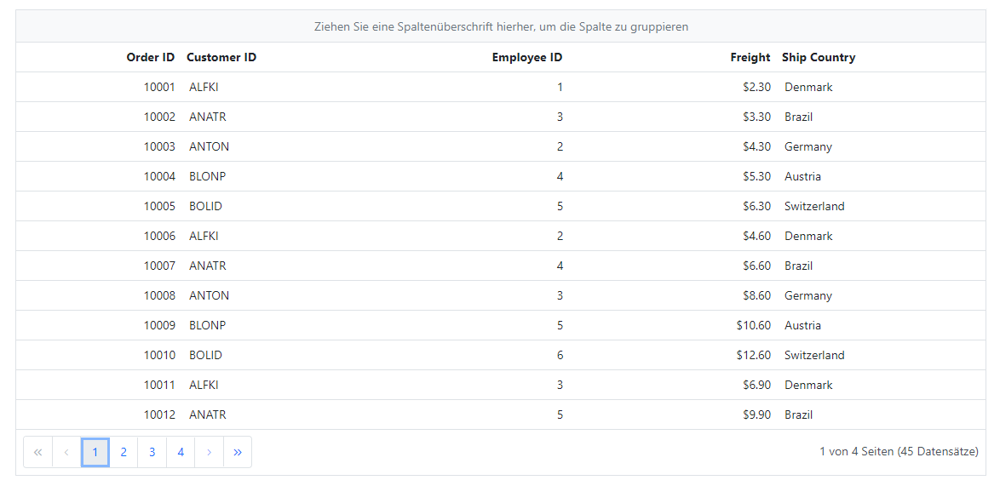
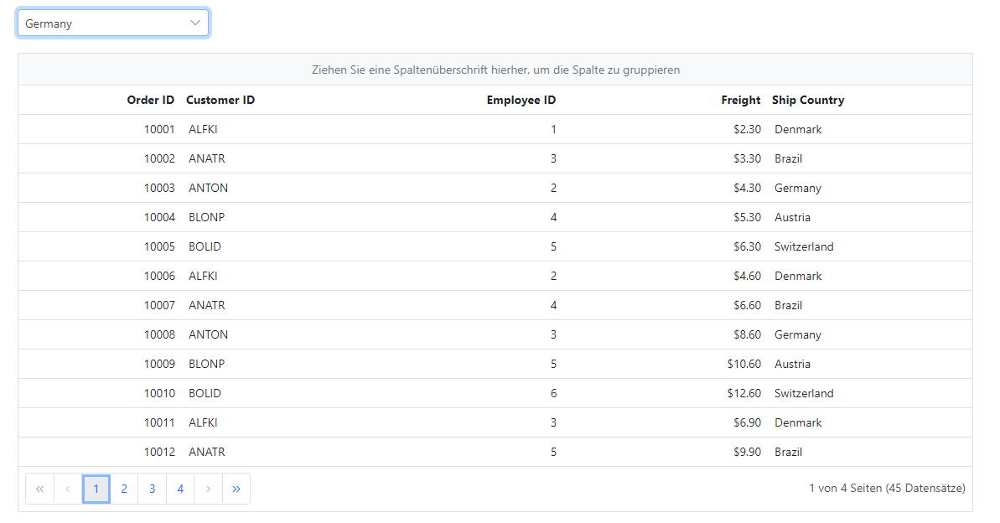

# Localization (Multi-Language) support in ASP.NET MVC

Localization (L10N) is the process of adapting application controls and content to the desired language with its corresponding region. This page shows, how to use the Localization feature in the ASP.NET MVC application.

## Localization of Syncfusion ASP.NET MVC Controls

Syncfusion controls can be localized using the culture based JSON files. You can find the default and culture based localization files in the following GitHub repository.

> You can get default and culture based JSON files from [GitHub](https://github.com/syncfusion/ej2-locale).

### Adding culture based JSON files

Syncfusion [locale data](https://www.npmjs.com/package/@syncfusion/ej2-locale) is also available as npm package. So, you can install it through the below command in the application root directory. Once the package is installed, you can find the culture specific JSON data under the location `node_modules\@syncfusion\ej2-locale\src`.




npm i @syncfusion/ej2-locale




Once the `ej2-locale` package has installed, create a folder `locale` inside the `Content` folder. Then copy the specific culture files from `node_modules\@syncfusion\ej2-locale\src` location and paste it inside the `~/Content/locale` folder like below. The culture file contains all Syncfusion ASP.NET MVC controls locale text.

## Statically set the culture

If you don't want to change culture dynamically, you can specify the static culture using `load` function of `L10n` class in **~/Views/Shared/_Layout.cshtml** file as in the below code.




<body>
    ...
    
</body>




Now, you can add the Syncfusion ASP.NET MVC control in `~/Views/Home/Index.cshtml` page.




@Html.EJS().Grid("RemoteData").DataSource(dataManger =>
{
    dataManger.Url("https://ej2services.syncfusion.com/production/web-services/api/Orders").CrossDomain(true).Adaptor("ODataV4Adaptor");

}).Columns(col =>
{
    col.Field("OrderID").HeaderText("Order ID").Width("120").TextAlign(Syncfusion.EJ2.Grids.TextAlign.Right).Add();
    col.Field("CustomerID").HeaderText("Customer ID").Width("160").Add();
    col.Field("EmployeeID").HeaderText("Employee ID").Width("120").TextAlign(Syncfusion.EJ2.Grids.TextAlign.Right).Add();
    col.Field("Freight").HeaderText("Freight").Width("150").Format("C2").TextAlign(Syncfusion.EJ2.Grids.TextAlign.Right).Add();
    col.Field("ShipCountry").HeaderText("Ship Country").Width("150").Add();

}).AllowPaging().AllowGrouping().Render()




> [View sample in GitHub](https://github.com/SyncfusionExamples/asp-net-mvc-localization/tree/main/Localization-with-static-culture)

## Dynamically set the culture

The culture can be set dynamically based on user's preference. The following example demonstrates how to dynamically change the culture in the ASP.NET MVC application.

Implement a culture change dynamically using the dropdown in the application like below.




    @Html.EJS().DropDownList("culture-swtich").DataSource((IEnumerable<Object>)ViewBag.data).Change("onCultureChange").Width("20%").Index(0).Fields(new Syncfusion.EJ2.DropDowns.DropDownListFieldSettings { Text = "Text", Value = "ID" }).Render()




using System.Web.Mvc;
using Localization_with_dynamic_culture.Models;

namespace Localization_with_dynamic_culture.Controllers
{
    public class HomeController : Controller
    {
        public ActionResult Index()
        {
            ViewBag.data = new CultureDetails().Cultures();
            return View();
        }
    ...
    }
}




Create a **CultureDetails** model page and add the following code for dropdown data in the **~/Models/CultureDetails.cs** page. 




using System.Web;

namespace Localization_with_dynamic_culture.Models
{
    public class CultureDetails
    {
        public string ID { get; set; }
        public string Text { get; set; }

        public List<CultureDetails> Cultures()
        {
            List<CultureDetails> Culture = new List<CultureDetails>();
            Culture.Add(new CultureDetails() { ID = "en-US", Text = "English" });
            Culture.Add(new CultureDetails() { ID = "de", Text = "Germany" });
            Culture.Add(new CultureDetails() { ID = "fr", Text = "French" });
            Culture.Add(new CultureDetails() { ID = "zh", Text = "Chinese" });
            return Culture;
        }
    }
}




> [View sample in GitHub](https://github.com/SyncfusionExamples/asp-net-mvc-localization/tree/main/Localization-with-dynamic-culture)

## Changing current locale

Current locale can be changed for all the Syncfusion ASP.NET MVC controls in the application by invoking `setCulture` function with the desired culture name and set locale property. You can change the different culture in Syncfusion ASP.NET MVC controls by setting [locale](https://help.syncfusion.com/cr/aspnetmvc-js2/Syncfusion.EJ2.Grids.Grid.html#Syncfusion_EJ2_Grids_Grid_Locale) property with culture codes.

The following example demonstrates the Grid in Deutsch culture.




@Html.EJS().Grid("Grid").DataSource(dataManger =>
    {
        dataManger.Url("https://ej2services.syncfusion.com/production/web-services/api/Orders").CrossDomain(true).Adaptor("ODataV4Adaptor");

    }).Columns(col =>
{
    col.Field("OrderID").HeaderText("Order ID").IsPrimaryKey(true).Width("120").Add();
    col.Field("CustomerID").HeaderText("Customer Name").Width("150").Add();
    col.Field("ShipName").HeaderText("Ship Name").Width("150").Add();
    col.Field("ShipCountry").HeaderText("Ship Country").Width("150").Add();

}).AllowPaging().AllowGrouping().Locale("de-DE").PageSettings(page => page.PageSize(6)).Render()




> Before changing a culture globally, ensure that locale text for the concerned culture is loaded through `L10n.load` function. 

## See also

* [Globalization](https://ej2.syncfusion.com/aspnetmvc/documentation/common/internationalization)
