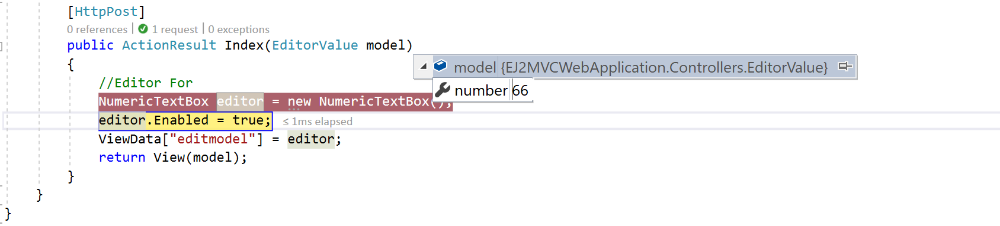

# Strongly-Typed HTML Helper

The Syncfusion editor controls supports the strongly typed HTML helpers represented by lambda expressions that have the model or template passed into the view. The Extension method is used to get a value from the model.

The Strongly-Typed HTML helper (i.e., NumericTextBox) takes lambda as a parameter that tells the helper, which element of the model to be used in the typed view.

The Strongly typed views are used for rendering specific types of model objects, instead of using the general ViewData structure.

The following list of controls supports the Strongly-Typed HTML Helper

* Autocomplete
* Checkbox and Radio Button
* DatePicker
* DateTimePicker
* DropDownList
* Numeric, Currency and Percentage Textbox
* RichText Editor
* TimePicker

The following steps explain how to use the strongly typed helpers to create a Numeric Textbox.

1. The NumericTextBox control supports strongly typed HTML helpers that uses lambda expression to refer to the models or view models passed to a view template. These helpers allows you to define the value of the NumericTextBoxFor from the model.

Add a class name “EditorValue” in the Models folder and replace the code with the following code:

```csharp
public class EditorValue
{
    public int number { set; get; }
    public EditorValue(int value)
    {
        number = value;
    }
    public EditorValue() { }
}
```
2. Create an action method that renders the NumericTextBox on the view page, and passes the model to be bound to the view page.

```csharp
using Syncfusion.EJ2.Inputs;

public ActionResult Index()
{
    //Editor For
    NumericTextBox editor = new NumericTextBox();
    editor.Enabled = false;
    ViewData["editmodel"] = editor;
    return View(new EditorValue(66));
}
```
3. In View, invoke the strongly typed NumericTextBoxFor helper with the lambda expression to set the default value.

```html

<div>
@using (Html.BeginForm())
        {
            @Html.EJS().NumericTextBoxFor(model => model.number, (Syncfusion.EJ2.Inputs.NumericTextBox)ViewData["editmodel"]).Render();
            @Html.EJS().Button("btn").Content("Post").Render()
        }
</div>
```


The following steps explain how to get the values by using the Scaffolding methods in Post back.

1. Create an action method, FormPost that handles the Post request and processes the data.
In the action method, you can pass the model as the parameter and that model has the NumericTexBox’s value.

```csharp
[HttpPost]
public ActionResult Index(EditorValue model)
{
    //Editor For
    NumericTextBox editor = new NumericTextBox();
    editor.Enabled = true;
    ViewData["editmodel"] = editor;
    return View(model);
}
```

On clicking the button, the Post method will be triggered. In that, the selected value will be obtained as follows.




## Server Side Validation

In the server-side validation, the page must be submitted via a postback to validate on the server and if the model data is not valid, the server sends a response back to the client.

The best way to validate a model is by using the Data Annotations that has a set of attributes and classes defined in the System.ComponentModel.DataAnnotations assembly.

Step 1: Add the following namespace to the “EditorValue” model.

```csharp
using System.ComponentModel.DataAnnotations;
```

The Data Annotations allows to decorate model classes with the metadata. This metadata describes a set of rules that are used to validate a property.

The following Data Annotation attributes are used for the Numeric Textbox.
Required: Indicates that the property is a required field.

Step 2: Next, Update the number property of the “EditorValue” class as “Required Field” by adding the following line

```csharp
public class EditorValue
{
    [Required(ErrorMessage = "Numeric Textbox is Required")]
    public int number { set; get; }
}
```

Step 3: Modify the view page as follows:

```html
<div>
@using (Html.BeginForm())
{
    @Html.ValidationSummary(true)
    @Html.EJS().NumericTextBoxFor(model => model.number, (Syncfusion.EJ2.Inputs.NumericTextBox)ViewData["editmodel"]).Render()
    @Html.ValidationMessageFor(model => model.number)
    @Html.EJS().Button("btn").Content("Post").Render()
}
</div>
```

When you press the “POST” button on this page then it will post the data to the server and the code written with in EditorFor action will validate the NumericTextBox value by checking the ModelState.IsValid property. If the NumericTextBox value is not selected, the ModelState.IsValid will return false and display error message.

