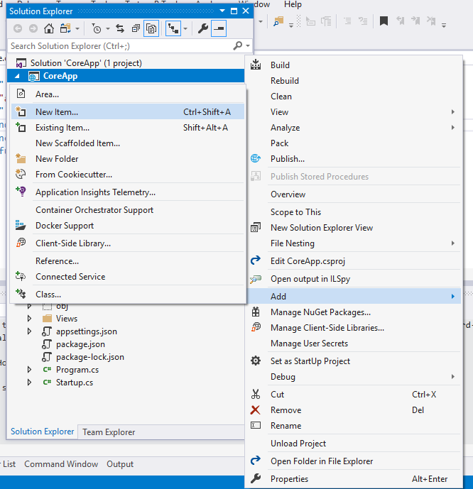
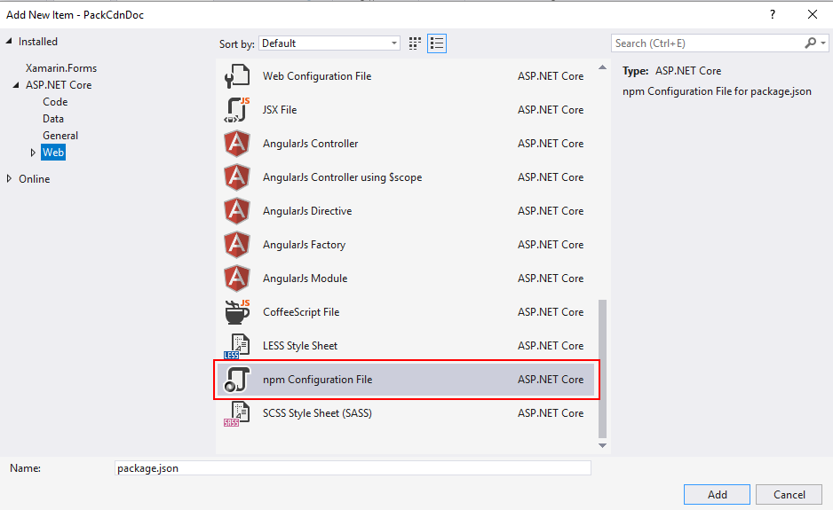
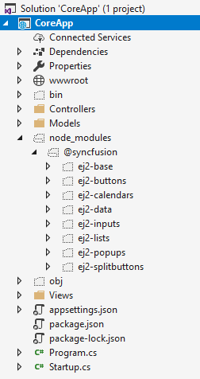
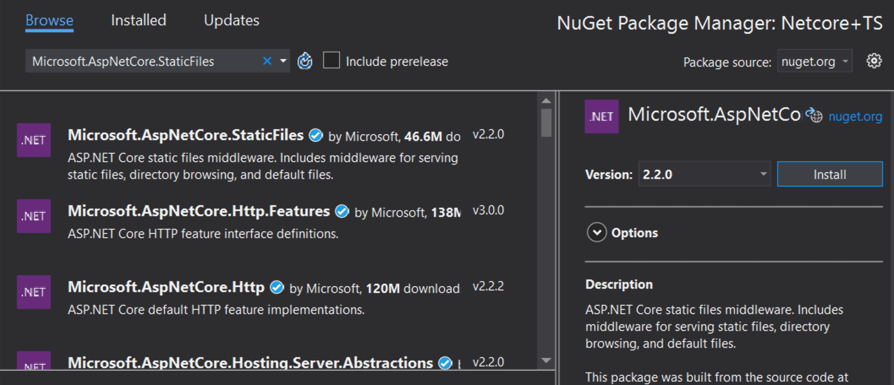
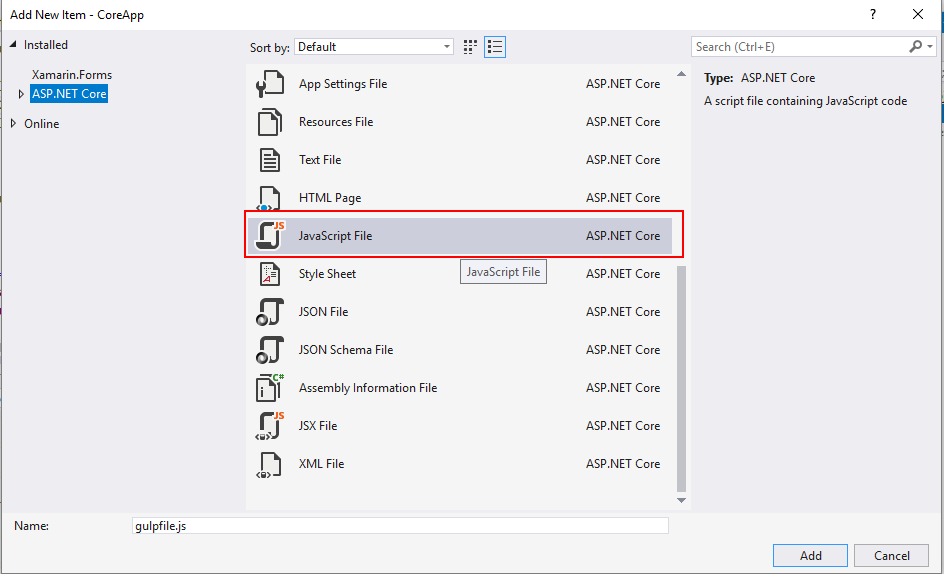
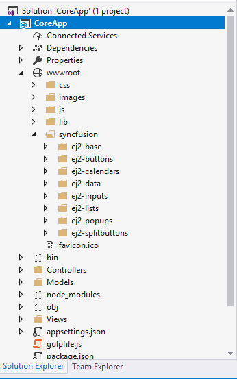

# Reference Scripts in ASP.NET Core Application

This section explains the available approaches for referencing client-side scripts and stylesheets for Syncfusion<sup style="font-size:70%">&reg;</sup> ASP.NET Core controls. You can reference scripts via **CDN**, **Static Web Assets** (served directly from NuGet packages), **NPM Packages**, or the **Custom Resource Generator (CRG)**. 

## Static Web Assets

Static web assets allow you to reference Syncfusion<sup style="font-size:70%">&reg;</sup> scripts and stylesheets directly from the installed NuGet packages no CDN, no manual file copying. The ASP.NET Core framework serves these files automatically at the path `_content/{PackageName}/`, making them the most reliable and version-consistent way to reference scripts in production.

### Enable Static Web Assets

To serve static web assets, call [UseStaticFiles](https://learn.microsoft.com/en-us/aspnet/core/fundamentals/static-files?view=aspnetcore-8.0) in the app's `~/Program.cs` file.




var app = builder.Build();
app.UseStaticFiles();




### Reference scripts from Static Web Assets

The combined script for all Syncfusion<sup style="font-size:70%">&reg;</sup> ASP.NET Core controls is available in the [Syncfusion.AspNetCore.Base](https://www.nuget.org/packages/Syncfusion.AspNetCore.Base/) package. Add the reference in the `<head>` element of `~/Pages/Shared/_Layout.cshtml`.




<head>

    <!-- Syncfusion ASP.NET Core controls scripts -->
    <script src="_content/Syncfusion.AspNetCore.Base/scripts/ej2.min.js"></script>
</head>




> **Note:** Syncfusion<sup style="font-size:70%">&reg;</sup> does not recommend referencing the combined `ej2.min.js` in production applications because it includes all controls, which increases page load time. For production, use individual control script references as described below.

### Individual control script references

For production use, reference only the scripts for the controls your application actually uses. This reduces the JavaScript payload significantly. Install the relevant NuGet package for each control group, then reference its static web asset files.

The script path follows this pattern:

```
_content/{NuGetPackageName}/scripts/{script-file-name}
```

The following table lists each NuGet package, the controls it covers, and the individual script files it provides.

<table>
<tr>
<th>NuGet Package</th>
<th>Controls</th>
<th>Script Files</th>
</tr>
<tr>
<td>Syncfusion.AspNetCore.Charts</td>
<td>AccumulationChart</td>
<td>


<script src="_content/Syncfusion.AspNetCore.Charts/scripts/sf-accumulation-chart.min.js"></script>


</td>
</tr>
<tr>
<td>Syncfusion.AspNetCore.BarcodeGenerator</td>
<td>Barcode Generator, DataMatrix, QR Code</td>
<td>


<script src="_content/Syncfusion.AspNetCore.BarcodeGenerator/scripts/sf-barcode.min.js"></script>
<script src="_content/Syncfusion.AspNetCore.BarcodeGenerator/scripts/sf-datamatrix.min.js"></script>
<script src="_content/Syncfusion.AspNetCore.BarcodeGenerator/scripts/sf-qrcode.min.js"></script>


</td>
</tr>
<tr>
<td>Syncfusion.AspNetCore.BlockEditor</td>
<td>Block Editor</td>
<td>


<script src="_content/Syncfusion.AspNetCore.BlockEditor/scripts/sf-blockeditor.min.js"></script>


</td>
</tr>
<tr>
<td>Syncfusion.AspNetCore.BulletChart</td>
<td>Bullet Chart</td>
<td>


<script src="_content/Syncfusion.AspNetCore.BulletChart/scripts/sf-bullet-chart.min.js"></script>


</td>
</tr>
<tr>
<td>Syncfusion.AspNetCore.Buttons</td>
<td>Button, CheckBox, Chips, FloatingActionButton, RadioButton, SpeedDial, Switch</td>
<td>


<script src="_content/Syncfusion.AspNetCore.Buttons/scripts/sf-button.min.js"></script>
<script src="_content/Syncfusion.AspNetCore.Buttons/scripts/sf-check-box.min.js"></script>
<script src="_content/Syncfusion.AspNetCore.Buttons/scripts/sf-chips.min.js"></script>
<script src="_content/Syncfusion.AspNetCore.Buttons/scripts/sf-floating-action-button.min.js"></script>
<script src="_content/Syncfusion.AspNetCore.Buttons/scripts/sf-radio-button.min.js"></script>
<script src="_content/Syncfusion.AspNetCore.Buttons/scripts/sf-speed-dial.min.js"></script>
<script src="_content/Syncfusion.AspNetCore.Buttons/scripts/sf-switch.min.js"></script>


</td>
</tr>
<tr>
<td>Syncfusion.AspNetCore.Calendars</td>
<td>Calendar, DatePicker, DateRangePicker, DateTimePicker, TimePicker</td>
<td>


<script src="_content/Syncfusion.AspNetCore.Calendars/scripts/sf-calendar.min.js"></script>
<script src="_content/Syncfusion.AspNetCore.Calendars/scripts/sf-datepicker.min.js"></script>
<script src="_content/Syncfusion.AspNetCore.Calendars/scripts/sf-daterangepicker.min.js"></script>
<script src="_content/Syncfusion.AspNetCore.Calendars/scripts/sf-datetimepicker.min.js"></script>
<script src="_content/Syncfusion.AspNetCore.Calendars/scripts/sf-timepicker.min.js"></script>


</td>
</tr>
<tr>
<td>Syncfusion.AspNetCore.Charts</td>
<td>Chart</td>
<td>


<script src="_content/Syncfusion.AspNetCore.Charts/scripts/sf-chart.min.js"></script>


</td>
</tr>
<tr>
<td>Syncfusion.AspNetCore.Chart3D</td>
<td>3D Chart</td>
<td>


<script src="_content/Syncfusion.AspNetCore.Chart3D/scripts/sf-chart3d.min.js"></script>


</td>
</tr>
<tr>
<td>Syncfusion.AspNetCore.CircularChart3D</td>
<td>3D Circular Chart</td>
<td>


<script src="_content/Syncfusion.AspNetCore.CircularChart3D/scripts/sf-circular3d.min.js"></script>


</td>
</tr>
<tr>
<td>Syncfusion.AspNetCore.CircularGauge</td>
<td>Circular Gauge</td>
<td>


<script src="_content/Syncfusion.AspNetCore.CircularGauge/scripts/sf-circular-gauge.min.js"></script>


</td>
</tr>
<tr>
<td>Syncfusion.AspNetCore.Diagram</td>
<td>Diagram</td>
<td>


<script src="_content/Syncfusion.AspNetCore.Diagram/scripts/sf-diagram.min.js"></script>


</td>
</tr>
<tr>
<td>Syncfusion.AspNetCore.DocumentEditor</td>
<td>Document Editor, Document Editor Container</td>
<td>


<script src="_content/Syncfusion.AspNetCore.DocumentEditor/scripts/sf-document-editor.min.js"></script>
<script src="_content/Syncfusion.AspNetCore.DocumentEditor/scripts/sf-document-editor-container.min.js"></script>


</td>
</tr>
<tr>
<td>Syncfusion.AspNetCore.DropDowns</td>
<td>AutoComplete, ComboBox, DropDownList, DropDownTree, ListBox, Mention, MultiSelect</td>
<td>


<script src="_content/Syncfusion.AspNetCore.DropDowns/scripts/sf-auto-complete.min.js"></script>
<script src="_content/Syncfusion.AspNetCore.DropDowns/scripts/sf-combo-box.min.js"></script>
<script src="_content/Syncfusion.AspNetCore.DropDowns/scripts/sf-drop-down-list.min.js"></script>
<script src="_content/Syncfusion.AspNetCore.DropDowns/scripts/sf-drop-down-tree.min.js"></script>
<script src="_content/Syncfusion.AspNetCore.DropDowns/scripts/sf-list-box.min.js"></script>
<script src="_content/Syncfusion.AspNetCore.DropDowns/scripts/sf-mention.min.js"></script>
<script src="_content/Syncfusion.AspNetCore.DropDowns/scripts/sf-multi-select.min.js"></script>


</td>
</tr>
<tr>
<td>Syncfusion.AspNetCore.FileManager</td>
<td>File Manager</td>
<td>


<script src="_content/Syncfusion.AspNetCore.FileManager/scripts/sf-file-manager.min.js"></script>


</td>
</tr>
<tr>
<td>Syncfusion.AspNetCore.Gantt</td>
<td>Gantt</td>
<td>


<script src="_content/Syncfusion.AspNetCore.Gantt/scripts/sf-gantt.min.js"></script>


</td>
</tr>
<tr>
<td>Syncfusion.AspNetCore.Grid</td>
<td>Grid</td>
<td>


<script src="_content/Syncfusion.AspNetCore.Grid/scripts/sf-grid.min.js"></script>


</td>
</tr>
<tr>
<td>Syncfusion.AspNetCore.HeatMap</td>
<td>HeatMap</td>
<td>


<script src="_content/Syncfusion.AspNetCore.HeatMap/scripts/sf-heatmap.min.js"></script>


</td>
</tr>
<tr>
<td>Syncfusion.AspNetCore.ImageEditor</td>
<td>Image Editor</td>
<td>


<script src="_content/Syncfusion.AspNetCore.ImageEditor/scripts/sf-image-editor.min.js"></script>


</td>
</tr>
<tr>
<td>Syncfusion.AspNetCore.InPlaceEditor</td>
<td>In-place Editor</td>
<td>


<script src="_content/Syncfusion.AspNetCore.InPlaceEditor/scripts/sf-inplace-editor.min.js"></script>


</td>
</tr>
<tr>
<td>Syncfusion.AspNetCore.Inputs</td>
<td>ColorPicker, MaskedTextBox, NumericTextBox, OTP Input, Rating, Signature, Slider, SpeechToText, TextArea, TextBox, Uploader</td>
<td>


<script src="_content/Syncfusion.AspNetCore.Inputs/scripts/sf-color-picker.min.js"></script>
<script src="_content/Syncfusion.AspNetCore.Inputs/scripts/sf-maskedtextbox.min.js"></script>
<script src="_content/Syncfusion.AspNetCore.Inputs/scripts/sf-numerictextbox.min.js"></script>
<script src="_content/Syncfusion.AspNetCore.Inputs/scripts/sf-otp-input.min.js"></script>
<script src="_content/Syncfusion.AspNetCore.Inputs/scripts/sf-rating.min.js"></script>
<script src="_content/Syncfusion.AspNetCore.Inputs/scripts/sf-signature.min.js"></script>
<script src="_content/Syncfusion.AspNetCore.Inputs/scripts/sf-slider.min.js"></script>
<script src="_content/Syncfusion.AspNetCore.Inputs/scripts/sf-speech-to-text.min.js"></script>
<script src="_content/Syncfusion.AspNetCore.Inputs/scripts/sf-textarea.min.js"></script>
<script src="_content/Syncfusion.AspNetCore.Inputs/scripts/sf-textbox.min.js"></script>
<script src="_content/Syncfusion.AspNetCore.Inputs/scripts/sf-uploader.min.js"></script>


</td>
</tr>
<tr>
<td>Syncfusion.AspNetCore.InteractiveChat</td>
<td>AI AssistView, Chat UI, Inline AI Assist</td>
<td>


<script src="_content/Syncfusion.AspNetCore.InteractiveChat/scripts/sf-ai-assistview.min.js"></script>
<script src="_content/Syncfusion.AspNetCore.InteractiveChat/scripts/sf-chat-ui.min.js"></script>
<script src="_content/Syncfusion.AspNetCore.InteractiveChat/scripts/sf-inline-ai-assist.min.js"></script>


</td>
</tr>
<tr>
<td>Syncfusion.AspNetCore.Kanban</td>
<td>Kanban</td>
<td>


<script src="_content/Syncfusion.AspNetCore.Kanban/scripts/sf-kanban.min.js"></script>


</td>
</tr>
<tr>
<td>Syncfusion.AspNetCore.Layouts</td>
<td>Dashboard Layout, Splitter, Timeline</td>
<td>


<script src="_content/Syncfusion.AspNetCore.Layouts/scripts/sf-dashboard-layout.min.js"></script>
<script src="_content/Syncfusion.AspNetCore.Layouts/scripts/sf-splitter.min.js"></script>
<script src="_content/Syncfusion.AspNetCore.Layouts/scripts/sf-timeline.min.js"></script>


</td>
</tr>
<tr>
<td>Syncfusion.AspNetCore.LinearGauge</td>
<td>Linear Gauge</td>
<td>


<script src="_content/Syncfusion.AspNetCore.LinearGauge/scripts/sf-linear-gauge.min.js"></script>


</td>
</tr>
<tr>
<td>Syncfusion.AspNetCore.Lists</td>
<td>ListView</td>
<td>


<script src="_content/Syncfusion.AspNetCore.Lists/scripts/sf-list-view.min.js"></script>


</td>
</tr>
<tr>
<td>Syncfusion.AspNetCore.Maps</td>
<td>Maps</td>
<td>


<script src="_content/Syncfusion.AspNetCore.Maps/scripts/sf-maps.min.js"></script>


</td>
</tr>
<tr>
<td>Syncfusion.AspNetCore.MultiColumnComboBox</td>
<td>MultiColumn ComboBox</td>
<td>


<script src="_content/Syncfusion.AspNetCore.MultiColumnComboBox/scripts/sf-multicolumn-combobox.min.js"></script>


</td>
</tr>
<tr>
<td>Syncfusion.AspNetCore.Navigations</td>
<td>Accordion, AppBar, Breadcrumb, Carousel, ContextMenu, Menu, Sidebar, Stepper, Tabs, Toolbar, TreeView</td>
<td>


<script src="_content/Syncfusion.AspNetCore.Navigations/scripts/sf-accordion.min.js"></script>
<script src="_content/Syncfusion.AspNetCore.Navigations/scripts/sf-appbar.min.js"></script>
<script src="_content/Syncfusion.AspNetCore.Navigations/scripts/sf-breadcrumb.min.js"></script>
<script src="_content/Syncfusion.AspNetCore.Navigations/scripts/sf-carousel.min.js"></script>
<script src="_content/Syncfusion.AspNetCore.Navigations/scripts/sf-context-menu.min.js"></script>
<script src="_content/Syncfusion.AspNetCore.Navigations/scripts/sf-menu.min.js"></script>
<script src="_content/Syncfusion.AspNetCore.Navigations/scripts/sf-sidebar.min.js"></script>
<script src="_content/Syncfusion.AspNetCore.Navigations/scripts/sf-stepper.min.js"></script>
<script src="_content/Syncfusion.AspNetCore.Navigations/scripts/sf-tab.min.js"></script>
<script src="_content/Syncfusion.AspNetCore.Navigations/scripts/sf-toolbar.min.js"></script>
<script src="_content/Syncfusion.AspNetCore.Navigations/scripts/sf-treeview.min.js"></script>


</td>
</tr>
<tr>
<td>Syncfusion.AspNetCore.Notifications</td>
<td>Message, Skeleton, Toast</td>
<td>


<script src="_content/Syncfusion.AspNetCore.Notifications/scripts/sf-message.min.js"></script>
<script src="_content/Syncfusion.AspNetCore.Notifications/scripts/sf-skeleton.min.js"></script>
<script src="_content/Syncfusion.AspNetCore.Notifications/scripts/sf-toast.min.js"></script>


</td>
</tr>
<tr>
<td>Syncfusion.AspNetCore.PdfViewer</td>
<td>PDF Viewer</td>
<td>


<script src="_content/Syncfusion.AspNetCore.PdfViewer/scripts/sf-pdfviewer.min.js"></script>


</td>
</tr>
<tr>
<td>Syncfusion.AspNetCore.PivotView</td>
<td>Pivot Table, Pivot Field List</td>
<td>


<script src="_content/Syncfusion.AspNetCore.PivotView/scripts/sf-pivotview.min.js"></script>
<script src="_content/Syncfusion.AspNetCore.PivotView/scripts/sf-pivotfieldlist.min.js"></script>


</td>
</tr>
<tr>
<td>Syncfusion.AspNetCore.Popups</td>
<td>Dialog, Spinner, Tooltip</td>
<td>


<script src="_content/Syncfusion.AspNetCore.Popups/scripts/sf-dialog.min.js"></script>
<script src="_content/Syncfusion.AspNetCore.Popups/scripts/sf-spinner.min.js"></script>
<script src="_content/Syncfusion.AspNetCore.Popups/scripts/sf-tooltip.min.js"></script>


</td>
</tr>
<tr>
<td>Syncfusion.AspNetCore.ProgressBar</td>
<td>Progress Bar</td>
<td>


<script src="_content/Syncfusion.AspNetCore.ProgressBar/scripts/sf-progressbar.min.js"></script>


</td>
</tr>
<tr>
<td>Syncfusion.AspNetCore.QueryBuilder</td>
<td>Query Builder</td>
<td>


<script src="_content/Syncfusion.AspNetCore.QueryBuilder/scripts/sf-query-builder.min.js"></script>


</td>
</tr>
<tr>
<td>Syncfusion.AspNetCore.RangeNavigator</td>
<td>Range Navigator</td>
<td>


<script src="_content/Syncfusion.AspNetCore.RangeNavigator/scripts/sf-range-navigator.min.js"></script>


</td>
</tr>
<tr>
<td>Syncfusion.AspNetCore.Ribbon</td>
<td>Ribbon</td>
<td>


<script src="_content/Syncfusion.AspNetCore.Ribbon/scripts/sf-ribbon.min.js"></script>


</td>
</tr>
<tr>
<td>Syncfusion.AspNetCore.RichTextEditor</td>
<td>Rich Text Editor</td>
<td>


<script src="_content/Syncfusion.AspNetCore.RichTextEditor/scripts/sf-rich-text-editor.min.js"></script>


</td>
</tr>
<tr>
<td>Syncfusion.AspNetCore.Sankey</td>
<td>Sankey</td>
<td>


<script src="_content/Syncfusion.AspNetCore.Sankey/scripts/sf-sankey.min.js"></script>


</td>
</tr>
<tr>
<td>Syncfusion.AspNetCore.Schedule</td>
<td>Schedule</td>
<td>


<script src="_content/Syncfusion.AspNetCore.Schedule/scripts/sf-schedule.min.js"></script>


</td>
</tr>
<tr>
<td>Syncfusion.AspNetCore.Smithchart</td>
<td>Smith Chart</td>
<td>


<script src="_content/Syncfusion.AspNetCore.Smithchart/scripts/sf-smithchart.min.js"></script>


</td>
</tr>
<tr>
<td>Syncfusion.AspNetCore.Sparkline</td>
<td>Sparkline</td>
<td>


<script src="_content/Syncfusion.AspNetCore.Sparkline/scripts/sf-sparkline.min.js"></script>


</td>
</tr>
<tr>
<td>Syncfusion.AspNetCore.SplitButtons</td>
<td>DropDownButton, ProgressButton, SplitButton</td>
<td>


<script src="_content/Syncfusion.AspNetCore.SplitButtons/scripts/sf-drop-down-button.min.js"></script>
<script src="_content/Syncfusion.AspNetCore.SplitButtons/scripts/sf-progress-button.min.js"></script>
<script src="_content/Syncfusion.AspNetCore.SplitButtons/scripts/sf-split-button.min.js"></script>


</td>
</tr>
<tr>
<td>Syncfusion.AspNetCore.Spreadsheet</td>
<td>Spreadsheet</td>
<td>


<script src="_content/Syncfusion.AspNetCore.Spreadsheet/scripts/sf-spreadsheet.min.js"></script>


</td>
</tr>
<tr>
<td>Syncfusion.AspNetCore.StockChart</td>
<td>Stock Chart</td>
<td>


<script src="_content/Syncfusion.AspNetCore.StockChart/scripts/sf-stock-chart.min.js"></script>


</td>
</tr>
<tr>
<td>Syncfusion.AspNetCore.TreeGrid</td>
<td>Tree Grid</td>
<td>


<script src="_content/Syncfusion.AspNetCore.TreeGrid/scripts/sf-treegrid.min.js"></script>


</td>
</tr>
<tr>
<td>Syncfusion.AspNetCore.TreeMap</td>
<td>TreeMap</td>
<td>


<script src="_content/Syncfusion.AspNetCore.TreeMap/scripts/sf-treemap.min.js"></script>


</td>
</tr>
</table>

## Node Package Manager (NPM)

A package in Node.js consists of a set of files needed for a JavaScript module which can be included in any web application. NPM is the popular package manager for both public and private packages.

### Syncfusion<sup style="font-size:70%">&reg;</sup> NPM packages

Scripts and style sheets of Syncfusion<sup style="font-size:70%">&reg;</sup> ASP.NET Core controls can be included in an ASP.NET Core web application using NPM packages, since Syncfusion<sup style="font-size:70%">&reg;</sup> publishes its ASP.NET Core controls as the scoped package in NPM.

#### Installing NPM packages in ASP.NET Core Web Application

1.Open the Source Explorer and right click the application name. Then, select “**Add New Item**” menu item to open the “**Add New Item**” window. 



2.Select “**Web**” on the left side Tree View and select “**npm configuration File**” in “**Add New Item**” window which will include and configure “**package.json**” file in root folder of the ASP.NET Core web application. 



3.Open the Source Explorer and right click on the application name. Then, select “**Open Folder in File Explorer**”. 

4.Open the Command Prompt for this location and install the required Syncfusion<sup style="font-size:70%">&reg;</sup> packages using “**npm install @syncfusion/{PACKAGE_NAME} --save**”




npm install @syncfusion/ej2-calendars --save




5.Installed packages with all its dependencies can be found under the  “**node_modules**” folder as shown in the following image.



#### From Installed Packages

Scripts and style sheets of Syncfusion<sup style="font-size:70%">&reg;</sup> ASP.NET Core controls from locally-installed packages can be included in an ASP.NET Core web application using the following two methods.

N>Files in the **wwwroot** folder can be accessed only in client-side, hence Syncfusion<sup style="font-size:70%">&reg;</sup> scripts and style sheets should be copied from **node_modules** to **wwwroot**.

By using either one of the following methods, Client-Side Resource can be loaded in ASP.NET Core web application:

1. Copying scripts and styles using gulp
2. Generating scripts and styles using [CRG (Custom Resource Generator)](./custom-resource-generator)

#### Copying by Gulp

Install required Syncfusion<sup style="font-size:70%">&reg;</sup> ASP.NET Core control packages as mentioned in “[**Installing NPM Packages in ASP.NET Core Web Application**](#installing-npm-packages-in-aspnet-core-web-application)”. 

1.In addition to Syncfusion<sup style="font-size:70%">&reg;</sup> ASP.NET Core packages, install gulp and glob packages using below commands.

N>Gulp Installation - **npm install gulp --save**




npm install gulp@latest --save




N>Glob Installation - **npm install glob --save**




npm install glob@latest --save




2.To set up the server, open Dependencies -> Manage NuGet Packages -> Browse. Then, search and install "**Microsoft.AspNetCore.StaticFiles -V2.2.0**" and "**Microsoft.TypeScript.MSBuild -V3.8.3**" packages.


     
Open up your "**Startup.cs**" file and edit your Configure function to looks like the below code snippet.




public void Configure(IApplicationBuilder app, IHostingEnvironment env)
{
    if (env.IsDevelopment())
    {
        app.UseDeveloperExceptionPage();
    }
    app.UseDefaultFiles();
    app.UseStaticFiles();
}




Restart Visual Studio for the red squiggly lines below "**UseDefaultFiles**" and "**UseStaticFiles**" to disappear.

3.Open the Source Explorer and right click on the application name. Then, select “**Add New Item**” menu item to open the “**Add New Item**” window. 

4.Select “**ASP.NET Core**” on the left side Tree View and select “**JavaScript File**” in the “**Add New Item**” window. It will include a js file in the root folder of the ASP.NET Core web application. Rename the js file as “**gulpfile.js**”.



5.Copy the following code snippet and paste it in **gulpfile.js** for automatically copying the script and styles from “**node_modules**” to “**wwwroot**” while building the web application.




/// <binding BeforeBuild='copy-client-resource'/>
// nodejs requiring statement for importing and using the package in this js file
var gulp = require('gulp');
var glob = require('glob');
// gulp task for copying file form “node_modules” to “wwwroot” directory
gulp.task("copy-client-resource", function (done) {
    let packagePath = './node_modules/@syncfusion/';
    let destCommonPath = 'wwwroot/syncfusion'
    let installedPackages = glob.sync(`${packagePath}*`);
    for (let insPackage of installedPackages) {
        let packagename = insPackage.replace(packagePath, '');
        gulp.src(`${insPackage}/dist/global/**/*`)
            .pipe(gulp.dest(`${destCommonPath}/${packagename}/`));
        gulp.src(`${insPackage}/styles/**/*.css`)
            .pipe(gulp.dest(`${destCommonPath}/${packagename}/styles/`));
    }
    done();
});




6.Build the ASP.NET Core web application and notice that a new folder named “**Syncfusion**” is created in “**wwwroot**” folder.



7.Add the client-side resource in the `<head>` element of the `~/Views/Shared/_Layout.cshtml`. Here, scripts and styles of Syncfusion<sup style="font-size:70%">&reg;</sup> ASP.NET Core Calendar has been loaded for example.  




<head>
    <!-- Syncfusion ASP.NET Core controls styles -->
    <link rel="stylesheet" href="~/syncfusion/ej2-calendars/styles/calendar/material.css" />
    <link rel="stylesheet" href="~/syncfusion/ej2-base/styles/material.css" />
    <link rel="stylesheet" href="~/syncfusion/ej2-buttons/styles/button/material.css" />
    <!-- Syncfusion ASP.NET Core controls scripts -->
    <script src="~/syncfusion/ej2-base/ej2-base.min.js"></script>
    <script src="~/syncfusion/ej2-calendars/ej2-calendars.min.js"></script>
</head>




## CDN Reference

Syncfusion<sup style="font-size:70%">&reg;</sup> hosts every ASP.NET Core control package on CDN, from which scripts and stylesheets can be loaded. For detailed CDN URLs, individual control CDN references, and CDN fallback configuration, refer to the [CDN Reference](./script-reference-cdn) page.

## Custom Resource Generator

The Syncfusion<sup style="font-size:70%">&reg;</sup> ASP.NET Core provides an option to generate a control's scripts using the [Custom Resource Generator](https://crg.syncfusion.com/) (CRG) tool. Refer [here](./custom-resource-generator) for details.

## See also

* [CDN Reference](./script-reference-cdn)
* [CDN Fallback](./cdn-fallback)
* [Adding Nonce to Script tag in ASP.NET Core](./security-aspects#adding-nonce-to-script-tag-in-aspnetcore)