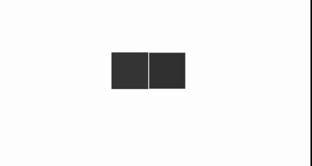

# Animation in Syncfusion ASP.NET Core

The **Animation** library is used to perform animation effects on HTML elements by running sequence of frames.

## Animation Supported controls

The following list demonstrates the Syncfusion ASP.NET Core control documents that are supported with Animation.

* [Accordion](../accordion/how-to/customize-expand-collapse-actions)
* [Accumulation Chart](../accumulation-chart/legend#enable-animation)
* [Bullet Chart](../bullet-chart/customization#animation)
* [Chart](../chart/legend#enable-animation)
* [Circular Gauge](../circular-gauge/gauge-pointers#animation)
* [Context Menu](../context-menu/how-to/change-animation-settings)
* [Dialog](../dialog/dialog/animation)
* [In-place Editor](../in-place-editor/how-to/custom-animation)
* [ProgressBar](../progress-bar/animation)
* [SideBar](../sidebar/how-to/sidebar-with-variation-animation)
* [Tabs](../tab/how-to/set-custom-animation)
* [Toast](../toast/animation)
* [ToolTip](../tooltip/animation)
* ListView
* Menu
* Pivot Table
* ProgressButton
* Smith Chart
* Stock Chart
* TreeView

## Animating a HTML Element

The `animate` method of `Animation` library can be used to animate the HTML elements. This method can also take additional `AnimationModel`. Refer the below code snippet to animate a multiple DOM element.



     
     

     

    
    
    




