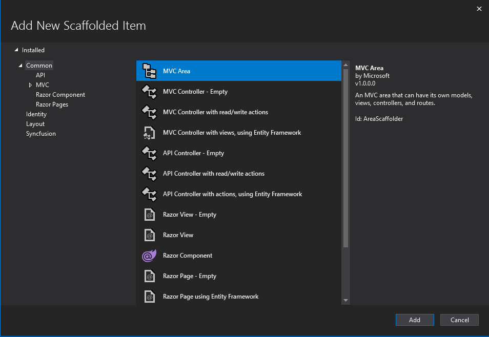
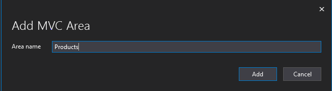
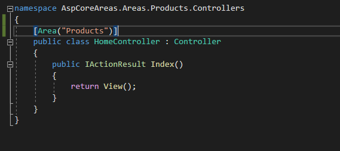
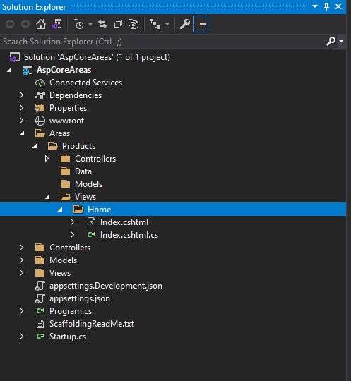
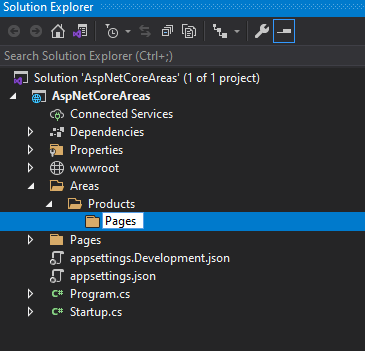
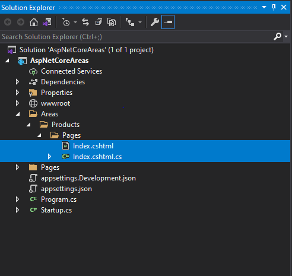

# Areas in ASP.NET Core

This article provides a step-by-step introduction to add areas and configure the Syncfusion control in the ASP.NET Core platform.

## Areas

ASP.NET Areas is a feature that allows to create a separate module in the application with its own set of Razor Pages, controllers, views, and models.

### MVC Areas

1. Create ASP.NET Core web application with MVC(views and controllers). Refer to [this](https://ej2.syncfusion.com/aspnetcore/documentation/getting-started/visual-studio-2017/) documentation to get started with ASP.NET Core application.

2. To add the MVC Area, right-click the application in the solution explorer and choose **ADD** -> **New Scaffolded Item**.

Select **MVC Area** from the pop-up and click **Add** to create an Area.

3. Now, created MVC Area is added to the root of the application with its Controllers, Data, Models, Views folders like the below structure.

4. Add the controller `HomeController.cs` in the `Areas/Products/Controllers/` folder location and then add the area attribute **`[Area("area name")]`** like below.

5. Add the View page in the `~/Areas/Products/Views/` folder location.

6. Move the Razor View Imports `_ViewImports.cshtml` and Razor View Start `_ViewStart.cshtml` files from `~/Views/` to the application root folder to share the common layout and view imports to all views.

>You can also add the `_ViewImports.cshtml` and `_ViewStart.cshtml` files to the appropriate Views folder under areas if you want to maintain it separately.

7. Open the `_ViewImports.cshtml` file and import the `Syncfusion.EJ2` package.




@addTagHelper *, Syncfusion.EJ2




>If `_ViewImports.cshtml` file is added in the appropriate Views folder under the areas, import the `Syncfusion.EJ2` package into each `_ViewImports.cshtml` file.

8. Add the Area routing configuration before the default routing in the `Startup.cs` page.




app.UseEndpoints(endpoints =>
{
    endpoints.MapControllerRoute(
        name : "MyAreas",
        pattern : "{area:exists}/{controller=Home}/{action=Index}/{id?}"
    );
    ...
});




9. Add the client-side resources through [CDN](https://ej2.syncfusion.com/documentation/deployment/#cdn) or [local npm package](https://www.npmjs.com/package/@syncfusion/ej2) in the `<head>` element of `~/Views/Shared/_Layout.cshtml` layout page.




<head>
    ...
    <!-- Syncfusion Essential JS 2 Styles -->
    <link rel="stylesheet" href="https://cdn.syncfusion.com/ej2/{{ site.ej2version }}/bootstrap5.css" />

    <!-- Syncfusion Essential JS 2 Scripts -->
    
</head>




10. Add the Syncfusion script manager at the end of `<body>` element in the `~/Views/Shared/_Layout.cshtml` layout page.




<body>
    ...
    <!-- Syncfusion script manager -->
    <ejs-scripts></ejs-scripts>
</body>




>If `_ViewStart.cshtml` file is added in the appropriate Views folder under the areas, add the Syncfusion script manager in that referred layout page.

11. Now, you can add the Syncfusion ASP.NET Core controls in `Index.cshtml` View file in the `~/Areas/Products/Views/` folder.




    <ejs-calendar id="calendar"></ejs-calendar>




12. Run the application. Syncfusion ASP.NET Core calendar control will render in the web browser on the **Products**(`localhost:[port]/products/home/index`) page.

### Areas with Razor Pages

1. Create an ASP.NET Core web application with Razor pages. Refer to [this](https://ej2.syncfusion.com/aspnetcore/documentation/getting-started/razor-pages/) documentation to get started with ASP.NET Core application.

2. Create the folders `Areas/<area name>/Pages` to the application root like the below structure.

3. Add the Razor Page in the `~/Areas/Products/Pages/` folder location.

4. Move the Razor View Imports `_ViewImports.cshtml` and Razor View Start `_ViewStart.cshtml` files from `~/Pages/` to the application root folder to share the common layout and view imports to all Razor Pages.

>You can also add the `_ViewImports.cshtml` and `_ViewStart.cshtml` files to the appropriate Pages folder under areas if you want to maintain it separately.

5. Open the `_ViewImports.cshtml` file and import the `Syncfusion.EJ2` package.




@addTagHelper *, Syncfusion.EJ2




>If `_ViewImports.cshtml` file is added in the appropriate Pages folder under the areas, import the `Syncfusion.EJ2` package into each `_ViewImports.cshtml` file.

6. Add the client-side resources through [CDN](https://ej2.syncfusion.com/documentation/deployment/#cdn) or [local npm package](https://www.npmjs.com/package/@syncfusion/ej2) in the `<head>` element of `~/Pages/Shared/_Layout.cshtml` layout page.




<head>
    ...
    <!-- Syncfusion Essential JS 2 Styles -->
    <link rel="stylesheet" href="https://cdn.syncfusion.com/ej2/{{ site.ej2version }}/bootstrap5.css" />

    <!-- Syncfusion Essential JS 2 Scripts -->
    
</head>




7. Add the Syncfusion script manager at the end of `<body>` element in the `~/Pages/Shared/_Layout.cshtml` layout page.




<body>
    ...
    <!-- Syncfusion script manager -->
    <ejs-scripts></ejs-scripts>
</body>




>If `_ViewStart.cshtml` file is added in the appropriate Pages folder under the areas, add the Syncfusion script manager in that referred layout page.

8. Now, you can add the Syncfusion ASP.NET Core controls in `Index.cshtml` Razor Page file in the `~/Areas/Products/Pages/` folder.




    <ejs-calendar id="calendar"></ejs-calendar>




9. Run the application. Syncfusion ASP.NET Core calendar control will render in the web browser on the **Products**(`localhost:[port]/products/home/index`) page.

