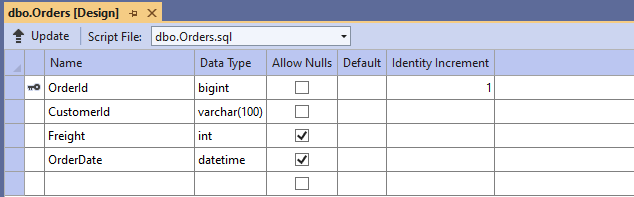
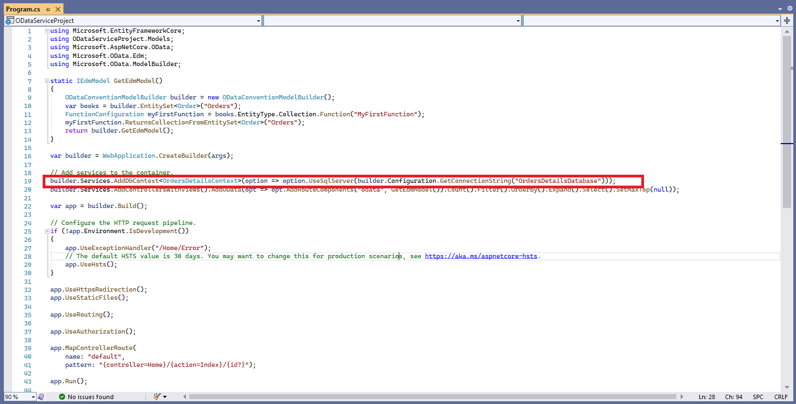
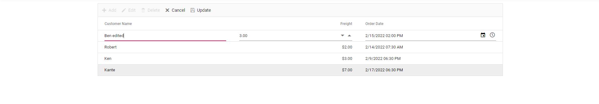

# Bind data to the Syncfusion Controls using ODataV4Adaptor

In this topic, we are going to learn how to retrieve data from RESTful web services, bind data to a ASP.NET Core Grid control, and perform CRUD operations. Here, we have fetched data from the ODataV4 service using **ODataV4Adaptor** in `DataManger`. It is recommended to choose the suitable adaptor based on the RESTful service which you are using to bind data for the Syncfusion ASP.NET Core control.

## Prerequisite software

The following software are needed
* Visual Studio 2022 v17.0 or later.
* .NET SDK 6.0 or later

## Create the database

Open Visual Studio, select **View -> SQL Server Object Explorer**. Right-click on the Databases folder to create a new Database and name it as OrdersDetails.

Right-click on the **Tables** folder of the created database and click **Add New Table**.

Use the following query to add a new table named **Orders**.




Create Table Orders(
 OrderId BigInt Identity(1,1) Primary Key Not Null,
 CustomerId Varchar(100) Not Null,
 Freight int Null,
 OrderDate datetime null
)




Now, the Orders table design will look like below. Click on the **Update** button.

Now, click on **Update Database**.

## Create OData service project

Open Visual Studio and create an empty ASP.NET Core Web Application with MVC(views and controllers) and name it as ODataServiceProject.

[Getting Started](https://ej2.syncfusion.com/aspnetcore/documentation/getting-started/visual-studio-2017/)

After creating the application, install **Microsoft.AspNetCore.OData** package by running the following command in the Package Manager Console.
* **Install-Package Microsoft.AspNetCore.OData -Version 8.0.7**: This package contains everything you need to create OData v4.0 endpoints using ASP.NET Core MVC and to support OData query syntax for your web APIs.

### Generate DbContext and model class from the database

Now, we are going to scaffold **DbContext** and **model classes** from the existing **OrdersDetails** database. To perform scaffolding and work with the SQL Server database in our application, we need to install the following NuGet packages.

Run the following commands in the **Package Manager Console**.

* **Install-Package Microsoft.EntityFrameworkCore.Tools -Version 6.0.2**: This package creates database context and model classes from the database.
* **Install-Package Microsoft.EntityFrameworkCore.SqlServer -Version 6.0.2**: The database provider that allows Entity Framework Core to work with SQL Server.

Once the above packages are installed, we can scaffold DbContext and Model classes. Run the following command in the **Package Manager Console**.




Scaffold-DbContext “Data Source=(localdb)\MSSQLLocalDB;Initial Catalog=OrdersDetails;Integrated Security=True;Connect Timeout=30;Encrypt=False;TrustServerCertificate=False;ApplicationIntent=ReadWrite;MultiSubnetFailover=False” Microsoft.EntityFrameworkCore.SqlServer -OutputDir Models




The above scaffolding command contains the following details for creating DbContext and model classes for the existing database and its tables.
* **Connection string**: Data Source=(localdb)\MSSQLLocalDB;Initial Catalog=OrdersDetails;Integrated Security=True;Connect Timeout=30;Encrypt=False;TrustServerCertificate=False;ApplicationIntent=ReadWrite;MultiSubnetFailover=False
* **Data provider**: Microsoft.EntityFrameworkCore.SqlServer
* **Output directory**: -OutputDir Models

After running the above command, the **OrdersDetailsContext.cs** and **Order.cs** files will be created under the **ODataServiceProject.Models** folder as follows.

We can see that OrdersDetailsContext.cs file contains the connection string details in the **OnConfiguring** method.

It is not recommended to have a connection string with sensitive information in the OrdersDetailsContext.cs file, so we are moving the connection string to the **appsettings.json** file.

Now, the DbContext must be configured using connection string and registered as scoped service using the AddDbContext method in **Program.cs**.

### Creating ODataV4 Service

The application is now configured to connect with the **OrdersDetails** database using Entity Framework. Now, it’s time to consume data from the OrdersDetails database. To do so, we need an OData controller to serve data from the DbContext to the ASP.NET Core application.

To create OData controller, right-click **Controller** folder in ODataServiceProject and select **Add -> New Item -> API controller with read/write actions**. We are naming this controller as **OrdersController** as it returns Orders table records.

Now, replace the controller with the following code which contains code to handle CRUD operations in the Orders table.




using Microsoft.AspNetCore.Mvc;
using ODataServiceProject.Models;
using Microsoft.AspNetCore.OData.Query;
using Microsoft.AspNetCore.OData.Deltas;
using Microsoft.AspNetCore.OData.Formatter;
using Microsoft.AspNetCore.OData.Routing.Controllers;

// For more information on enabling Web API for empty projects, visit https://go.microsoft.com/fwlink/?LinkID=397860

namespace ODataServiceProject.Controllers
{
    [Route("api/[controller]")]
    [ApiController]
    public class OrdersController : ODataController
    {
        private OrdersDetailsContext _db;
        public OrdersController(OrdersDetailsContext context)
        {
            _db = context;
        }

        [HttpGet]
        [EnableQuery]
        public IActionResult Get()
        {
            return Ok(_db.Orders);
        }

        [EnableQuery]
        public async Task<IActionResult> Post([FromBody] Order book)
        {
            _db.Orders.Add(book);
            _db.SaveChanges();
            return Created(book);
        }
        [EnableQuery]
        public async Task<IActionResult> Patch([FromODataUri] long key, [FromBody] Delta<Order> book)
        {
            var entity = await _db.Orders.FindAsync(key);
            book.Patch(entity);
            await _db.SaveChangesAsync();
            return Updated(entity);
        }
        [EnableQuery]
        public long Delete([FromODataUri] long key)
        {
            var deleterow = _db.Orders.Find(key);
            _db.Orders.Remove(deleterow);
            _db.SaveChanges();
            return key;
        }
    }
}




Open **Program.cs** file and configure by referring to the following codes.




using Microsoft.EntityFrameworkCore;
using ODataServiceProject.Models;
using Microsoft.AspNetCore.OData;
using Microsoft.OData.Edm;
using Microsoft.OData.ModelBuilder;

static IEdmModel GetEdmModel()
{
    ODataConventionModelBuilder builder = new ODataConventionModelBuilder();
    var books = builder.EntitySet<Order>("Orders");
    FunctionConfiguration myFirstFunction = books.EntityType.Collection.Function("MyFirstFunction");
    myFirstFunction.ReturnsCollectionFromEntitySet<Order>("Orders");
    return builder.GetEdmModel();
}

var builder = WebApplication.CreateBuilder(args);

// Add services to the container.
builder.Services.AddDbContext<OrdersDetailsContext>(option => option.UseSqlServer(builder.Configuration.GetConnectionString("OrdersDetailsDatabase")));
builder.Services.AddControllersWithViews().AddOData(opt => opt.AddRouteComponents("odata", GetEdmModel()).Count().Filter().OrderBy().Expand().Select().SetMaxTop(null));

var app = builder.Build();

// Configure the HTTP request pipeline.
if (!app.Environment.IsDevelopment())
{
    app.UseExceptionHandler("/Home/Error");
    // The default HSTS value is 30 days. You may want to change this for production scenarios, see https://aka.ms/aspnetcore-hsts.
    app.UseHsts();
}

app.UseHttpsRedirection();
app.UseStaticFiles();

app.UseRouting();

app.UseAuthorization();

app.MapControllerRoute(
    name: "default",
    pattern: "{controller=Home}/{action=Index}/{id?}");

app.Run();




## Install ASP.NET Core package in the application

Syncfusion ASP.NET Core controls are available in [nuget.org.](https://www.nuget.org/packages?q=syncfusion.EJ2) Refer to [NuGet packages topic](../../nuget-packages/) to learn more about installing NuGet packages in various OS environments. To add ASP.NET Core controls in the application, open the NuGet package manager in Visual Studio (Tools → NuGet Package Manager → Manage NuGet Packages for Solution), search for [Syncfusion.EJ2.AspNet.Core](https://www.nuget.org/packages/Syncfusion.EJ2.AspNet.Core/) and then install it.

> The Syncfusion.EJ2.AspNet.Core NuGet package has dependencies, [Newtonsoft.Json](https://www.nuget.org/packages/Newtonsoft.Json/) for JSON serialization and [Syncfusion.Licensing](https://www.nuget.org/packages/Syncfusion.Licensing/) for validating Syncfusion license key.

## Add Syncfusion ASP.NET Core Tag Helper

Open `~/Views/_ViewImports.cshtml` file and import the `Syncfusion.EJ2` TagHelper.




@addTagHelper *, Syncfusion.EJ2



    
## Add Style Sheet

Checkout the [Themes topic](../../appearance/theme/) to learn different ways ([CDN](../../common/adding-script-references), [NPM package](../../common/adding-script-references#node-package-manager-npm), and [CRG](../../common/custom-resource-generator/)) to refer styles in ASP.NET Core application, and to have the expected appearance for Syncfusion ASP.NET Core controls. Here, the theme is referred using CDN inside the `<head>` of `~/Views/Shared/_Layout.cshtml` file as follows,



<head>
    ...
    <!-- Syncfusion Essential JS 2 Styles -->
    <link rel="stylesheet" href="https://cdn.syncfusion.com/ej2/{{ site.ej2version }}/material.css" />
</head>



## Add Script Reference

In this getting started walk-through, the required scripts are referred using [CDN](../../common/adding-script-references) inside the `<head>` of `~/Views/Shared/_Layout.cshtml` file as follows,



<head>
    ...
    <!-- Syncfusion Essential JS 2 Scripts -->
    
</head>



## Register Syncfusion Script Manager

Open `~/Views/Shared/_Layout.cshtml` page and register the script manager <ejs-script> at the end of `<body>` in the ASP.NET Core application as follows. 



<body>
    ...
    <!-- Syncfusion Script Manager -->
    <ejs-scripts></ejs-scripts>
</body>



## Add DataGrid control to an application

In previous steps, we have successfully configured the Syncfusion ASP.NET Core package in the application. Now, we can add the grid control to to your **Index.cshtml** view page which is present under `Views/Home` folder.




<ejs-grid id="Grid"></ejs-grid>




## Binding data to  DataGrid control using ODataV4Adaptor

To consume data from the OData Controller, we need to add the **DataManager** with **ODataV4Adaptor** like below.




<ejs-grid id="Grid">
    <e-data-manager url="https://localhost:7029/odata/Orders" adaptor="ODataV4Adaptor" crossdomain="true"></e-data-manager>
</ejs-grid>




> In the above code example, we have used our localhost address from our application. Instead of localhost, you can give the exact URL of your OData service.

Grid columns can be defined by using the [GridColumn](https://help.syncfusion.com/cr/aspnetcore-js2/Syncfusion.EJ2.Grids.GridColumn.html) component. We are going to create columns using the following code.




<ejs-grid id="Grid">
    <e-data-manager url="https://localhost:7029/odata/Orders" adaptor="ODataV4Adaptor" crossdomain="true"></e-data-manager>
    <e-grid-editSettings allowDeleting="true" allowEditing="true" allowAdding="true"></e-grid-editSettings>
    <e-grid-columns>
                <e-grid-column field="OrderId" headerText="Order ID" visible="false" isPrimaryKey="true" width="140"></e-grid-column>
                <e-grid-column field="CustomerId" headerText="Customer Name" validationRules="@(new { required=true})" width="150"></e-grid-column>
                <e-grid-column field="Freight" headerText="Freight" validationRules="@(new { required=true})" textAlign="Right" editType="numericedit" format="C2" width="140"></e-grid-column>
                <e-grid-column field="OrderDate" headerText="Order Date" editType="datetimepickeredit" customFormat="@(new {type = "datetime", format = "M/d/y hh:mm a" })" width="160"></e-grid-column>
    </e-grid-columns>
 </ejs-grid>




When you run the application, the **Get()** method will be called in your OData controller.




[Route("api/[controller]")]
[ApiController]
public class OrdersController : ODataController
{
    private OrdersDetailsContext _db;
    public OrdersController(OrdersDetailsContext context)
    {
        _db = context;
    }

    [HttpGet]
    [EnableQuery]
    public IActionResult Get()
    {
        return Ok(_db.Orders);
    }
    ...
}




## Handling CRUD operations with Syncfusion DataGrid control

We can enable editing in the grid control using the [GridEditSettings](https://help.syncfusion.com/cr/aspnetcore-js2/Syncfusion.EJ2.Grids.GridEditSettings.html) component. Grid provides various modes of editing options such as [Inline/Normal](https://ej2.syncfusion.com/aspnetcore/documentation/grid/editing/in-line-editing), [Dialog](https://ej2.syncfusion.com/aspnetcore/documentation/grid/editing/dialog-editing), and [Batch](https://ej2.syncfusion.com/aspnetcore/documentation/grid/editing/batch-editing) editing.

Here, we are using **Inline** edit mode and used Toolbar property to show toolbar items for editing.




<ejs-grid id="Grid" toolbar="@(new List<string>() { "Add", "Edit", "Delete", "Cancel", "Update" })">
    <e-data-manager url="https://localhost:7029/odata/Orders" adaptor="ODataV4Adaptor" crossdomain="true"></e-data-manager>
    <e-grid-editSettings allowAdding="true" allowDeleting="true" allowEditing="true" mode="Normal"></e-grid-editSettings>
    <e-grid-columns>
                <e-grid-column field="OrderId" headerText="Order ID" visible="false" isPrimaryKey="true" width="140"></e-grid-column>
                <e-grid-column field="CustomerId" headerText="Customer Name" validationRules="@(new { required=true})" width="150"></e-grid-column>
                <e-grid-column field="Freight" headerText="Freight" validationRules="@(new { required=true})" textAlign="Right" editType="numericedit" format="C2" width="140"></e-grid-column>
                <e-grid-column field="OrderDate" headerText="Order Date" editType="datetimepickeredit" customFormat="@(new {type = "datetime", format = "M/d/y hh:mm a" })" width="160"></e-grid-column>
    </e-grid-columns>
 </ejs-grid>




> Normal editing is the default edit mode for the Grid component. Set the [IsPrimaryKey](https://help.syncfusion.com/cr/blazor/Syncfusion.Blazor.Grids.GridColumn.html#Syncfusion_Blazor_Grids_GridColumn_IsPrimaryKey) property of Column as **true** for a particular column, whose value is a unique value for editing purposes.

### Insert a row

To insert a new row, click the **Add** toolbar button. The new record edit form will look like below.

Clicking the **Update** toolbar button will insert the record in the Orders table by calling the below **POST** method of the OData controller.




[EnableQuery]
public async Task<IActionResult> Post([FromBody] Order book)
{
    _db.Orders.Add(book);
    _db.SaveChanges();
    return Created(book);
}




### Update a row

To edit a row, select any row and click the **Edit** toolbar button. The edit form will look like below. Edit the Customer Name column.

Clicking the **Update** toolbar button will update the record in the Orders table by calling the below **PATCH** method of the OData controller.




[EnableQuery]
public async Task<IActionResult> Patch([FromODataUri] long key, [FromBody] Delta<Order> book)
{
    var entity = await _db.Orders.FindAsync(key);
    book.Patch(entity);
    await _db.SaveChangesAsync();
    return Updated(entity);
}




The resultant grid will look like below.

### Delete a row

To delete a row, select any row and click the **Delete** toolbar button. Deleting operation will send a **DELETE** request to the OData controller with the selected record`s primary key value to remove the corresponding record from the Orders table.




[EnableQuery]
public long Delete([FromODataUri] long key)
{
    var deleterow = _db.Orders.Find(key);
    _db.Orders.Remove(deleterow);
    _db.SaveChanges();
    return key;
}




> [View sample in GitHub](https://github.com/SyncfusionExamples/ASP-NET-Core-Getting-Started-Examples/tree/main/data-binding/Restful%20Service%20Binding)
