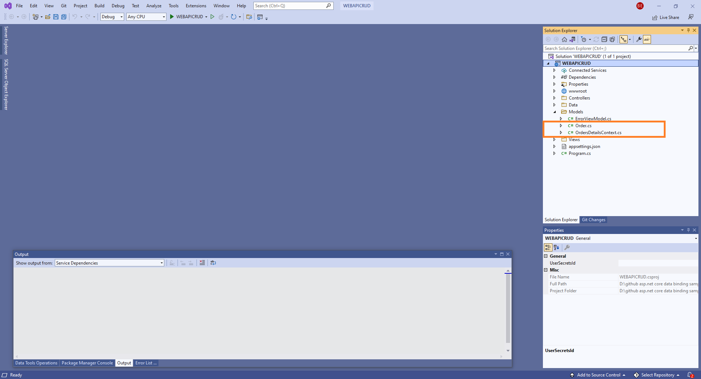
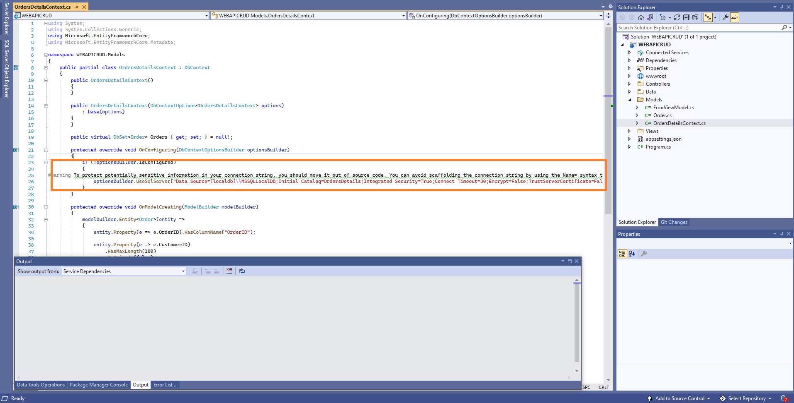
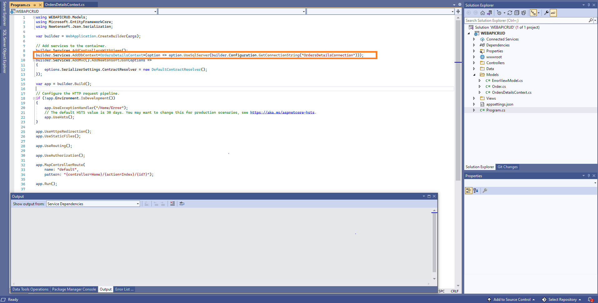

# Bind data to the Syncfusion ASP.NET Core components using WebApiAdaptor of DataManager and perform CRUD operations

In this topic, we are going to learn how to retrieve data from WebApi Controller, bind to Grid component using **WebApiAdaptor** of `DataManger`, and perform CRUD operations.

You can use the WebApiAdaptor of DataManager to interact with Web APIs created with OData endpoint. The WebApiAdaptor is extended from the ODataAdaptor. Hence, to use WebApiAdaptor, the endpoint should understand the OData formatted queries sent along with the request.

To enable the OData query option for Web API, please refer to this [documentation](https://docs.microsoft.com/en-us/aspnet/web-api/overview/odata-support-in-aspnet-web-api/supporting-odata-query-options).

## Prerequisite software

The following software are needed
* Visual Studio 2022 v17.0 or later.
* .NET SDK 6.0 or later.

## Create the database

Open Visual Studio, select **View -> SQL Server Object Explorer**. Right-click on the Databases folder to create a new Database and name it as **OrdersDetails**.


Right-click on the **Tables** folder of the created database and click **Add New Table**.


Use the following query to add a new table named **Orders**.




Create Table Orders(
 OrderID BigInt Primary Key Not Null,
 CustomerID Varchar(100) Not Null,
 Freight int Null,
 OrderDate datetime null
)




Now, the Orders table design will look like below. Click on the **Update** button.


Now, click on **Update Database**.


## Create ASP.NET Core MVC Application

Open Visual Studio and follow the steps in the below documentation to create the Application.

[Getting Started](https://ej2.syncfusion.com/aspnetcore/documentation/getting-started/visual-studio-2017/)

### Generate DbContext and model class from the database

Now, we are going to scaffold **DbContext** and **model classes** from the existing **OrdersDetails** database. To perform scaffolding and work with the SQL Server database in our application, we need to install the following NuGet packages.

Run the following commands in the **Package Manager Console**.

* **Install-Package Microsoft.EntityFrameworkCore.Tools -Version 6.0.2**: This package creates database context and model classes from the database.
* **Install-Package Microsoft.EntityFrameworkCore.SqlServer -Version 6.0.2**: The database provider that allows Entity Framework Core to work with SQL Server.

Once the above packages are installed, we can scaffold DbContext and Model classes. Run the following command in the **Package Manager Console**.




Scaffold-DbContext “Data Source=(localdb)\MSSQLLocalDB;Initial Catalog=OrdersDetails;Integrated Security=True;Connect Timeout=30;Encrypt=False;TrustServerCertificate=False;ApplicationIntent=ReadWrite;MultiSubnetFailover=False” Microsoft.EntityFrameworkCore.SqlServer -OutputDir Models




The above scaffolding command contains the following details for creating DbContext and model classes for the existing database and its tables.
* **Connection string**: Data Source=(localdb)\MSSQLLocalDB;Initial Catalog=OrdersDetails;Integrated Security=True;Connect Timeout=30;Encrypt=False;TrustServerCertificate=False;ApplicationIntent=ReadWrite;MultiSubnetFailover=False
* **Data provider**: Microsoft.EntityFrameworkCore.SqlServer
* **Output directory**: -OutputDir Models

After running the above command, **OrdersDetailsContext.cs** and **Orders.cs** files will be created under the **WEBAPICRUD.Models** folder as follows.



We can see that OrdersDetailsContext.cs file contains the connection string details in the **OnConfiguring** method.



It is not recommended to have a connection string with sensitive information in the OrdersDetailsContext.cs file, so we are moving the connection string to the **appsettings.json** file.


Now, the DbContext must be configured using connection string and registered as scoped service using the **AddDbContext** method in **Startup.cs**.



### Creating API Controller

The application is now configured to connect with the **OrdersDetails** database using Entity Framework. Now, it’s time to consume data from the OrdersDetails database. To do so, we need a Web API controller to serve data from the DbContext to the ASP.NET Core application.

To create a Web API controller, right-click the **Controller** folder in the Server project and select **Add -> New Item -> API controller with read/write actions** to create a new Web API controller. We are naming this controller as OrdersController as it returns Orders table records.

Now, replace the Web API controller with the following code which contains code to handle CRUD operations in the Orders table.




using Microsoft.AspNetCore.Mvc;
using System;
using System.Collections.Generic;
using System.Linq;
using System.Threading.Tasks;
using WEBAPICRUD.Models;
namespace WEBAPICRUD
{
    [Route("api/[controller]")]
    [ApiController]
    public class OrdersController : ControllerBase
    {
        private OrdersDetailsContext _context;
        public OrdersController(OrdersDetailsContext context)
        {
            _context = context;
        }

        // GET: api/<OrdersController>
        [HttpGet]
        public object Get()
        {
            return new { Items = _context.Orders.ToList(), Count = _context.Orders.Count() };
        }

        // GET api/<OrdersController>/5
        [HttpGet("{id}")]
        public string Get(int id)
        {
            return "value";
        }

        // POST api/<OrdersController>
        [HttpPost]
        public void Post([FromBody] Order book)
        {
            _context.Orders.Add(book);
            _context.SaveChanges();
        }
        // PUT api/<OrdersController>
        [HttpPut]
        public void Put(long id, [FromBody] Order book)
        {
            Order _book = _context.Orders.Where(x => x.OrderID.Equals(book.OrderID)).FirstOrDefault();
            _book.CustomerID = book.CustomerID;
            _book.Freight = book.Freight;
            _book.OrderDate = book.OrderDate;
            _context.SaveChanges();
        }

        // DELETE api/<OrdersController>/5
        [HttpDelete("{id}")]
        public void Delete(int id)
        {
            Order _book = _context.Orders.Where(x => x.OrderID.Equals(id)).FirstOrDefault();
            _context.Orders.Remove(_book);
            _context.SaveChanges();
        }
    }
}




## Install ASP.NET Core package in the application

Syncfusion ASP.NET Core components are available in [nuget.org.](https://www.nuget.org/packages?q=syncfusion.EJ2) Refer to [NuGet packages topic](https://ej2.syncfusion.com/aspnetcore/documentation/nuget-packages/) to learn more about installing NuGet packages in various OS environments. To add ASP.NET Core components in the application, open the NuGet package manager in Visual Studio (Tools → NuGet Package Manager → Manage NuGet Packages for Solution), search for [Syncfusion.EJ2.AspNet.Core](https://www.nuget.org/packages/Syncfusion.EJ2.AspNet.Core/) and then install it.

> The Syncfusion.EJ2.AspNet.Core NuGet package has dependencies, [Newtonsoft.Json](https://www.nuget.org/packages/Newtonsoft.Json/) for JSON serialization and [Syncfusion.Licensing](https://www.nuget.org/packages/Syncfusion.Licensing/) for validating Syncfusion license key.

## Add Syncfusion ASP.NET Core Tag Helper
Open `~/Views/_ViewImports.cshtml` file and import the `Syncfusion.EJ2` TagHelper.




@addTagHelper *, Syncfusion.EJ2



    
## Add Style Sheet

Checkout the [Themes topic](https://ej2.syncfusion.com/aspnetcore/documentation/appearance/theme/) to learn different ways (CDN, NPM package, and [CRG](https://ej2.syncfusion.com/aspnetcore/documentation/common/custom-resource-generator/)) to refer styles in ASP.NET Core application, and to have the expected appearance for Syncfusion ASP.NET Core components. Here, the theme is referred using CDN inside the `<head>` of `~/Views/Shared/_Layout.cshtml` file as follows,



    <head>
        ....
        ....

        <!-- Syncfusion Essential JS 2 Styles -->
        <link rel="stylesheet" href="https://cdn.syncfusion.com/ej2/{{ site.ej2version }}/material.css" />

    </head>



## Add Script Reference
In this getting started walk-through, the required scripts are referred using CDN inside the `<head>` of `~/Views/Shared/_Layout.cshtml` file as follows,



    <head>
        ....
        ....

        <!-- Syncfusion Essential JS 2 Scripts -->
        <script src="https://cdn.syncfusion.com/ej2/{{ site.ej2version }}/dist/ej2.min.js"></script>
    </head>



## Register Syncfusion Script Manager
Open `~/Views/Shared/_Layout.cshtml` page and register the script manager <ejs-script> at the end of `<body>` in the ASP.NET Core application as follows. 



    <body>
        ....
        ....
        <!-- Syncfusion Script Manager -->
        <ejs-scripts></ejs-scripts>
    </body>



## Add Syncfusion ASP.NET Core Grid component to an application

In previous steps, we have successfully configured the Syncfusion ASP.NET Core package in the application. Now, we can add the grid component to to your **Index.cshtml** view page which is present under `Views/Home` folder.




<ejs-grid id="Grid">

</ejs-grid>




## Binding data to ASP.NET Core Grid component using WebApiAdaptor

To consume data from the WebApi Controller, we need to add the **DataManager** with **WebApiAdaptor**.




<ejs-grid id="Grid">
<e-data-manager url="/api/Orders" adaptor="WebApiAdaptor" crossdomain="true"></e-data-manager>
</ejs-grid>




Grid columns can be defined by using the [GridColumn](https://help.syncfusion.com/cr/aspnetcore-js2/Syncfusion.EJ2.Grids.GridColumn.html) component. We are going to create columns using the following code.




<ejs-grid id="Grid">
    <e-data-manager url="/api/Orders" adaptor="WebApiAdaptor" crossdomain="true"></e-data-manager>
    <e-grid-editSettings allowDeleting="true" allowEditing="true" allowAdding="true"></e-grid-editSettings>
    <e-grid-columns>
        <e-grid-column field="OrderID" headerText="Order ID" type="number" textAlign="Right" width="120" isPrimaryKey="true"></e-grid-column>
        <e-grid-column field="CustomerID" headerText="Customer ID" type="string" width="140"></e-grid-column>
        <e-grid-column field="Freight" headerText="Freight" textAlign="Right" format="C2" width="120"></e-grid-column>
        <e-grid-column field="OrderDate" headerText="Order Date" format='yMd' textAlign="Right" width="140"></e-grid-column>
    </e-grid-columns>
 </ejs-grid>




When you run the application, the `Get()` method will be called in your API controller.




using System.Collections.Generic;
using System.Linq;
using System.Threading.Tasks;
using WEBAPICRUD.Models;

namespace WEBAPICRUD
{
    [Route("api/[controller]")]
    [ApiController]
    public class OrdersController : ControllerBase
    {
        private OrdersDetailsContext _context;
        public OrdersController(OrdersDetailsContext context)
        {
            _context = context;
        }
        // GET: api/<OrdersController>
        [HttpGet]
        public object Get()
        {
            return new { Items = _context.Orders, Count = _context.Orders.Count() };
        }
        ...
    }
}




The response object from the Web API should contain the properties, `Items` and `Count`, whose values are a collection of entities and the total count of the entities, respectively.

The sample response object should look like this:

```c#

{
    "Items": [{..}, {..}, {..}, ...],
    "Count": 830
}

```

## Handling CRUD operations with our Syncfusion ASP.NET Core Grid component

We can enable editing in the grid component using the [GridEditSettings](https://help.syncfusion.com/cr/aspnetcore-js2/Syncfusion.EJ2.Grids.GridEditSettings.html) component. Grid provides various modes of editing options such as [Inline/Normal](https://helpej2.syncfusion.com/aspnetcore/documentation/grid/edit#normal), [Dialog](https://helpej2.syncfusion.com/aspnetcore/documentation/grid/edit#dialog), and [Batch](https://helpej2.syncfusion.com/aspnetcore/documentation/grid/edit#batch) editing.

Here, we are using **Inline** edit mode and used Toolbar property to show toolbar items for editing.
We have added the Grid Editing and Toolbar code with previous Grid model.




<ejs-grid id="Grid" toolbar="@(new List<string>() { "Add", "Edit", "Delete", "Cancel", "Update" })">
    <e-data-manager url="/api/Orders" adaptor="WebApiAdaptor" crossdomain="true"></e-data-manager>
    <e-grid-editSettings allowDeleting="true" allowEditing="true" allowAdding="true"></e-grid-editSettings>
    <e-grid-columns>
        <e-grid-column field="OrderID" headerText="Order ID" type="number" textAlign="Right" width="120" isPrimaryKey="true"></e-grid-column>
        <e-grid-column field="CustomerID" headerText="Customer ID" type="string" width="140"></e-grid-column>
        <e-grid-column field="Freight" headerText="Freight" textAlign="Right" format="C2" width="120"></e-grid-column>
        <e-grid-column field="OrderDate" headerText="Order Date" format='yMd' textAlign="Right" width="140"></e-grid-column>
    </e-grid-columns>
 </ejs-grid>




> Normal editing is the default edit mode for the Grid component. Set the [IsPrimaryKey](https://help.syncfusion.com/cr/aspnetcore-js2/Syncfusion.EJ2.Grids.GridColumn.html#Syncfusion_EJ2_Grids_GridColumn_IsPrimaryKey) property of Column as **true** for a particular column, whose value is a unique value for editing purposes.

### Insert a row

To insert a new row, click the **Add** toolbar button. The new record edit form will look like below.


Clicking the **Update** toolbar button will insert the record in the Orders table by calling the following **POST** method of the Web API.




[HttpPost]
public void Post([FromBody] Orders book)
{
    _context.Orders.Add(book);
    _context.SaveChanges();
}





### Update a row

To edit a row, select any row and click the **Edit** toolbar button. The edit form will look like below. Edit the Customer Name column.


Clicking the **Update** toolbar button will update the record in the Orders table by calling the following **PUT** method of the Web API.




    // PUT api/<OrdersController>
    [HttpPut]
    public void Put(long id, [FromBody] Order book)
    {
        Order _book = _context.Orders.Where(x => x.OrderID.Equals(book.OrderID)).FirstOrDefault();
        _book.CustomerID = book.CustomerID;
        _book.Freight = book.Freight;
        _book.OrderDate = book.OrderDate;
        _context.SaveChanges();
    }




The resultant grid will look like below.


### Delete a row

To delete a row, select any row and click the **Delete** toolbar button. Deleting operation will send a **DELETE** request to the Web API with the selected record`s primary key value to remove the corresponding record from the Orders table.




[HttpDelete("{id}")]
public void Delete(long id)
{
    Order _book = _context.Orders.Where(x => x.OrderID.Equals(id)).FirstOrDefault();
    _context.Orders.Remove(_book);
    _context.SaveChanges();
}



