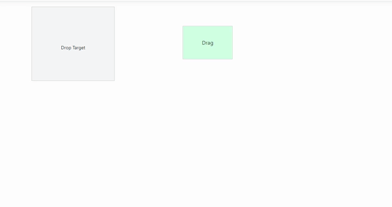

# Drag and Drop support in Syncfusion ASP.NET Core Components

* Drag and Drop support can be enabled for Syncfusion ASP.NET Core components by setting `allowDragAndDrop` property to `true`. It allows you to drag and drop the specific elements in the Syncfusion ASP.NET Core components.

* Drag and Drop is supported through two libraries of Essential JS 2. Those are [`Draggable`](https://ej2.syncfusion.com/documentation/api/base/draggable/) and [`Droppable`](https://ej2.syncfusion.com/documentation/api/base/droppable/). Draggable makes DOM to be dragged using mouse or touch gestures and Droppable mark required DOM as droppable zone.

## Drag and Drop Supported Components

The following table demonstrates the list of Syncfusion ASP.NET Core component documents that are supported with Drag and Drop.

* [Tabs](../tab/drag-and-drop)
* [Dashboard Layout](../dashboard-layout/interaction-with-panels/dragging-of-panels)
* [Schedule](../schedule/appointments#drag-and-drop-appointments)
* [File Manager](../file-manager/drag-and-drop)
* [Gantt](../gantt/how-to/maintainrecordindex)
* [Grid](../grid/row/row-drag-and-drop)
* [Kanban](../kanban/drag-and-drop)
* [ListBox](../list-box/drag-and-drop)
* [ListView](../listview/how-to/drag-and-drop-list-items)
* [TreeGrid](../tree-grid/row#drag-and-drop)
* [TreeView](../treeview/drag-and-drop)

## Initializing custom Draggable element

You can make any element draggable by passing the element to Draggable constructor. Refer the following code snippet to enable draggable for DOM element.

 ```cshtml
<div id="drag">
    <div id="drag-element"><p>Draggable Element </p></div>
</div>
    
<script> 
var dragElement = document.getElementById('drag-element');
var draggable = new ej.base.Draggable(dragElement,{clone: false});
</script>

<style>
    #drag-element {
        height: 100px;
        width: 150px;
        border: 1px solid #cecece;
        cursor: move;
        user-select: none;
        color: #6a77a7;
        touch-action: none;
    }
    p {
        padding-top: 20px;
        text-align: center;
        margin: 14px 0px 14px 0px;
    }
</style>
 ```


## Creating Droppable zone

You can convert any DOM element as a droppable zone, which accepts the draggable elements. Refer the following code snippet to enable droppable zone.

 ```cshtml
<div id="droppable">
    <p class="drop">
        <span>Drop Target</span> 
    </p>
</div>    

<script>
    var droppable = new ej.base.Droppable(document.getElementById('droppable'));
</script>

<style>
    #droppable {
        margin: 5px;
        line-height: 170px;
        font-size: 14px;
        width: 250px;
        border: 1px solid #cecece;
        background: #f6f6f6;
        touch-action: none;
    }
    
    .drop {
        padding-top: 23px;
        text-align: center;
        margin: 14px 0px 14px 0px;
        }
</style>
 ```


## Defining Drop Action

To define drop action set [`drop`](https://ej2.syncfusion.com/documentation/api/base/droppable/#drop) callback function during droppable object creation. You can get details of dropped element through dropped element property in event argument. Refer the following code snippet to use basic drag and drop action.

 ```cshtml
<div id="droppable">
    <p class="drop"><span>Drop Target </span></p></div>
<div id="drag-element"><p class="drag-text">Drag </p></div>

<script>
    var draggable = new ej.base.Draggable(document.getElementById('drag-element'), {
    clone: false
});
var droppable = new ej.base.Droppable(document.getElementById('droppable'), {
    drop: (function (e) {
        e.droppedElement.querySelector('.drag-text').textContent = 'Dropped';
    })
});
</script>


<style>
    #drag-element {
    height: 100px;
    width: 150px;
    border: 1px solid #cecece;
    cursor: move;
    background: #cdffe3;
    user-select: none;
    touch-action: none;
}

#droppable {
    margin: 5px;
    line-height: 170px;
    font-size: 14px;
    width: 250px;
    border: 1px solid #cecece;
    background: #f6f6f6;
    touch-action: none;
}

.drop,.drag-text {
    padding-top: 23px;
    text-align: center;
    margin: 14px 0px 14px 0px;
}
</style>
 ```

 

## See Also

* [Define handle element for Draggable](https://ej2.syncfusion.com/documentation/api/base/draggable/#handle)<br/>
* [Restricting Draggable within conainer](https://ej2.syncfusion.com/documentation/api/base/draggable/#dragarea)<br>
* [Visual feedback of draggable element](https://ej2.syncfusion.com/documentation/api/base/draggable/#clone)<br>
* [Accepting specific drag element in droppable](https://ej2.syncfusion.com/documentation/api/base/droppable/#accept)