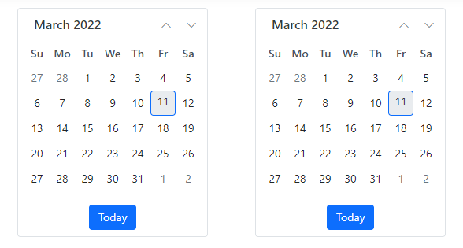

# How to render ASP.NET Core Control using both HTML and Tag Helper

This article provides a step-by-step instructions for building ASP.NET Core MVC application with Calendar control using both HTML and tag helper in Visual Studio.

## Prerequisites

[System requirements for ASP.NET Core components](https://ej2.syncfusion.com/aspnetcore/documentation/system-requirements/)

## Create ASP.NET Core MVC application

 * [Create a Project using Microsoft Templates](https://docs.microsoft.com/en-us/aspnet/core/tutorials/first-mvc-app/start-mvc?view=aspnetcore-6.0&tabs=visual-studio)

 * [Create a Project using Syncfusion ASP.NET Core Extension](https://ej2.syncfusion.com/aspnetcore/documentation/visual-studio-integration/VS2019-Extensions/create-project/)

## Install ASP.NET Core package in the application

Syncfusion ASP.NET Core controls are available in [nuget.org.](https://www.nuget.org/packages?q=syncfusion.EJ2) Refer to [NuGet packages topic](../../nuget-packages/) to learn more about installing NuGet packages in various OS environments. To add ASP.NET Core components in the application, open the NuGet package manager in Visual Studio (Tools → NuGet Package Manager → Manage NuGet Packages for Solution), search for [Syncfusion.EJ2.AspNet.Core](https://www.nuget.org/packages/Syncfusion.EJ2.AspNet.Core/) and then install it.

> The Syncfusion.EJ2.AspNet.Core NuGet package has dependencies, [Newtonsoft.Json](https://www.nuget.org/packages/Newtonsoft.Json/) for JSON serialization and [Syncfusion.Licensing](https://www.nuget.org/packages/Syncfusion.Licensing/) for validating Syncfusion license key.

## Add Syncfusion ASP.NET Core Tag Helper

Open `~/Views/_ViewImports.cshtml` file and import the `Syncfusion.EJ2` TagHelper.




@addTagHelper *, Syncfusion.EJ2



    
## Add style sheet

Checkout the [Themes topic](../../appearance/theme/) to learn different ways ([CDN](../../common/adding-script-references), [NPM package](../../common/adding-script-references#node-package-manager-npm), and [CRG](../../common/custom-resource-generator/)) to refer styles in ASP.NET Core application, and to have the expected appearance for Syncfusion ASP.NET Core controls. Here, the theme is referred using CDN inside the `<head>` of `~/Views/Shared/_Layout.cshtml` file as follows,



<head>
    ...
    <!-- Syncfusion ASP.NET Core controls styles -->
    <link rel="stylesheet" href="https://cdn.syncfusion.com/ej2/{{ site.ej2version }}/material.css" />
</head>



## Add script reference

In this getting started walk-through, the required scripts are referred using [CDN](../../common/adding-script-references) inside the `<head>` of `~/Views/Shared/_Layout.cshtml` file as follows,



<head>
    ...
    <!-- Syncfusion ASP.NET Core controls scripts -->
    
</head>



## Register Syncfusion script manager

Open `~/Views/Shared/_Layout.cshtml` page and register the script manager <ejs-script> at the end of `<body>` in the ASP.NET Core application as follows. 



<body>
    ...
    <!-- Syncfusion Script Manager -->
    @Html.EJS().ScriptManager()
    <ejs-scripts></ejs-scripts>
</body>



## Add ASP.NET Core Calendar control

Now, add the both HTML and Tag ASP.NET Core Calendar control in `~/Views/Home/Index.cshtml` page.




   @Html.EJS().Calendar("first-calendar").Render()
   <ejs-calendar id="second-calendar"></ejs-calendar>




Press <kbd>Ctrl</kbd>+<kbd>F5</kbd> (Windows) or <kbd>⌘</kbd>+<kbd>F5</kbd> (macOS) to run the app. Then, the Syncfusion ASP.NET Core Calendar control will be rendered in the default web browser.

