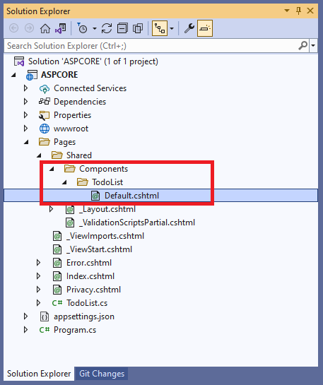

# Extend and Customize Syncfusion Controls

The ASP.NET Core provides the support to extend a component or customize it within another component for a strong composite model.

## Extend Syncfusion ASP.NET Core Control

The Syncfusion ASP.NET Core Controls can extend and customize the logic by creating a new [tag helper component](https://docs.microsoft.com/en-us/aspnet/core/mvc/views/tag-helpers/th-components?view=aspnetcore-6.0).

1.Right-click on the `~/Pages` folder in the Visual Studio and select `Add -> New Item -> Class` to create a new tag helper component (SyncButton.cs).

2.Inherit any Syncfusion ASP.NET Core control and use [HtmlTargetElement](https://docs.microsoft.com/en-us/aspnet/core/mvc/views/tag-helpers/th-components?view=aspnetcore-6.0#create-a-component) to create tag helper component. Render your component based on your logic with Syncfusion ASP.NET Core API.




using Microsoft.AspNetCore.Razor.TagHelpers;

namespace ASPCore.Pages
{
    [HtmlTargetElement("SyncButton")]
    public class SyncButton : Syncfusion.EJ2.Buttons.Button
    {
        public string className = "e-control e-btn";
        public ButtonStyles Styles { get; set; }
        public enum ButtonStyles
        {
            Basic,
            Success,
            Info,
            Warning,
            Danger
        }

        public override void Process(TagHelperContext context, TagHelperOutput output)
        {
            output.TagName = "button";
            output.TagMode = TagMode.StartTagAndEndTag;
            output.Content.SetContent(Content);
            if(Disabled)
            {
                output.Attributes.SetAttribute("disabled", Disabled);
            }
            if (IsPrimary)
            {
                className += " e-primary";
            }
            else if (Styles == ButtonStyles.Success)
            {
                className += " e-success";
            }
            else if (Styles == ButtonStyles.Info)
            {
                className += " e-info";
            }
            else if (Styles == ButtonStyles.Warning)
            {
                className += " e-warning";
            }
            else
            {
                className += " e-danger";
            }
            output.Attributes.SetAttribute("Class", className);
        }
    }
}




3.Open `~/Pages/_ViewImports.cshtml` file and import the project Name as TagHelper.




@addTagHelper *, ASPCORE




4.Render your new component in the view page `~/Pages/Index.cshtml` and run the application.




<SyncButton Content="Primary" IsPrimary="true" Disabled="true"></SyncButton>
<SyncButton Content="Success" Styles="@ASPCore.Pages.SyncButton.ButtonStyles.Success"></SyncButton>
<SyncButton Content="Info" Styles="@ASPCore.Pages.SyncButton.ButtonStyles.Info"></SyncButton>
<SyncButton Content="Warning" Styles="@ASPCore.Pages.SyncButton.ButtonStyles.Warning"></SyncButton>
<SyncButton Content="Danger" Styles="@ASPCore.Pages.SyncButton.ButtonStyles.Danger"></SyncButton>




> [View sample in GitHub](https://github.com/SyncfusionExamples/asp-net-core-extend-control)

## Use Syncfusion ASP.NET Core Control within Another view component

The Syncfusion ASP.NET Core control can be implemented within another [view component](https://docs.microsoft.com/en-us/aspnet/core/mvc/views/view-components?view=aspnetcore-6.0#view-components).

1.Create a folder with component name `TodoList` in `~/Pages/Shared/Components` and add the `Default.cshtml` razor view in `~/Components/TodoList` like below.

2.Right-click on the `~/Pages` folder in the Visual Studio and select `Add -> New Item -> Class` to create a view component class (TodoList.cs) then add the below code.




using Microsoft.AspNetCore.Mvc;

namespace ASPCORE.Pages
{
    public class TodoList : ViewComponent
    {
        public IViewComponentResult Invoke()
        {
            return View();
        }
    }
}




3.Add any Syncfusion ASP.NET Core control to the newly created ASP.NET Core view component `~/Components/TodoList/Default.cshtml`.




<h3>Todo List</h3>

    <ejs-textbox id="text" placeholder="Add new item" change="onchange" width="20%"></ejs-textbox>
    <ejs-button id="add" content="Add"></ejs-button>

<ejs-listview id="list" width="40%">
    <e-listview-fieldsettings text="text"></e-listview-fieldsettings>
</ejs-listview>




4.Open `~/Pages/_ViewImports.cshtml` file and import the project Name as TagHelper.




@addTagHelper *, ASPCORE




5.Render your new view component in the view page `~/Pages/Index.cshtml` and run the application.




<vc:todo-list></vc:todo-list>




> [View sample in GitHub](https://github.com/SyncfusionExamples/asp-net-core-view-component)

## See also

* [ASP.NET Core MVC view components](https://docs.microsoft.com/en-us/aspnet/core/mvc/views/view-components?view=aspnetcore-6.0) 